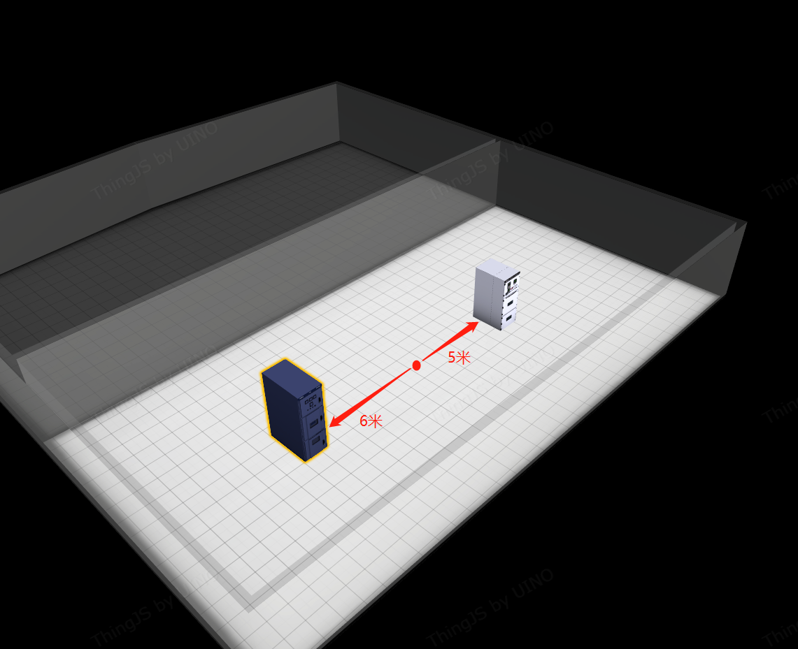

<!-- @import "[TOC]" {cmd="toc" depthFrom=1 depthTo=6 orderedList=false} -->

<!-- code_chunk_output -->

- [*Namespace* 解构(THINGX.Utils)](#namespace-解构thingxutils)
- [*Namespace* 数据请求库(THINGX.Utils.Http)](#namespace-数据请求库thingxutilshttp)
  - [*Method* THINGX.Utils.Http.get](#method-thingxutilshttpget)
  - [*Method* THINGX.Utils.Http.post](#method-thingxutilshttppost)
- [*Namespace* 空间计算库(THINGX.Utils.Space)](#namespace-空间计算库thingxutilsspace)
  - [*Method* THINGX.Utils.Space.queryBySphere](#method-thingxutilsspacequerybysphere)

<!-- /code_chunk_output -->

###  *<a><font color="grey">Namespace</font></a>* 解构(THINGX.Utils)
> THINGX.Utils:namespace
```javascript
    //系统工具命名空间下暂无具体实现
    //包含三级命名空间2个
    // -数据请求库命名空间(THINGX.Utils.Http)
    // -空间计算库命名空间(THINGX.Utils.Space)

    // THINGX.Utils 解构
    THINGX.Utils:namespace
        namespaces
            - THINGX.Utils.Http
            - THINGX.Utils.Space

```

###  *<a><font color="grey">Namespace</font></a>* 数据请求库(THINGX.Utils.Http)
> THINGX.Utils.Http:namespace
```javascript

    //Http请求模块
    //可用于对后台数据请求的工具库
    //该工具库已经提供了 http post、get 两种方式进行数据的请求获取
    
    // THINGX.Utils.Http 解构
    THINGX.Utils.Http:namespace
        Members
            - 无
        Methods
            - get(url, data, config):Promise.<Object>    //http get请求
            - post(url, data, config):Promise.<Object>   //http post请求
        Type Definitions
            - Config (信息配置)               
                - timeout:number                        //请求超时时间，0表示没超时限制 （单位:毫秒）; default value : 0 
                - withCredentials:boolean               //表示跨域请求时是否需要使用凭证; default value : false
                - headers:Map.<string, string>          //发送的自定义请求头
                - responseType:string                   //示服务器响应的数据类型 'arraybuffer', 'blob', 'document', 'json', 'text', 'stream'
    
```

#### *<a><font color="grey">Method</font></a>* THINGX.Utils.Http.get
> HTTP GET请求, THINGX.Utils.Http.get(url, data, config):Promise
* 参数
  ||||||
  |-|-|-|-|-|
  |名称|类型|必填|默认值|描述|
  |url|string|是| - | 请求的url |   
  |data|Object|是| - | 请求数据 |   
  |config|THINGX.Utils.Http.Config|是| - | Type Definitions (Config) |   
* 类型: void
* 示例
    ```javascript

        // 示例1. 请求XXX 资源
        const url = "http://IP:PROT/thing/xxx";
        const data = {
             "key1":"value1",
             "key2":"value2"   
        };
        const config = {
            timeout: 6000,
            withCredentials:false,
            headers: new Map().set("token","x88sadadis923213msad"),
            responseType: "json"
        };

        //http post 请求
        THINGX.Utils.Http.get(url,data,config).then((object)=>{
                console.warn('请求响应结果:', object);
        });

        // 示例2. 通过接口获取资源描述文件
        const url = "http://192.168.21.131:1662/thing/rsm/1310278173863045/configure/action/1225-2249/bundle.json";
        const data = {
            // "key1":"value1",
            // "key2":"value2"   
        };
        const config = {
            timeout: 6000,
            withCredentials:false,
            headers: new Map().set("tk","2e3d55a06e05a2ccf570824ccdd4253df02f5319db4050b075093296dc8cdce62168273738b580c987208dd2000daa76f0a670bd23d0346fd62d6e870cb790d1"),
            responseType: "json"
        };

        //http post 请求
        THINGX.Utils.Http.get(url,data,config).then((object)=>{
                console.warn('请求响应结果:', object);
        });

    ```
    ***

#### *<a><font color="grey">Method</font></a>* THINGX.Utils.Http.post
> HTTP GET请求, THINGX.Utils.Http.get(url, data, config):Promise
* 参数
  ||||||
  |-|-|-|-|-|
  |名称|类型|必填|默认值|描述|
  |url|string|是| - | 请求的url |   
  |data|Object|是| - | 请求数据 |   
  |config|THINGX.Utils.Http.Config|是| - | Type Definitions (Config) |   
* 类型: void
* 示例
    ```javascript

        // 示例1. 请求XXX 接口
        const url = "http://IP:PROT/thing/xxx";
        const data = {
             "key1":"value1",
             "key2":"value2"   
        };
        const config = {
            timeout: 6000,
            withCredentials:false,
            headers: new Map().set("token","x88sadadis923213msad"),
            responseType: "json"
        };

        //http post 请求
        THINGX.Utils.Http.post(url,data,config).then((object)=>{
                console.warn('HTTP POST 请求响应结果:', object);
        });

        // 示例2. 场景信息查询
        const url = "http://192.168.21.131:1662/thing/twin/scene/querySingle";
        const data = {
            "number": "WRL7JR0KQ",
            "name": "WRL7JR0KQ",
            "primaryKey": "WRL7JR0KQ",
            "onlyResponseTrans": true
        };
        const config = {
            timeout: 6000,
            withCredentials:false,
            headers: new Map().set("tk","2e3d55a06e05a2ccf570824ccdd4253df02f5319db4050b075093296dc8cdce62168273738b580c987208dd2000daa76f0a670bd23d0346fd62d6e870cb790d1"),
            responseType: "json"
        };

        //http post 请求
        THINGX.Utils.Http.post(url,data,config).then((object)=>{
                console.warn('HTTP POST 请求响应结果:', object);
        });
    ```
    ***


###  *<a><font color="grey">Namespace</font></a>* 空间计算库(THINGX.Utils.Space)
> THINGX.Utils.Space:namespace
```javascript

    //空间计算库
    //可用于对三维空间相关操作或计算
    //该工具库已经提供了 queryBySphere ,查询在以center为球心,radius为半径的球内的目标对象
    
    // THINGX.Utils.Space 解构
    THINGX.Utils.Space:namespace
        Members
            - 无
        Methods
            - queryBySphere(filter, center, radius [, queryLevel]):THING.Selector  //查询在以center为球心,radius为半径的球内的目标对象
    
```

#### *<a><font color="grey">Method</font></a>* THINGX.Utils.Space.queryBySphere
> 查询计算空间对象, THINGX.Utils.Space.queryBySphere(filter, center, radius [, queryLevel]):THING.Selector
* 参数
  ||||||
  |-|-|-|-|-|
  |名称|类型|必填|默认值|描述|
  |filter|string|是| - | 筛选条件 ThingJS 语法表达式支持|   
  |center|Array.\<number>|是| - | 中心坐标 |   
  |radius|number|是| - | 半径 （单位：米） |   
  |queryLevel|THING.BaseObject|-| THING.App.current.level.current | 查询层级 |   
* 类型: void
* 示例
    ```javascript

        // 示例1. 筛选房间中心坐标原点位置6米内设备
        THINGX.Utils.Space.queryBySphere(".Device", [0,0,0], 6)
    ```
* 示例演示图
  
    
    ***
!> 系统工具 支持   
**质量保证:** `刘远健`    
**审核校正:** `唐鑫` 、`张光光`  
**问题反馈:** `张明雷(zhangminglei@uino.com)`  
