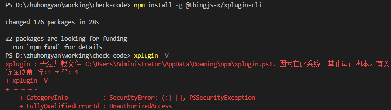
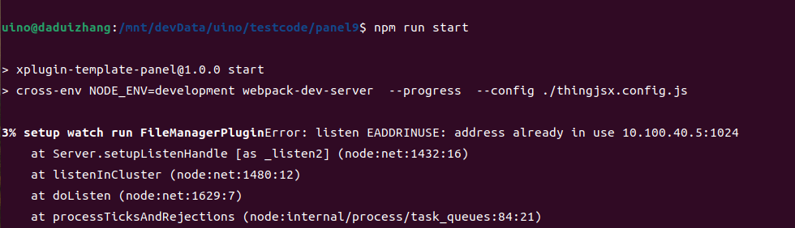
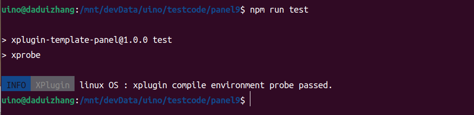
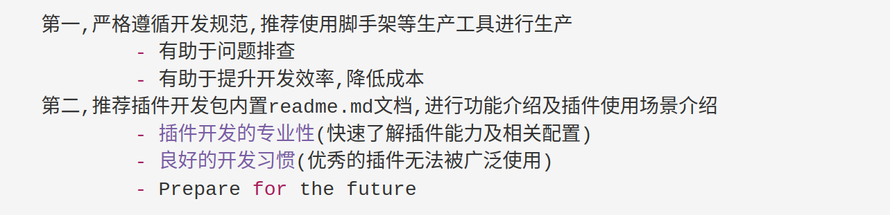
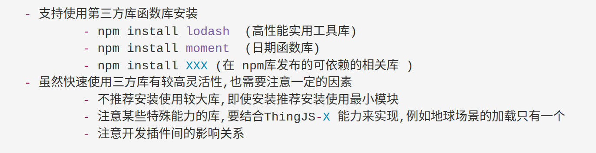

# FAQ

## 系统上禁止运行脚本的错
?> `npm install -g @thingjs-x/xplugin-cli` 系统上禁止运行脚本的错误         
可参考解决方案: https://blog.csdn.net/itopit/article/details/127284105



## 地址或端口被占用
?> `listen EADDRINUSE: address already in use x.x.x.x:1024` 地址或端口被占用         
由于在当前地址端口1024已经启动服务,无法同时启动相关端口,故解决方案为将已启动占用端口的服务停止在进行`npm run start` 服务启动



## 开发环境可用性检测
?> `npm run test`  检测插件工程依赖环境的可用性         
由于各客户端下载安装开发脚手架后及相关依赖是否可达的检查工作,以确保开发插件环境一致     
`passed` 环境即可用,`其它提示信息` 依据信息进行相关依赖的升级与调整



## 插件开发规范强一致性要求


## 插件开发是否可以安装依赖第三方函数库


## console 日志在控制台无输出
```javascript
    一般来说控制台日志无输出有这么两种情况
    1. 使用了api 设置了日志等级导致console.log等日志无输出 
        - THINGX.Debugger.setLevel
    2. 插件开发过程中 npm run dev & start 等不会对console 日志进行处理,但是在 npm run build:prod 或 build:pack 生产打包情况下默认会对 console.log 和 console.info 日志进行剔除,故使用的插件包有时候也会无法查看到日志
        - 可以使用插件开发高级设置进行配置日志输出(不推荐), 调整配置文件 thingjsx.config.js 即可
    3. 插件开发中不推荐使用  THINGX.Debugger.setLevel 调试器api,若在插件中使用在进行打包时会进行强制剔除
```

## 静态资源目录如何使用

```javascript
    //package.json 中升级依赖 "@thingjs-x/xplugin-plugin": "^0.3.1"
    // OR
    //xplugin upgrade 升级模板代码，重新进行工程创建

    使用
        1. 在工程src目录下创建 resources目录，该目录下的文件会按照实际目录结构进行拷贝 
        2. 在 src/模板类型代码/resources目录下放置的文件会进行平铺拷贝不会，注意不会拷贝目录结构
        3. src/resources 目录下的内容优先级高于 src/模板类型代码/resources 下文件
```