<!-- @import "[TOC]" {cmd="toc" depthFrom=1 depthTo=6 orderedList=false} -->

<!-- code_chunk_output -->

- [ThingJS-X 配置项规范](#thingjs-x-配置项规范)
  - [Glossary](#glossary)
  - [Type Definitions](#type-definitions)
  - [Widget List](#widget-list)
    - [文本『 text 』::配置说明](#文本-text-配置说明)
  - [|\*|suffix|控件后缀|-| - |-|](#suffix控件后缀-----)
    - [数字『 number 』::配置说明](#数字-number-配置说明)
    - [日期『 date 』::配置说明](#日期-date-配置说明)
  - [|\*|suffix|控件后缀|-| - |-|](#suffix控件后缀------1)
    - [时间『 time 』::配置说明](#时间-time-配置说明)
  - [|\*|suffix|控件后缀|-| - |-|](#suffix控件后缀------2)
    - [下拉『 select 』::配置说明](#下拉-select-配置说明)
    - [色块『 color 』::配置说明](#色块-color-配置说明)
    - [开关『 switch 』::配置说明](#开关-switch-配置说明)
  - [|\*|suffix|控件后缀|-| - |-|](#suffix控件后缀------3)
    - [滑块『 slider 』::配置说明](#滑块-slider-配置说明)
    - [单选『 radio 』::配置说明](#单选-radio-配置说明)
    - [多选『 checkbox 』::配置说明](#多选-checkbox-配置说明)
    - [视频『 video 』::配置说明](#视频-video-配置说明)
    - [音频『 audio 』::配置说明](#音频-audio-配置说明)
    - [图片『 image 』::配置说明](#图片-image-配置说明)
    - [资源『 file 』::配置说明](#资源-file-配置说明)
    - [代码『 code 』::配置说明](#代码-code-配置说明)
  - [|\*|suffix|控件后缀|-| - |-|](#suffix控件后缀------4)
    - [文本域『 textarea 』::配置说明](#文本域-textarea-配置说明)
  - [|\*|suffix|控件后缀|-| - |-|](#suffix控件后缀------5)
    - [日期时间『 datetime 』::配置说明](#日期时间-datetime-配置说明)
  - [|\*|suffix|控件后缀|-| - |-|](#suffix控件后缀------6)
    - [折叠『 collapse 』::配置说明](#折叠-collapse-配置说明)
    - [容器『 container 』::配置说明](#容器-container-配置说明)
    - [检查框『 check-checkbox 』::配置说明](#检查框-check-checkbox-配置说明)
    - [颜色分级『 range-color 』::配置说明](#颜色分级-range-color-配置说明)
    - [多选下拉『 datalist-select 』::配置说明](#多选下拉-datalist-select-配置说明)
    - [多选框『 datalist-checkbox 』::配置说明](#多选框-datalist-checkbox-配置说明)
    - [多行文本『 multiple-text 』::配置说明](#多行文本-multiple-text-配置说明)
  - [|\*|suffix|控件后缀|-| - |-|](#suffix控件后缀------7)
    - [多行数字『 multiple-number 』::配置说明](#多行数字-multiple-number-配置说明)
    - [多行下拉『 multiple-select 』::配置说明](#多行下拉-multiple-select-配置说明)
    - [多行色块『 multiple-color 』::配置说明](#多行色块-multiple-color-配置说明)
    - [多行开关『 multiple-switch 』::配置说明](#多行开关-multiple-switch-配置说明)
  - [|\*|suffix|控件后缀|-| - |-|](#suffix控件后缀------8)
    - [多行单选『 multiple-radio 』::配置说明](#多行单选-multiple-radio-配置说明)
    - [多行多选『 multiple-checkbox 』::配置说明](#多行多选-multiple-checkbox-配置说明)
    - [多行键值『 multiple-keyvalue 』::配置说明](#多行键值-multiple-keyvalue-配置说明)
    - [多行容器『 multiple-container 』::配置说明](#多行容器-multiple-container-配置说明)
    - [联动单选『 linkage-radio 』::配置说明](#联动单选-linkage-radio-配置说明)
    - [联动下拉『 linkage-select 』::配置说明](#联动下拉-linkage-select-配置说明)
    - [联动开关『 linkage-switch 』::配置说明](#联动开关-linkage-switch-配置说明)
    - [联动多选『 linkage-checkbox 』::配置说明](#联动多选-linkage-checkbox-配置说明)
    - [条件选择器『 selector 』::配置说明](#条件选择器-selector-配置说明)
    - [条件文本『 selector-text 』::配置说明](#条件文本-selector-text-配置说明)
    - [条件下拉『 selector-select 』::配置说明](#条件下拉-selector-select-配置说明)
    - [条件色块『 selector-color 』::配置说明](#条件色块-selector-color-配置说明)
    - [条件键值『 selector-keyvalue 』::配置说明](#条件键值-selector-keyvalue-配置说明)
    - [条件标记『 selector-attachment 』::配置说明](#条件标记-selector-attachment-配置说明)
    - [条件操作集『 selector-action 』::配置说明](#条件操作集-selector-action-配置说明)
    - [多行选择器『 multiple-selector 』::配置说明](#多行选择器-multiple-selector-配置说明)
    - [多条件文本『 multiple-selector-text 』::配置说明](#多条件文本-multiple-selector-text-配置说明)
    - [多条件下拉『 multiple-selector-select 』::配置说明](#多条件下拉-multiple-selector-select-配置说明)
    - [多条件色块『 multiple-selector-color 』::配置说明](#多条件色块-multiple-selector-color-配置说明)
    - [多条件键值『 multiple-selector-keyvalue 』::配置说明](#多条件键值-multiple-selector-keyvalue-配置说明)
    - [多条件标记『 multiple-selector-attachment 』::配置说明](#多条件标记-multiple-selector-attachment-配置说明)
    - [多条件操作集『 multiple-selector-action 』::配置说明](#多条件操作集-multiple-selector-action-配置说明)
    - [字典『 dictionary 』::配置说明](#字典-dictionary-配置说明)
    - [效果『 effect 』::配置说明](#效果-effect-配置说明)
    - [文章『 articles 』::配置说明](#文章-articles-配置说明)
    - [对象配置『 keyobjects 』::配置说明](#对象配置-keyobjects-配置说明)
    - [标题『 title 』::配置说明](#标题-title-配置说明)
    - [模型『 model 』::配置说明](#模型-model-配置说明)
  - [|path| 资源路径 | string |  |-|](#path-资源路径--string----)
    - [事件『 event 』::配置说明](#事件-event-配置说明)
  - [|\*|suffix|控件后缀|-| - |-|](#suffix控件后缀------9)
    - [标记『 attachment 』::配置说明](#标记-attachment-配置说明)
  - [|\*|suffix|控件后缀|-| - |-|](#suffix控件后缀------10)
    - [操作集『 action 』::配置说明](#操作集-action-配置说明)
  - [|\*|suffix|控件后缀|-| - |-|](#suffix控件后缀------11)
    - [互斥标记『 mutex-attachment 』::配置说明](#互斥标记-mutex-attachment-配置说明)
    - [孪生体分类『 category 』::配置说明](#孪生体分类-category-配置说明)
  - [|\*|suffix|控件后缀|-| - |-|](#suffix控件后缀------12)
    - [资源选择器『 selector-resource 』::配置说明](#资源选择器-selector-resource-配置说明)
    - [选择器效果文本『 selector-effect-text 』::配置说明](#选择器效果文本-selector-effect-text-配置说明)
    - [选择器文本标记『 selector-text-attachment 』::配置说明](#选择器文本标记-selector-text-attachment-配置说明)
    - [选择器色块文本『 selector-color-text 』::配置说明](#选择器色块文本-selector-color-text-配置说明)

<!-- /code_chunk_output -->
# ThingJS-X 配置项规范

>配置项规范 是 ThingJS-X 插件开发规范的组成部分,规定了插件配置部分的`UI规范`,   
>使插件开发配置项标准统一,同时提供了可参考实现的相关数据结构和规范文档,明确了使用者对规范的使用方式


?>配置项规范落地 遵循了`W3C标准`以及`开发者共识` 
对配置项控件按照能力进行了分类,共分为: `基础控件`、`高级控件`、`预制控件`、`专用控件`四种类型

|分类|描述|数量|
|-|-|-|
|基础控件|控件的最小单元,一般来说具备设置属性: `值`:结构单一 `显示名称` `引导文字` `描述` `隐藏` `只读` `必填` `...`|17|
|高级控件|控件能力的扩展类型: `1.控件的复杂组合能力` `2.控件的动态增删行能力` `3.控件的联动控制能力`|24|
|预制控件|与系统相关术语有关的组合控件: `单行选择器` `多行选择器` `字典` `效果` `...`|21|
|专用控件|专用于ThingJS-X 系统术语的组件定义: `模型` `标记` `操作集` |10|


## Glossary
?> 编辑术语表是一项永无止境的工作, 你可以添加新的条目或改进、完善现有条目

|-|术语|释意|
|-|-|-|
||配置项|一组`控件集合`|
||控件|控件是指具有用户界面的组件`可视化组件`, 比如：`按钮`、`列表框`、`编辑框`或者某个对话框中的静态`文本`等</br>本文档中控件所指的最小单元即为一个可视化控件|


## Type Definitions
|-|名称|释意|
|-|-|-|
|-|XText| X+具体类型即为 控件最小单元,拥有控件通用元素,例如: </br>XText 是指 text类型的控件</br>XNumber 是指 number类型的控件</br>XSelect 是指 select类型的控件</br>...|
|-|XNumber|number类型的控件 |
|-|XSelect|select类型的控件 |


## Widget List

### 文本『 text 』::配置说明

>##### 控件效果

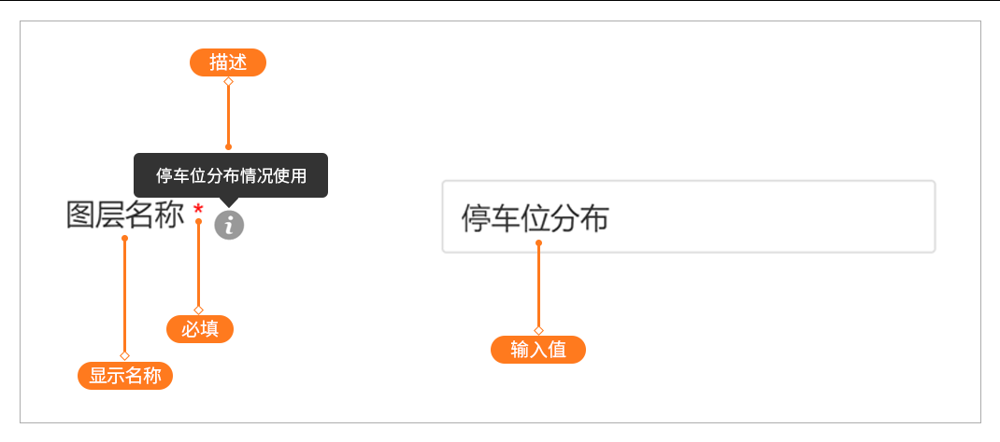

>##### 属性描述
|-|字段名|含义|默认值|描述|必填|
|-|-|-|-|-|-|
|*|type|文本|text| 控件类型 |是|
|*|key|唯一标识|-| 取值控件唯一标识 |是|
|*|label|显示名称| -| - |-|
|*|value|值|-| 控件值/默认值 |-|
|*|placeholder|引导文字|-| - |-|
|*|description|描述|-| - |-|
|*|hidden|隐藏|false| 控件隐藏 |-|
|*|readonly|只读|false| 控件只读 |-|
|*|required|必填|false| 控件必填 |-|
|*|prefix|控件前缀|-| - |-|
|*|suffix|控件后缀|-| - |-|
---

>##### 代码结构
```JSON
{
  "type": "text", 
  "key": "",
  "label": "文本",
  "placeholder": "",
  "description": "",
  "value": "",
  "hidden": false,
  "readonly": false,
  "required": false,
  "prefix": "",
  "suffix": ""
}
```


### 数字『 number 』::配置说明

>###### 控件效果
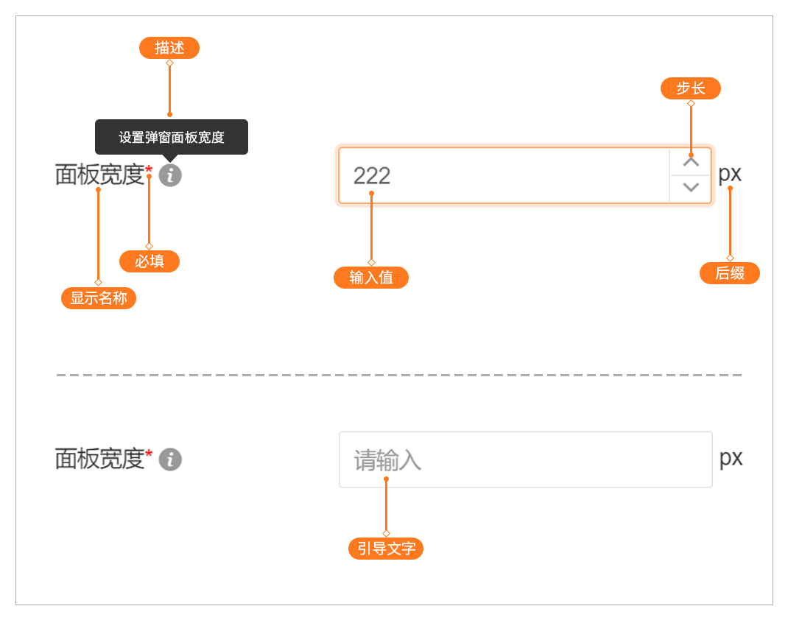

>###### 属性描述
|-|字段名|含义|默认值|描述|必填|
|-|-|-|-|-|-|
|*|type|数字|number| 控件类型 |是|
|*|key|唯一标识|-| 取值控件唯一标识 |是|
|*|label|显示名称| -| - |-|
|*|value|值| 0 | 控件值/默认值 |-|
|*|placeholder|引导文字|-| - |-|
|*|description|描述|-| - |-|
|*|hidden|隐藏|false| 控件隐藏 |-|
|*|readonly|只读|false| 控件只读 |-|
|*|required|必填|false| 控件必填 |-|
|*|prefix|控件前缀|-| - |-|
|*|suffix|控件后缀|-| - |-|
||max|最大值|10| - |是|
||min|最小值|0| - |是|
||step|步长|1| 数字控件每次增加或减少长度值 |是|

>###### 代码结构
```JSON
{
  "type": "number",
  "key": "",
  "label": "数字",
  "value": 0,
  "placeholder": "",
  "description": "",
  "hidden": false,
  "readonly": false,
  "required": false,
  "prefix": "",
  "suffix": "",
  "max": 10,
  "min": 0,
  "step": 1
}
```

### 日期『 date 』::配置说明

>##### 控件效果
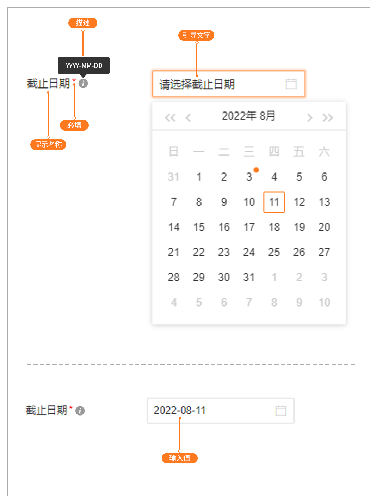

>##### 属性描述
|-|字段名|含义|默认值|描述|必填|
|-|-|-|-|-|-|
|*|type|日期|date| 控件类型 |是|
|*|key|唯一标识|-| 取值控件唯一标识 |是|
|*|label|显示名称| -| - |-|
|*|value|值| - | 控件值/默认值</br>格式:YYYY-MM-DD |-|
|*|placeholder|引导文字|-| - |-|
|*|description|描述|-| - |-|
|*|hidden|隐藏|false| 控件隐藏 |-|
|*|readonly|只读|false| 控件只读 |-|
|*|required|必填|false| 控件必填 |-|
|*|prefix|控件前缀|-| - |-|
|*|suffix|控件后缀|-| - |-|
---


>##### 代码结构
```JSON
{
  "type": "date",
  "key": "",
  "label": "日期",
  "placeholder": "",
  "description": "",
  "value": "",
  "hidden": false,
  "readonly": false,
  "required": false,
  "prefix": "",
  "suffix": ""
}
```

### 时间『 time 』::配置说明

>##### 控件效果
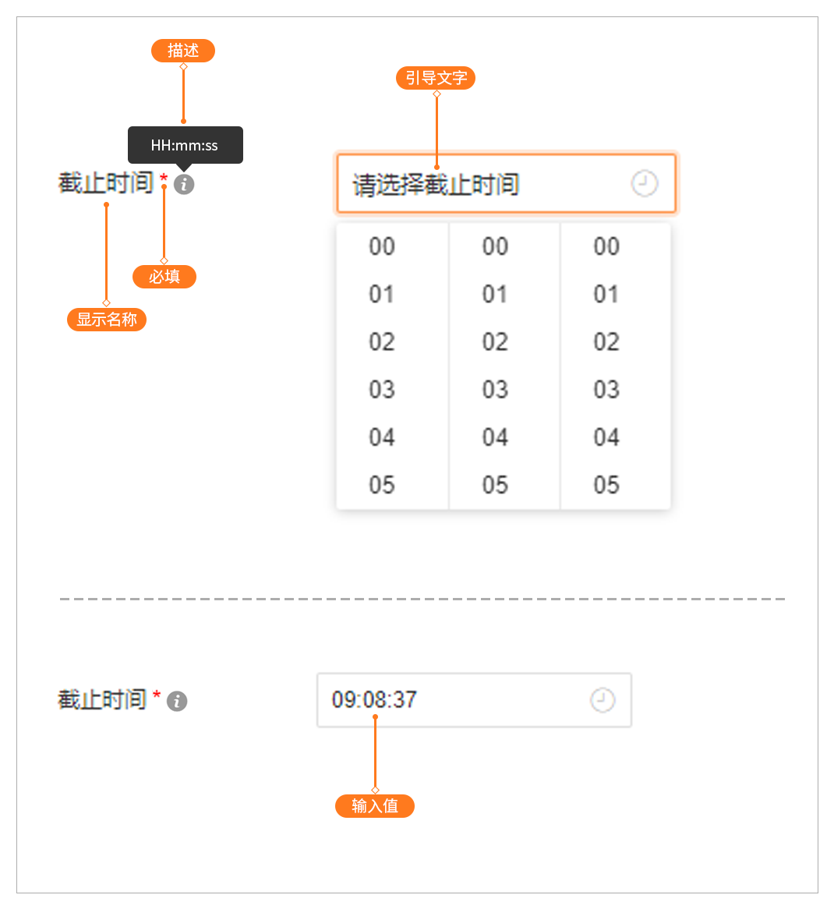

>##### 属性描述
|-|字段名|含义|默认值|描述|必填|
|-|-|-|-|-|-|
|*|type|时间|time| 控件类型 |是|
|*|key|唯一标识|-| 取值控件唯一标识 |是|
|*|label|显示名称| -| - |-|
|*|value|值| - | 控件值/默认值</br>格式:HH:mm:ss |-|
|*|placeholder|引导文字|-| - |-|
|*|description|描述|-| - |-|
|*|hidden|隐藏|false| 控件隐藏 |-|
|*|readonly|只读|false| 控件只读 |-|
|*|required|必填|false| 控件必填 |-|
|*|prefix|控件前缀|-| - |-|
|*|suffix|控件后缀|-| - |-|
---

>##### 代码结构
```JSON
{
  "type": "time",
  "key": "",
  "label": "时间",
  "placeholder": "",
  "description": "",
  "value": "",
  "hidden": false,
  "readonly": false,
  "required": false,
  "prefix": "",
  "suffix": ""
}
```

### 下拉『 select 』::配置说明

>##### 控件效果
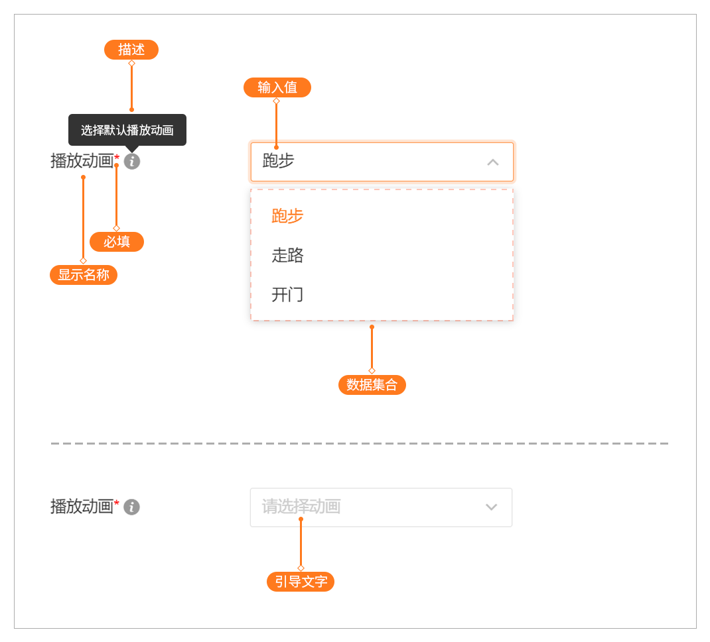


>##### 属性描述
|-|字段名|含义|默认值|描述|必填|
|-|-|-|-|-|-|
|*|type|下拉|select| 控件类型 |是|
|*|key|唯一标识|-| 取值控件唯一标识 |是|
|*|label|显示名称| -| - |-|
|*|value|值| - | 控件值/默认值 |-|
|*|placeholder|引导文字|-| - |是|
|*|description|描述|-| - |-|
|*|hidden|隐藏|false| 控件隐藏 |是|
|*|readonly|只读|false| 控件只读 |是|
|*|required|必填|false| 控件必填 |是|
|*|prefix|控件前缀|-| - |-|
|*|suffix|控件后缀|-| - |-|
|*|dataset|数据集合|Array<ValueLabelObject>| - |是|

- 数据集 ValueLabelObject
  
  |字段名|含义|默认值|描述|是否必填|
  |-|-|-|-|-|
  |label|显示名称|-| - |是|
  |value|值|-| - |是|

>##### 代码结构
```JSON
{
  "type": "select",
  "key": "",
  "label": "下拉",
  "value": "",
  "placeholder": "",
  "description": "",
  "hidden": false,
  "readonly": false,
  "required": false,
  "prefix": "",
  "suffix": "",
  "dataset": [ //dataset 数据集 
    //value 选中值  label 显示名称
    {"value": "api","label": "接口数据"},
    {"value": "static","label": "静态数据"},
    {"value": "digitaltwin","label": "孪生体属性"}
  ]
}
```

### 色块『 color 』::配置说明

>##### 控件效果
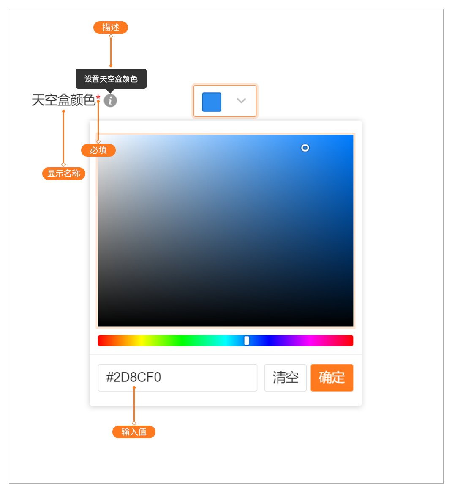
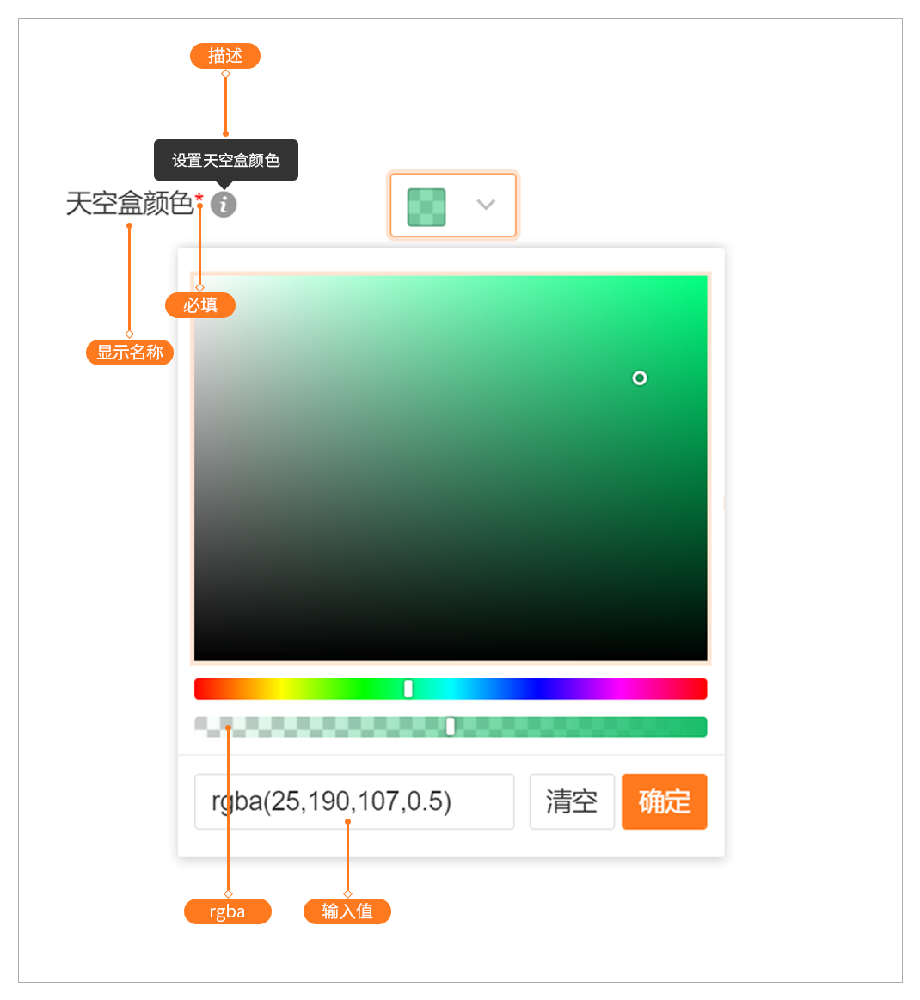


>##### 属性描述
|-|字段名|含义|默认值|描述|必填|
|-|-|-|-|-|-|
|*|type|色块|color| 控件类型 |是|
|*|key|唯一标识|-| 取值控件唯一标识 |是|
|*|label|显示名称| -| - |-|
|*|value|值| - | 控件值/默认值 |-|
|*|~~placeholder~~|~~引导文字~~|-| - |-|
|*|description|描述|-| - |-|
|*|hidden|隐藏|false| 控件隐藏 |-|
|*|readonly|只读|false| 控件只读 |-|
|*|required|必填|false| 控件必填 |-|
|*|prefix|控件前缀|-| - |-|
|*|suffix|控件后缀|-| - |-|
||rgba|颜色空间|false| RGBA是代表Red（红色）Green（绿色）Blue（蓝色）和Alpha的色彩空间。</br>Alpha通道一般用作不透明度参数。|是|

>##### 代码结构
```JSON
{
  "type": "color",
  "key": "",
  "label": "色块",
  //"placeholder": "", 不支持的属性
  "description": "",
  "value": "",
  "hidden": false,
  "readonly": false,
  "required": false,
  "prefix": "",
  "suffix": "",
  "rgba":false
}
```

### 开关『 switch 』::配置说明

>##### 控件效果
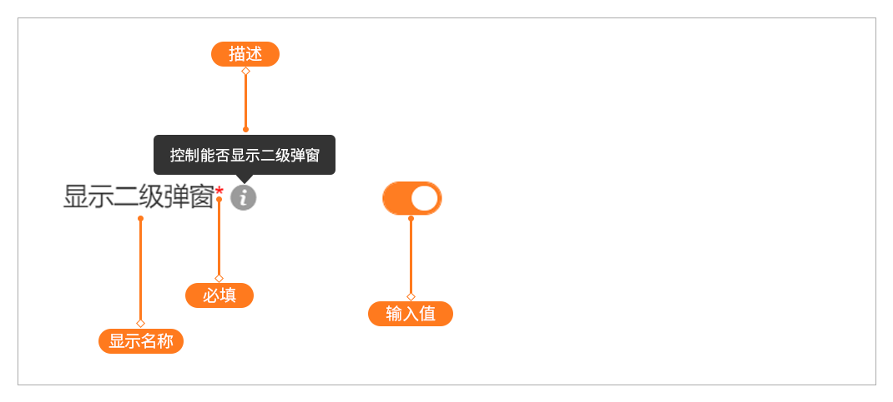

>##### 属性描述
|-|字段名|含义|默认值|描述|必填|
|-|-|-|-|-|-|
|*|type|开关|switch| 控件类型 |是|
|*|key|唯一标识|-| 取值控件唯一标识 |是|
|*|label|显示名称| -| - |-|
|*|value|值| false | 控件值/默认值 |是|
|*|~~placeholder~~|~~引导文字~~|-| - |-|
|*|description|描述|-| - |-|
|*|hidden|隐藏|false| 控件隐藏 |是|
|*|readonly|只读|false| 控件只读 |是|
|*|required|必填|false| 控件必填 |是|
|*|prefix|控件前缀|-| - |-|
|*|suffix|控件后缀|-| - |-|
---

>##### 代码结构
```JSON
{
  "type": "switch",
  "key": "",
  "label": "开关",
  "value": false,
  //"placeholder": "", 不支持的属性
  "description": "",
  "hidden": false,
  "readonly": false,
  "required": false,
  "prefix": "",
  "suffix": ""
}
```

### 滑块『 slider 』::配置说明

>##### 控件效果
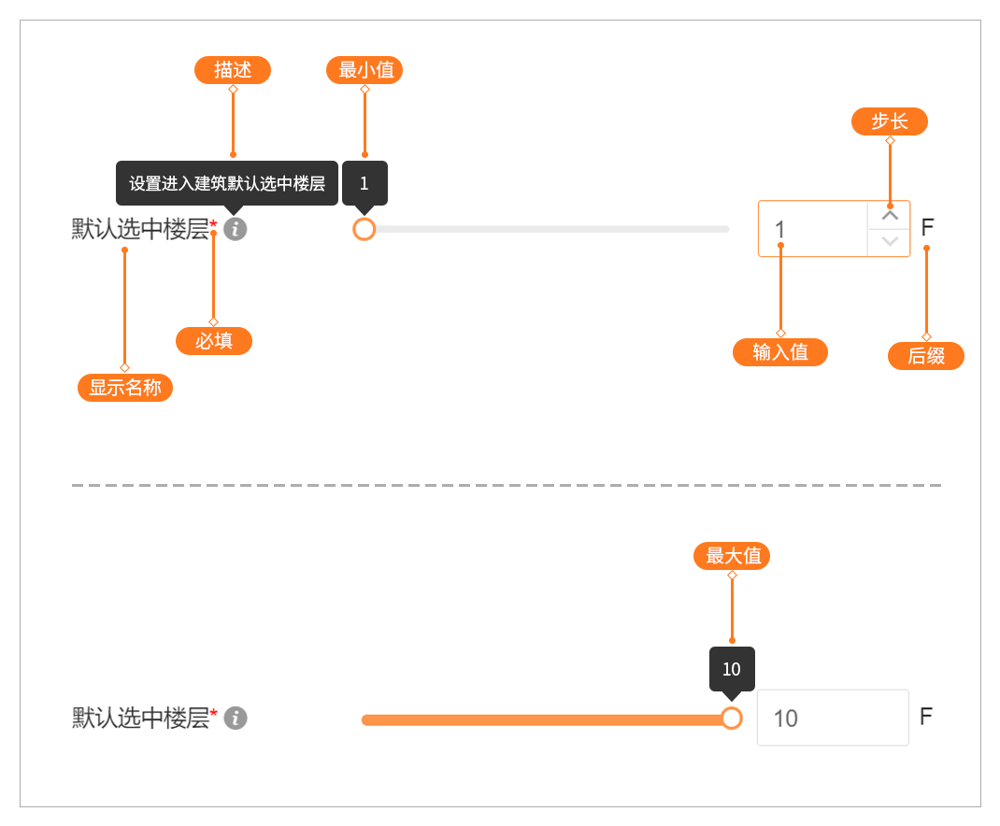

>##### 属性描述
|-|字段名|含义|默认值|描述|必填|
|-|-|-|-|-|-|
|*|type|滑块|slider| 控件类型 |是|
|*|key|唯一标识|-| 取值控件唯一标识 |是|
|*|label|显示名称| -| - |-|
|*|value|值| 0 | 控件值/默认值 |-|
|*|placeholder|引导文字|-| - |-|
|*|description|描述|-| - |-|
|*|hidden|隐藏|false| 控件隐藏 |-|
|*|readonly|只读|false| 控件只读 |-|
|*|required|必填|false| 控件必填 |-|
|*|prefix|控件前缀|-| - |-|
|*|suffix|控件后缀|-| - |-|
||max|最大值|10| - |是|
||min|最小值|0| - |是|
||step|步长|1| 控件每次增加或减少长度值 |是|

>##### 代码结构
```JSON
{
  "type": "slider",
  "key": "",
  "label": "滑块",
  "value": 0,
  "placeholder": "",
  "description": "",
  "hidden": false,
  "readonly": false,
  "required": false,
  "prefix": "",
  "suffix": "",
  "max": 10,
  "min": 0,
  "step": 1
}
```

### 单选『 radio 』::配置说明

>##### 控件效果
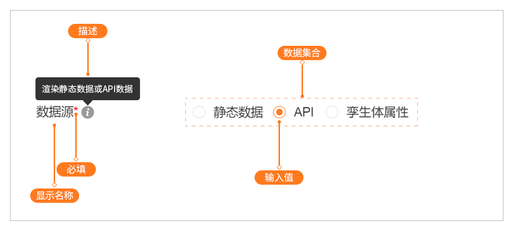

>##### 属性描述
|-|字段名|含义|默认值|描述|必填|
|-|-|-|-|-|-|
|*|type|单选|radio| 控件类型 |是|
|*|key|唯一标识|-| 取值控件唯一标识 |是|
|*|label|显示名称| -| - |-|
|*|value|值| - | 控件值/默认值 |-|
|*|~~placeholder~~|~~引导文字~~|-| - |-|
|*|description|描述|-| - |-|
|*|hidden|隐藏|false| 控件隐藏 |是|
|*|readonly|只读|false| 控件只读 |是|
|*|required|必填|false| 控件必填 |是|
|*|prefix|控件前缀|-| - |-|
|*|suffix|控件后缀|-| - |-|
|*|dataset|数据集合|Array<ValueLabelObject>| - |是|

- 数据集 ValueLabelObject
  
  |字段名|含义|默认值|描述|是否必填|
  |-|-|-|-|-|
  |value|值|-| - |是|
  |label|显示名称|-| - |是|

>##### 代码结构
```JSON
{
  "type": "radio",
  "key": "",
  "label": "单选",
  "value": "",
  //"placeholder": "", 不支持的属性
  "description": "",
  "hidden": false,
  "readonly": false,
  "required": false,
  "prefix": "",
  "suffix": "",
  "dataset": [ //dataset 数据集 
    //value 选中值  label 显示名称
    {"value": "api","label": "接口数据"},
    {"value": "static","label": "静态数据"},
    {"value": "digitaltwin","label": "孪生体属性"}
  ]
}
```

### 多选『 checkbox 』::配置说明

>##### 控件效果


>##### 属性描述
|-|字段名|含义|默认值|描述|必填|
|-|-|-|-|-|-|
|*|type|多选|checkbox| 控件类型 |是|
|*|key|唯一标识|-| 取值控件唯一标识 |是|
|*|label|显示名称| -| - |-|
|*|value|值| Array<string> | 控件值/默认值 |-|
|*|~~placeholder~~|~~引导文字~~|-| - |-|
|*|description|描述|-| - |-|
|*|hidden|隐藏|false| 控件隐藏 |是|
|*|readonly|只读|false| 控件只读 |是|
|*|required|必填|false| 控件必填 |是|
|*|prefix|控件前缀|-| - |-|
|*|suffix|控件后缀|-| - |-|
|*|dataset|数据集合|Array<ValueLabelObject>| - |是|

- 数据集 ValueLabelObject
  
  |字段名|含义|默认值|描述|是否必填|
  |-|-|-|-|-|
  |value|值|-| - |是|
  |label|显示名称|-| - |是|

>##### 代码结构
```JSON
{
  "type": "checkbox",
  "key": "",
  "label": "多选",
  "value": [],
  //"placeholder": "", 不支持的属性
  "description": "",
  "hidden": false,
  "readonly": false,
  "required": false,
  "prefix": "",
  "suffix": "",
  "dataset": [ //dataset 数据集 
    //value 选中值  label 显示名称
    {"value": "api","label": "接口数据"},
    {"value": "static","label": "静态数据"},
    {"value": "digitaltwin","label": "孪生体属性"}
  ]
}
```

### 视频『 video 』::配置说明

>##### 控件效果
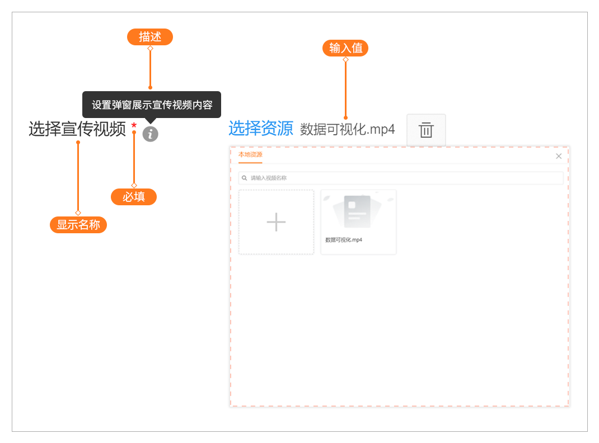

>##### 属性描述
|-|字段名|含义|默认值|描述|必填|
|-|-|-|-|-|-|
|*|type|视频|video| 控件类型 |是|
|*|key|唯一标识|-| 取值控件唯一标识 |是|
|*|label|显示名称| -| - |-|
|*|value|值| videoObject | 控件值/默认值 |-|
|*|~~placeholder~~|~~引导文字~~|-| - |-|
|*|description|描述|-| - |-|
|*|hidden|隐藏|false| 控件隐藏 |-|
|*|readonly|只读|false| 控件只读 |-|
|*|required|必填|false| 控件必填 |-|
|*|prefix|控件前缀|-| - |-|
|*|suffix|控件后缀|-| - |-|

- 值/默认值 videoObject
    |字段名|含义|默认值|描述|必填|
    |-|-|-|-|-|
    |name|视频显示名称|-|-|是|
    |path|视频路径|-|-|是|
    |file|视频全名称|-|-|是|

- 默认支持视频资源类型
 
  |类型|全称|分类|描述|
  |-|-|-|-|
  |MP4|Moving Picture Experts Group 4|视频|音频、视频信息的压缩编码标准|
  |~~WMV~~|~~Windows Media Video~~|~~视频~~|~~是一种流媒体格式</br>体积小,适合在线播放和传输~~|
  |~~AVI~~|~~Audio Video Interleave~~|~~视频~~|~~兼容性好且画面质量高</br>体积太大~~|

>##### 代码结构
```JSON
{
  "type": "video",
  "key": "",
  "label": "视频",
  //"placeholder": "", 不支持的属性
  "description": "",
  "value":  {  
    "name": "80d0d76935614bb6840d085674c47833.mp4", 
    "path": "/configure/other/ed8274e37c7da44045bcf1ad/",
    "file": "80d0d76935614bb6840d085674c47833.mp4"
  },
  "hidden": false,
  "readonly": false,
  "required": false,
  "prefix": "",
  "suffix": ""
}
```

### 音频『 audio 』::配置说明

>##### 控件效果
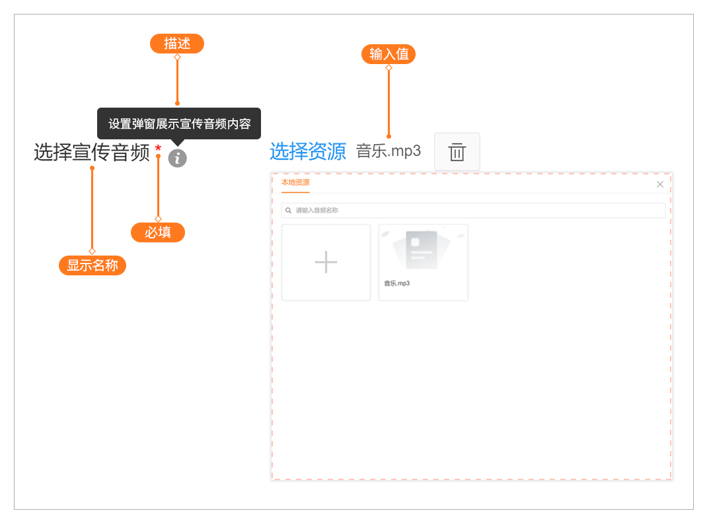

>##### 属性描述
|-字段名|含义|默认值|描述|必填|
|-|-|-|-|-|-|
|*|type|音频|audio| 控件类型 |是|
|*|key|唯一标识|-| 取值控件唯一标识 |是|
|*|label|显示名称| -| - |-|
|*|value|值| audioObject | 控件值/默认值 |-|
|*|~~placeholder~~|~~引导文字~~|-| - |-|
|*|description|描述|-| - |-|
|*|hidden|隐藏|false| 控件隐藏 |-|
|*|readonly|只读|false| 控件只读 |-|
|*|required|必填|false| 控件必填 |-|
|*|prefix|控件前缀|-| - |-|
|*|suffix|控件后缀|-| - |-|

- 值/默认值 audioObject
    |字段名|含义|默认值|描述|必填|
    |-|-|-|-|-|
    |name|音频显示名称|-|-|是|
    |path|音频路径|-|-|是|
    |file|音频全名称|-|-|是|

- 默认支持音频资源类型
 
  |类型|全称|分类|描述|
  |-|-|-|-|
  |MP3|MPEG Audio Layer3|音频|音频信息的压缩编码标准|
  |~~WMA~~|~~Windows Media Audio~~|~~音频~~|~~微软开发的一种音频格式</br>压缩比和音质方面都超过了MP3|
  |~~ACC~~|~~Advanced Audio Coding~~|~~音频~~|~~体积小音质高</br>体积太大~~|


>##### 代码结构
```JSON
{
  "type": "audio",
  "key": "",
  "label": "音频",
  //"placeholder": "", 不支持的属性
  "description": "",
  "value":  {  
    "name": "80d0d76935614bb6840d085674c47833.mp3", 
    "path": "/configure/other/ed8274e37c7da44045bcf1ad/",
    "file": "80d0d76935614bb6840d085674c47833.mp3"
  },
  "hidden": false,
  "readonly": false,
  "required": false,
  "prefix": "",
  "suffix": ""
}
```


### 图片『 image 』::配置说明

>##### 控件效果


>##### 属性描述
|字段名|含义|默认值|描述|必填|
|-|-|-|-|-|-|
|*|type|图片|image| 控件类型 |是|
|*|key|唯一标识|-| 取值控件唯一标识 |是|
|*|label|显示名称| -| - |-|
|*|value|值| imageObject | 控件值/默认值 |-|
|*|~~placeholder~~|~~引导文字~~|-| - |-|
|*|description|描述|-| - |-|
|*|hidden|隐藏|false| 控件隐藏 |-|
|*|readonly|只读|false| 控件只读 |-|
|*|required|必填|false| 控件必填 |-|
|*|prefix|控件前缀|-| - |-|
|*|suffix|控件后缀|-| - |-|

- 值/默认值 imageObject
    |字段名|含义|默认值|描述|必填|
    |-|-|-|-|-|
    |name|图片显示名称|-|-|是|
    |path|图片路径|-|-|是|
    |file|图片全名称|-|-|是|

- 默认支持图片资源类型

  |类型|全称|分类|描述|
  |-|-|-|-|
  |JPG|Joint Photographic Group|位图|针对摄影图像进行了优化|
  |JPEG|Joint Photographic Experts Group|位图|针对摄影图像进行了优化</br>“JPEG”和“JPG”是同一种文件格式</br>“JPG”只是“JPEG”简化的扩展名|
  |PNG|Portable Network Graphics|位图|针对线条绘制进行了优化</br>png是一种采用无损压缩算法的位图格式|
  |GIF|Graphics Interchange Format|位图|动态图片</br>公用的图像文件格式标准</br>GIF采用LZW压缩算法进行编码。是无损的|
  |~~TIFF~~|~~Tagged Image File Format~~|~~位图~~|~~印刷生产，色彩还原准确</br>标签图像文件格式</br>主要用来存储包括照片和艺术图在内的图像~~|
  |~~BMP~~|~~Bitmap~~|~~位图~~|~~Windows操作系统中的标准图像文件格式</br>包含的图像信息较丰富，几乎不进行压缩</br>占用磁盘空间过大~~|
  |~~RAW~~|~~Raw Image File~~|~~位图~~|~~数字底片,需要后处理~~|
  |~~SVG~~|~~Scalable Vector Graphics~~|~~矢量图~~|~~主要应用于在线使用~~|
  |~~PDF~~|~~Portable Document Format~~|~~矢量图~~|~~普遍使用的一种图像格式</br>取代eps格式~~|

>##### 代码结构
```JSON
{
  "type": "image",
  "key": "",
  "label": "图片",
  //"placeholder": "", 不支持的属性
  "description": "",
  "value":  {  
    "name": "80d0d76935614bb6840d085674c47833.png", 
    "path": "/configure/other/ed8274e37c7da44045bcf1ad/",
    "file": "80d0d76935614bb6840d085674c47833.png"
  },
  "hidden": false,
  "readonly": false,
  "required": false,
  "prefix": "",
  "suffix": ""
}
```

### 资源『 file 』::配置说明

>##### 控件效果
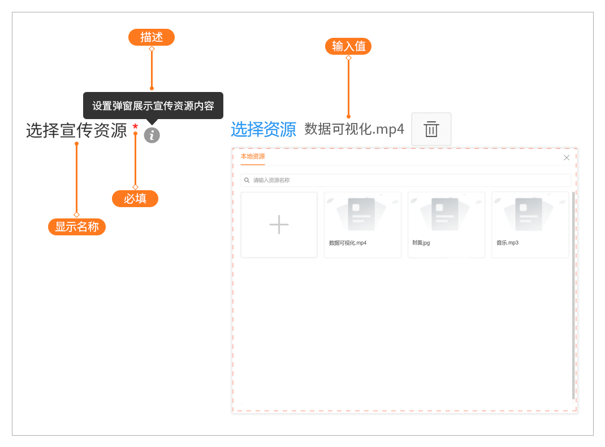

>##### 属性描述
|-|字段名|含义|默认值|描述|必填|
|-|-|-|-|-|-|
|*|type|资源|file| 控件类型 |是|
|*|key|唯一标识|-| 取值控件唯一标识 |是|
|*|label|显示名称| -| - |-|
|*|value|值| fileObject | 控件值/默认值 |-|
|*|~~placeholder~~|~~引导文字~~|-| - |-|
|*|description|描述|-| - |-|
|*|hidden|隐藏|false| 控件隐藏 |-|
|*|readonly|只读|false| 控件只读 |-|
|*|required|必填|false| 控件必填 |-|
|*|prefix|控件前缀|-| - |-|
|*|suffix|控件后缀|-| - |-|
||filter|资源条件|Array<String>| [".mp3",".mp4",".pdf",".png",".doc"]</br> 默认不进行资源条件限制 |-|

- 值/默认值 fileObject
    |字段名|含义|默认值|描述|必填|
    |-|-|-|-|-|
    |name|资源显示名称|-|-|是|
    |path|资源路径|-|-|是|
    |file|资源全名称|-|-|是|

- 资源条件 String
 
  |值|
  |-|
  |.mp3|
  |.wmv|
  |.doc|
  |...|
 

>##### 代码结构
```JSON
{
  "type": "file",
  "key": "",
  "label": "资源",
  //"placeholder": "", 不支持的属性
  "description": "",
  "value":  {  
    "name": "80d0d76935614bb6840d085674c47833.doc", 
    "path": "/configure/other/ed8274e37c7da44045bcf1ad/",
    "file": "80d0d76935614bb6840d085674c47833.doc"
  },
  "hidden": false,
  "readonly": false,
  "required": false,
  "prefix": "",
  "suffix": "",
  "filter": [] //资源类型筛选条件: .mp3,.mp4,.pdf,.png,.doc 
}
```

### 代码『 code 』::配置说明

>##### 控件效果
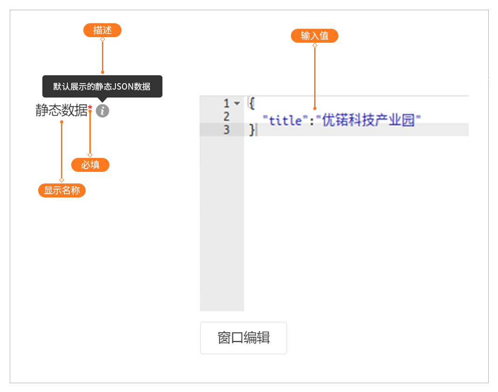

>##### 属性描述
|-|字段名|含义|默认值|描述|必填|
|-|-|-|-|-|-|
|*|type|代码|code| 控件类型 |是|
|*|key|唯一标识|-| 取值控件唯一标识 |是|
|*|label|显示名称| -| - |-|
|*|value|值| - | 控件值/默认值 |-|
|*|placeholder|引导文字|-| - |-|
|*|description|描述|-| - |-|
|*|hidden|隐藏|false| 控件隐藏 |-|
|*|readonly|只读|false| 控件只读 |-|
|*|required|必填|false| 控件必填 |-|
|*|prefix|控件前缀|-| - |-|
|*|suffix|控件后缀|-| - |-|
---

>##### 代码结构
```JSON
{
  "type": "code",
  "key": "",
  "label": "代码",
  "placeholder": "",
  "description": "",
  "value": "",
  "hidden": false,
  "readonly": false,
  "required": false,
  "prefix": "",
  "suffix": ""
}
```

### 文本域『 textarea 』::配置说明

>##### 控件效果
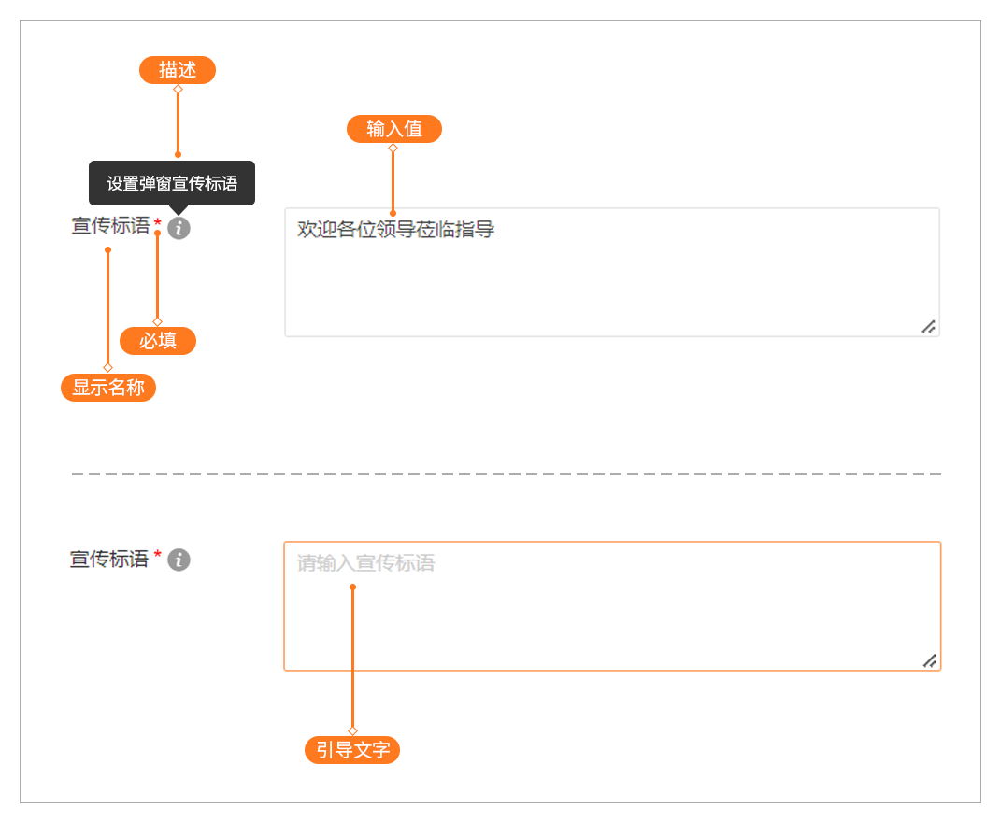

>##### 属性描述
|-|字段名|含义|默认值|描述|必填|
|-|-|-|-|-|-|
|*|type|文本域|textarea| 控件类型 |是|
|*|key|唯一标识|-| 取值控件唯一标识 |是|
|*|label|显示名称| -| - |-|
|*|value|值| - | 控件值/默认值|-|
|*|placeholder|引导文字|-| - |-|
|*|description|描述|-| - |-|
|*|hidden|隐藏|false| 控件隐藏 |-|
|*|readonly|只读|false| 控件只读 |-|
|*|required|必填|false| 控件必填 |-|
|*|prefix|控件前缀|-| - |-|
|*|suffix|控件后缀|-| - |-|
---

>##### 代码结构
```JSON
{
  "type": "textarea",
  "key": "",
  "label": "文本域",
  "placeholder": "",
  "description": "",
  "value": "",
  "hidden": false,
  "readonly": false,
  "required": false,
  "prefix": "",
  "suffix": ""
}
```

### 日期时间『 datetime 』::配置说明

>##### 控件效果


>##### 属性描述
|-|字段名|含义|默认值|描述|必填|
|-|-|-|-|-|-|
|*|type|日期时间|datetime| 控件类型 |是|
|*|key|唯一标识|-| 取值控件唯一标识 |是|
|*|label|显示名称| -| - |-|
|*|value|值| - | 控件值/默认值</br>格式:YYYY-MM-DD HH:mm:ss |-|
|*|placeholder|引导文字|-| - |-|
|*|description|描述|-| - |-|
|*|hidden|隐藏|false| 控件隐藏 |-|
|*|readonly|只读|false| 控件只读 |-|
|*|required|必填|false| 控件必填 |-|
|*|prefix|控件前缀|-| - |-|
|*|suffix|控件后缀|-| - |-|
---

>##### 代码结构
```JSON
{
  "type": "datetime",
  "key": "",
  "label": "日期时间",
  "placeholder": "",
  "description": "",
  "value": "",
  "hidden": false,
  "readonly": false,
  "required": false,
  "prefix": "",
  "suffix": ""
}
```

### 折叠『 collapse 』::配置说明

>##### 控件效果
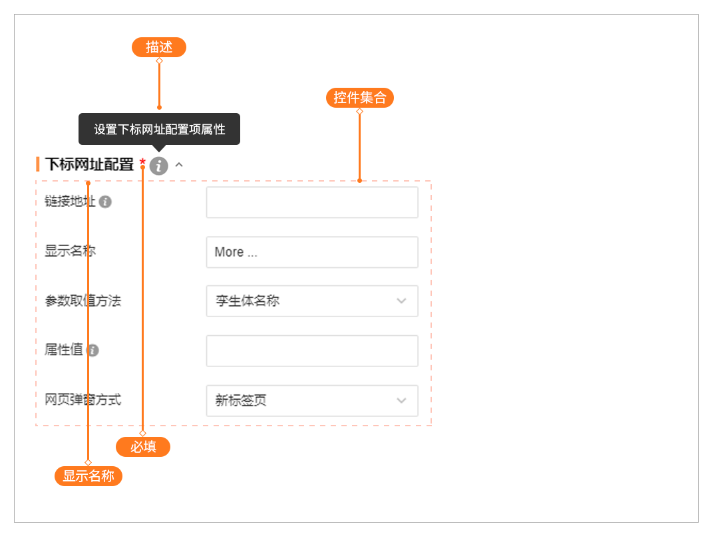

>##### 属性描述
|字段名|含义|默认值|描述|必填|
|-|-|-|-|-|
|type|折叠|collapse| 控件类型 |是|
|key|唯一标识|-| 取值控件唯一标识 |是|
|label|显示名称| -| - |-|
|value|值| Boolean:true | 控件值/默认值 |-|
|~~placeholder~~|~~占位符~~|-| - |-|
|description|描述|-| - |-|
|prefix|控件前缀|-| - |-|
|suffix|控件后缀|-| - |-|
|groups|控件集合|Array<XControlObject>| XControlObject是指 除了: *** 所有控件 |-|


>##### 代码结构
```JSON
{
  "type": "collapse",
  "key": "",
  "label": "折叠",
  "value": true,
   //"placeholder": "", 不支持的属性
  "description": "",
  "prefix": "",
  "suffix": "",
  "groups": []//控件;不支持的控件有:

}
```

### 容器『 container 』::配置说明

>##### 控件效果
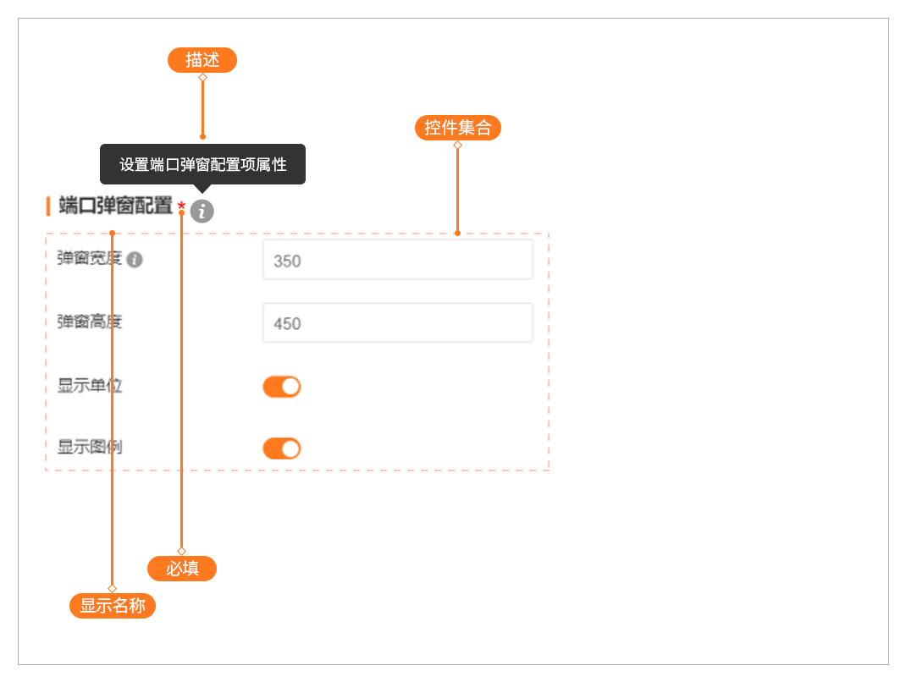

>##### 属性描述
|-|字段名|含义|默认值|描述|必填|
|-|-|-|-|-|-|
|*|type|容器|container| 控件类型 |是|
|*|key|唯一标识|-| 取值控件唯一标识 |是|
|*|label|显示名称| -| - |-|
|*|value|值| - | 控件值/默认值 |-|
|*|~~placeholder~~|~~占位符~~|-| - |-|
|*|description|描述|-| - |-|
|*|prefix|控件前缀|-| - |-|
|*|suffix|控件后缀|-| - |-|
||groups|控件集合|Array<XControlObject>| XControlObject是指 除了: *** 所有控件 |-|


>##### 代码结构
```JSON
{
  "type": "container",
  "key": "",
  "label": "容器",
  "value": "",
  //"placeholder": "", 不支持的属性
  "description": "",
  "prefix": "",
  "suffix": "",
  "groups": []//控件;不支持的控件有:
}
```

### 检查框『 check-checkbox 』::配置说明

>##### 控件效果
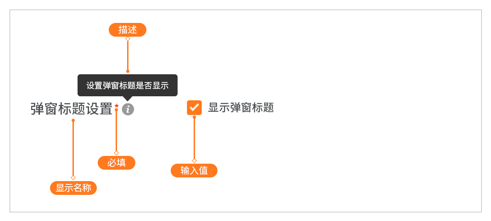

>##### 属性描述
|-|字段名|含义|默认值|描述|必填|
|-|-|-|-|-|-|
|*|type|检查框|check-checkbox| 控件类型 |是|
|*|key|唯一标识|-| 取值控件唯一标识 |是|
|*|label|显示名称| -| - |-|
|*|value|值| Array<string> | 控件值/默认值 |-|
|*|~~placeholder~~|~~引导文字~~|-| - |-|
|*|description|描述|-| - |-|
|*|hidden|隐藏|false| 控件隐藏 |是|
|*|readonly|只读|false| 控件只读 |是|
|*|required|必填|false| 控件必填 |是|
|*|prefix|控件前缀|-| - |-|
|*|suffix|控件后缀|-| - |-|
|*|dataset|数据集合|Array<ValueLabelObject>| - |是|

- 数据集 ValueLabelObject
  
  |字段名|含义|默认值|描述|是否必填|
  |-|-|-|-|-|
  |value|值|-| - |是|
  |label|显示名称|-| - |是|

>##### 代码结构
```JSON
{
  "type": "check-checkbox",
  "key": "",
  "label": "检查框",
  "value": [],
  //"placeholder": "", 不支持的属性
  "description": "",
  "hidden": false,
  "readonly": false,
  "required": false,
  "prefix": "",
  "suffix": "",
  "dataset": [ //dataset 数据集 
    //value 选中值  label 显示名称
    {"value": "showTwins","label": "孪生体显示"}
  ]
}
```

### 颜色分级『 range-color 』::配置说明

>##### 控件效果
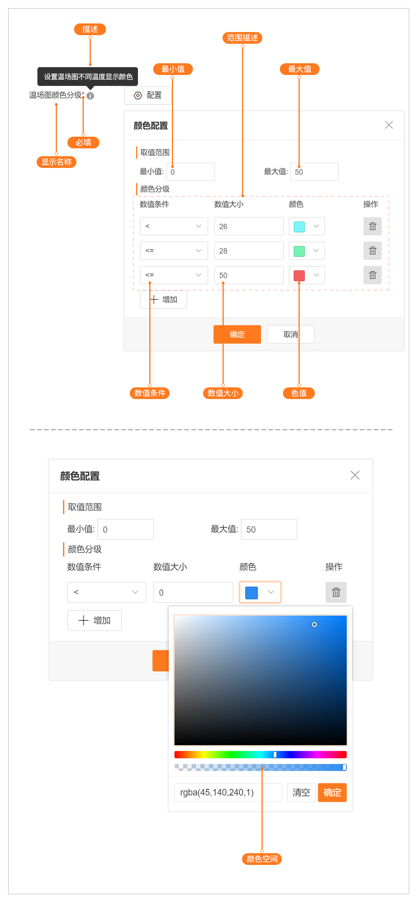

>##### 属性描述
|-|字段名|含义|默认值|描述|必填|
|-|-|-|-|-|-|
|*|type|颜色分级|range-color| 控件类型 |是|
|*|key|唯一标识|-| 取值控件唯一标识 |是|
|*|label|显示名称| -| - |-|
|*|value|值| RangeColorObject ⬇ | 控件值/默认值 |-|
|*|placeholder|占位符|-| - |-|
|*|description|描述|-| - |-|
|*|hidden|隐藏|false| 控件隐藏 |-|
|*|readonly|只读|false| 控件只读 |-|
|*|required|必填|false| 控件必填 |-|
|*|prefix|控件前缀|-| - |-|
|*|suffix|控件后缀|-| - |-|
||rgba|颜色空间|false| RGBA是代表Red（红色）Green（绿色）Blue（蓝色）和Alpha的色彩空间。</br>Alpha通道一般用作不透明度参数。|是|

- 值/默认值 RangeColorObject
    |字段名|含义|默认值|描述|必填|
    |-|-|-|-|-|
    |min|最小值|0|-|是|
    |max|最大值|10|-|是|
    |range|范围描述|Array<RangeObject> ⬇|-|-|

  - 范围描述 RangeObject
      |字段名|含义|默认值|描述|必填|
      |-|-|-|-|-|
      |condition|数值条件|自定义条件|-|是|
      |value|数值大小|0|-|是|
      |color|色值|RGBA 白色|-|是|

>##### 代码结构
```JSON
{
  "key": "", //属性识别
  "type": "range-color",//类型
  "label": "",//显示名称
  //"placeholder": "",//引导文字 不支持的属性
  "description": "",//描述
  "value": {
        "min": 0,//计算最小值
        "max": 10,//计算最大值
        "range":[//建议value按从小到大排序，condition不可为空
           {"condition":"<","value":2,"color":"rgba(129, 68, 68, 1)"},
           {"condition":"<=","value":6,"color":"rgba(129, 68, 68, 1)"},
           {"condition":"<=","value":10,"color":"rgba(129, 68, 68, 1)"}
        ]
  },//默认值
  "hidden": false,//隐藏
  "readonly": false,//只读
  "required": false,//必填
  "prefix": "",//前置
  "suffix": "",//后置
  "rgba": false
}

```

### 多选下拉『 datalist-select 』::配置说明

>##### 控件效果
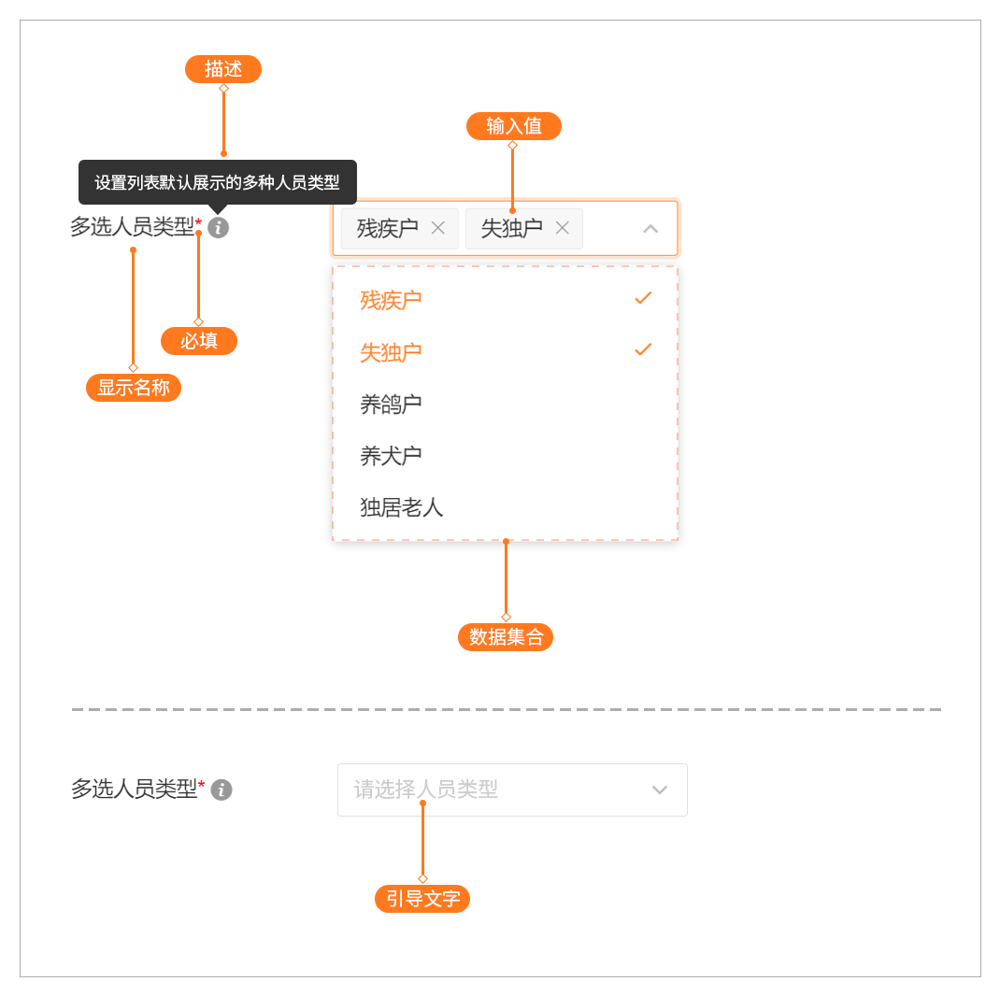

>##### 属性描述
|字段名|含义|默认值|描述|必填|
|-|-|-|-|-|
|type|多选下拉|datalist-select| 控件类型 |是|
|key|唯一标识|-| 取值控件唯一标识 |是|
|label|显示名称| -| - |-|
|value|值| Array<string> | 控件值/默认值 |-|
|placeholder|占位符|-| - |-|
|description|描述|-| - |-|
|hidden|隐藏|false| 控件隐藏 |是|
|readonly|只读|false| 控件只读 |是|
|required|必填|false| 控件必填 |是|
|prefix|控件前缀|-| - |-|
|suffix|控件后缀|-| - |-|
|dataset|数据集合|Array<ValueLabelObject> ⬇| - |是|

- 数据集 ValueLabelObject
  
  |字段名|含义|默认值|描述|必填|
  |-|-|-|-|-|
  |value|值|-| - |是|
  |label|显示名称|-| - |是|

>##### 代码结构
```JSON
{
  "type": "datalist-select",
  "key": "",
  "label": "多选下拉",
  "value": ["api","static"],
  "placeholder": "",
  "description": "",
  "hidden": false,
  "readonly": false,
  "required": false,
  "prefix": "",
  "suffix": "",
  "dataset": [ //dataset 数据集 
    //value 选中值  label 显示名称
    {"value": "api","label": "接口数据"},
    {"value": "static","label": "静态数据"},
    {"value": "digitaltwin","label": "孪生体属性"}
  ]
}
```

### 多选框『 datalist-checkbox 』::配置说明

>##### 控件效果
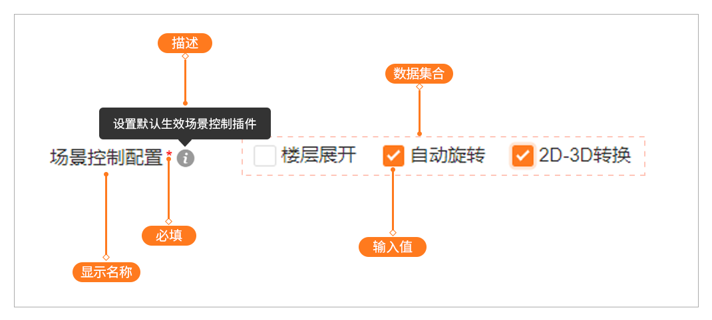

>##### 属性描述
|字段名|含义|默认值|描述|必填|
|-|-|-|-|-|
|type|多选框|datalist-checkbox| 控件类型 |是|
|key|唯一标识|-| 取值控件唯一标识 |是|
|label|显示名称| -| - |-|
|value|值| Array<string> | 控件值/默认值 |-|
|~~placeholder~~|~~引导文字~~|-| - |-|
|description|描述|-| - |-|
|hidden|隐藏|false| 控件隐藏 |是|
|readonly|只读|false| 控件只读 |是|
|required|必填|false| 控件必填 |是|
|prefix|控件前缀|-| - |-|
|suffix|控件后缀|-| - |-|
|dataset|数据集合|Array<ValueLabelObject> ⬇| - |是|

- 数据集 ValueLabelObject
  
  |字段名|含义|默认值|描述|必填|
  |-|-|-|-|-|
  |value|值|-| - |是|
  |label|显示名称|-| - |是|

>##### 代码结构
```JSON
{
  "type": "datalist-checkbox",
  "key": "",
  "label": "多选框",
  "value": ["api","static"],
  //"placeholder": "", 不支持的属性
  "description": "",
  "hidden": false,
  "readonly": false,
  "required": false,
  "prefix": "",
  "suffix": "",
  "dataset": [ //dataset 数据集 
    //value 选中值  label 显示名称
    {"value": "api","label": "接口数据"},
    {"value": "static","label": "静态数据"},
    {"value": "digitaltwin","label": "孪生体属性"}
  ]
}
```

### 多行文本『 multiple-text 』::配置说明

>##### 控件效果
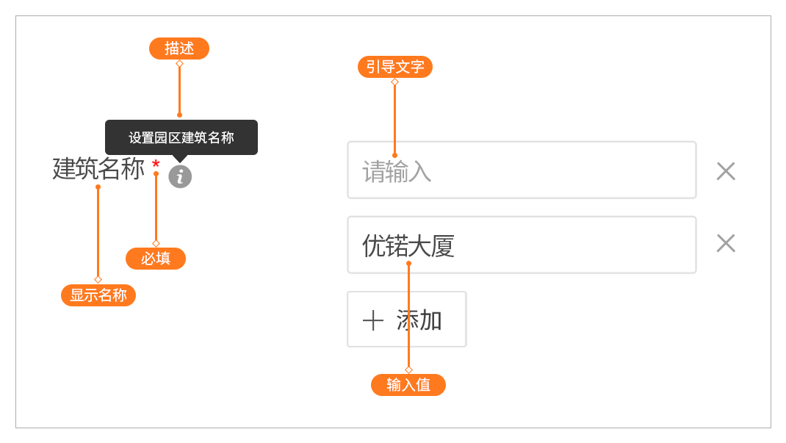

>##### 属性描述
|-|字段名|含义|默认值|描述|必填|
|-|-|-|-|-|-|
|*|type|多行文本|multiple-text| 控件类型 |是|
|*|key|唯一标识|-| 取值控件唯一标识 |是|
|*|label|显示名称| -| - |-|
|*|value|值|Set<string>| 控件值/默认值 |-|
|*|placeholder|占位符|-| - |-|
|*|description|描述|-| - |-|
|*|hidden|隐藏|false| 控件隐藏 |-|
|*|readonly|只读|false| 控件只读 |-|
|*|required|必填|false| 控件必填 |-|
|*|prefix|控件前缀|-| - |-|
|*|suffix|控件后缀|-| - |-|
---

>##### 代码结构
```JSON
{
  "type": "multiple-text", 
  "key": "",
  "label": "多行文本",
  "placeholder": "",
  "description": "",
  "value": [],//Set<string>
  "hidden": false,
  "readonly": false,
  "required": false,
  "prefix": "",
  "suffix": ""
}
```

### 多行数字『 multiple-number 』::配置说明

>##### 控件效果
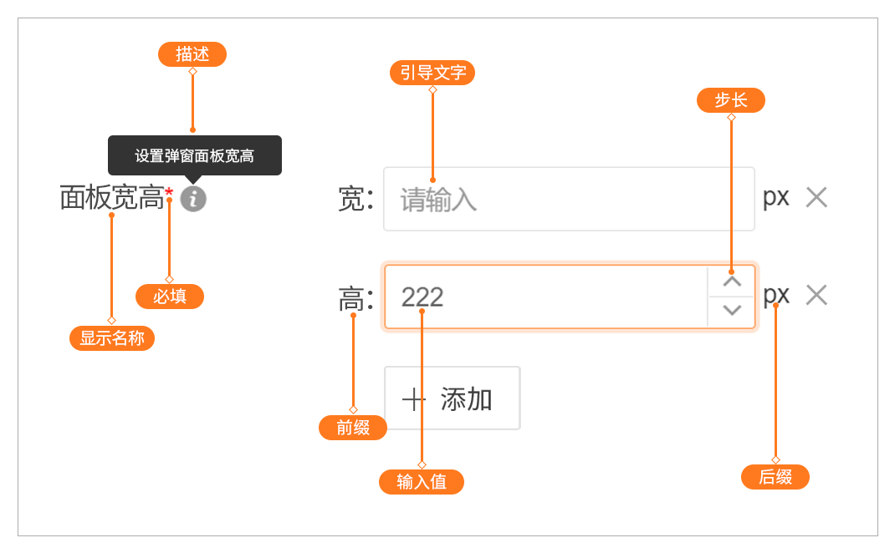

>##### 属性描述
|-|字段名|含义|默认值|描述|必填|
|-|-|-|-|-|-|
|*|type|多行数字|multiple-number| 控件类型 |是|
|*|key|唯一标识|-| 取值控件唯一标识 |是|
|*|label|显示名称| -| - |-|
|*|value|值|Set<number>| 控件值/默认值 |-|
|*|placeholder|占位符|-| - |-|
|*|description|描述|-| - |-|
|*|hidden|隐藏|false| 控件隐藏 |-|
|*|readonly|只读|false| 控件只读 |-|
|*|required|必填|false| 控件必填 |-|
|*|prefix|控件前缀|-| - |-|
|*|suffix|控件后缀|-| - |-|
|max|最大值|10| - |是|
|min|最小值|0| - |是|
|step|步长|1| 数字控件每次增加或减少长度值 |是|

>##### 代码结构
```JSON
{
  "type": "multiple-number", 
  "key": "",
  "label": "多行数字",
  "placeholder": "",
  "description": "",
  "value": [],//Set<number>
  "hidden": false,
  "readonly": false,
  "required": false,
  "prefix": "",
  "suffix": "",
  "max": 10,
  "min": 0,
  "step": 1
}
```

### 多行下拉『 multiple-select 』::配置说明

>##### 控件效果
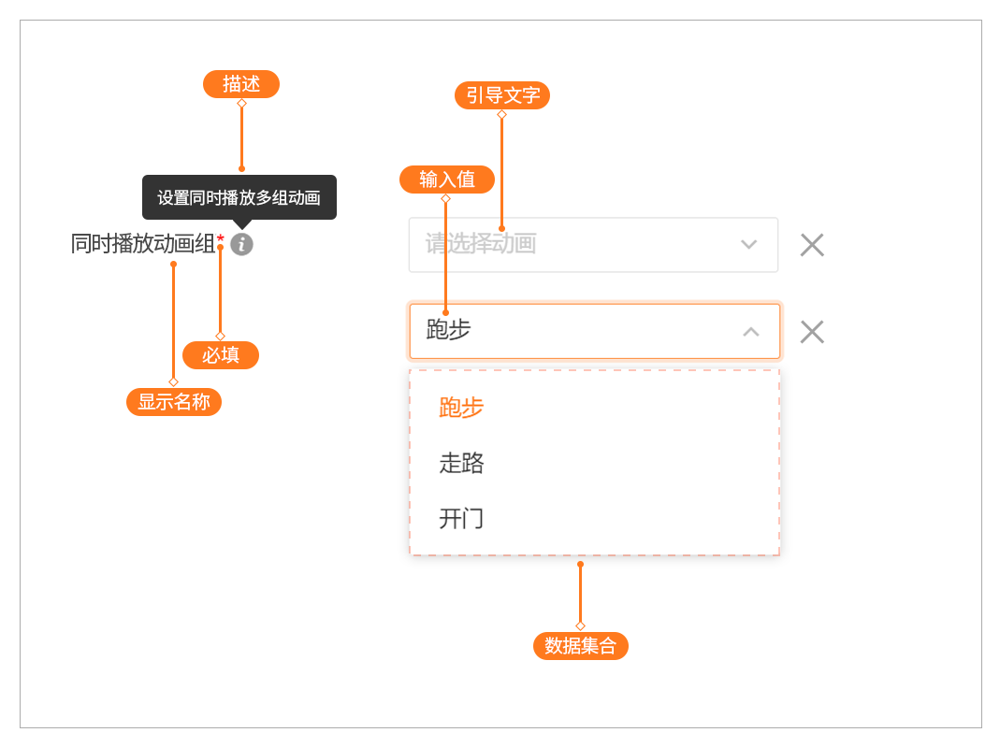

>##### 属性描述
|-|字段名|含义|默认值|描述|必填|
|-|-|-|-|-|-|
|*|type|多行下拉|multiple-select| 控件类型 |是|
|*|key|唯一标识|-| 取值控件唯一标识 |是|
|*|label|显示名称| -| - |-|
|*|value|值|Set<string>| 控件值/默认值 |-|
|*|placeholder|占位符|-| - |-|
|*|description|描述|-| - |-|
|*|hidden|隐藏|false| 控件隐藏 |-|
|*|readonly|只读|false| 控件只读 |-|
|*|required|必填|false| 控件必填 |-|
|*|prefix|控件前缀|-| - |-|
|*|suffix|控件后缀|-| - |-|
||dataset|数据集合|Array<ValueLabelObject>| - |是|

- 数据集 ValueLabelObject
  
  |字段名|含义|默认值|描述|必填|
  |-|-|-|-|-|
  |value|值|-| - |是|
  |label|显示名称|-| - |是|

>##### 代码结构
```JSON
{
  "type": "multiple-select", 
  "key": "",
  "label": "多行下拉",
  "placeholder": "",
  "description": "",
  "value": ["",""],//Set<string>
  "hidden": false,
  "readonly": false,
  "required": false,
  "prefix": "",
  "suffix": "",
  "dataset": [ //dataset 数据集 
    //value 选中值  label 显示名称
    {"value": "api","label": "接口数据"},
    {"value": "static","label": "静态数据"},
    {"value": "digitaltwin","label": "孪生体属性"}
  ]
}
```

### 多行色块『 multiple-color 』::配置说明

>##### 控件效果
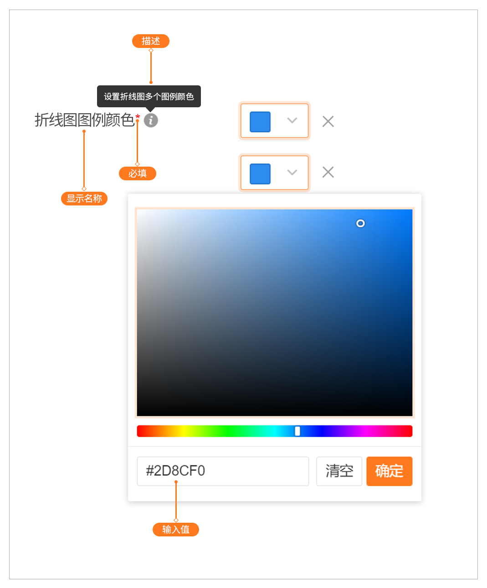
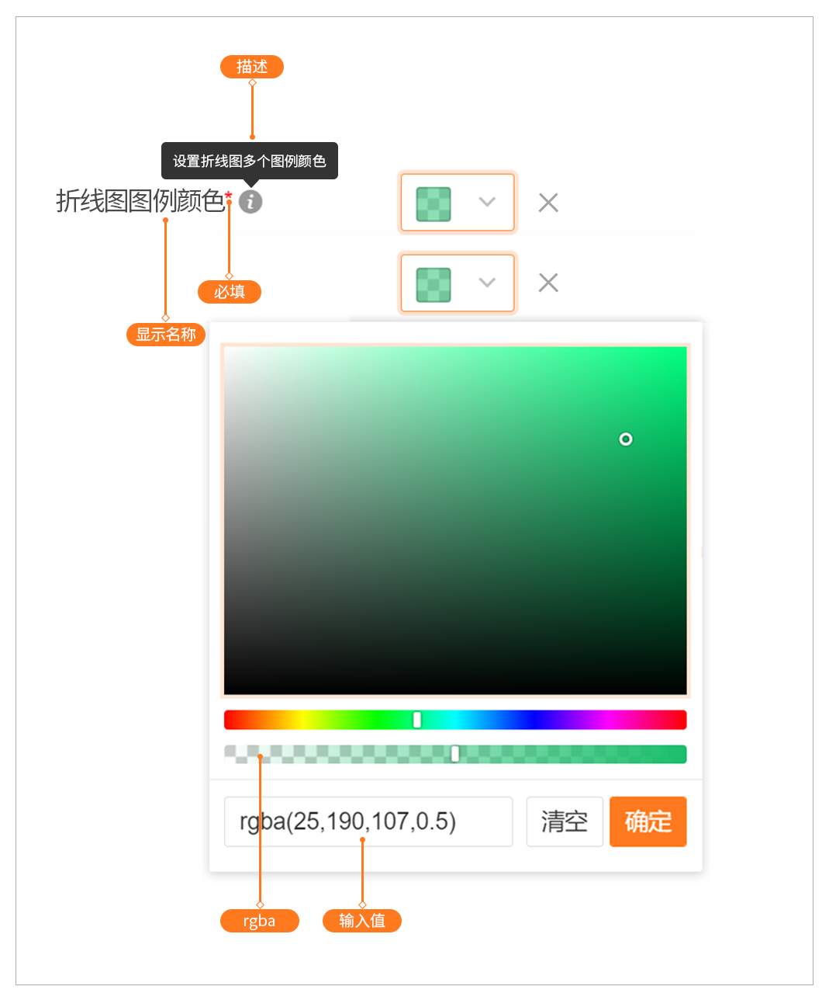

>##### 属性描述
|-|字段名|含义|默认值|描述|必填|
|-|-|-|-|-|-|
|*|type|多行色块|multiple-color| 控件类型 |是|
|*|key|唯一标识|-| 取值控件唯一标识 |是|
|*|label|显示名称| -| - |-|
|*|value|值|Set<string>| 控件值/默认值 |-|
|*|placeholder|占位符|-| - |-|
|*|description|描述|-| - |-|
|*|hidden|隐藏|false| 控件隐藏 |-|
|*|readonly|只读|false| 控件只读 |-|
|*|required|必填|false| 控件必填 |-|
|*|prefix|控件前缀|-| - |-|
|*|suffix|控件后缀|-| - |-|
||rgba|颜色空间|false| RGBA是代表Red（红色）Green（绿色）Blue（蓝色）和Alpha的色彩空间。</br>Alpha通道一般用作不透明度参数。|是|

>##### 代码结构
```JSON
{
  "type": "multiple-color", 
  "key": "",
  "label": "多行色块",
  //"placeholder": "", 不支持的属性
  "description": "",
  "value": ["rgba(113, 23, 23, 1)",""],//Set<string>
  "hidden": false,
  "readonly": false,
  "required": false,
  "prefix": "",
  "suffix": "",
  "rgba": false		
}
```

### 多行开关『 multiple-switch 』::配置说明

>##### 控件效果
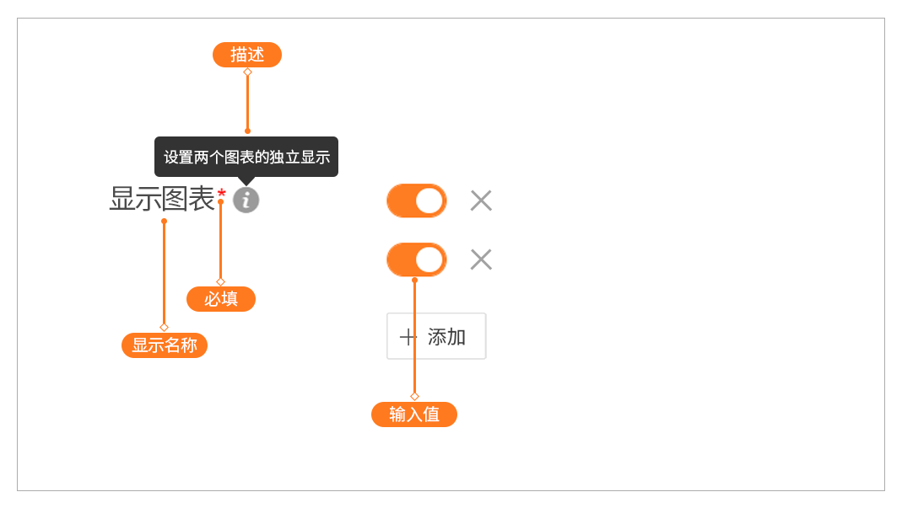

>##### 属性描述
|-|字段名|含义|默认值|描述|必填|
|-|-|-|-|-|-|
|*|type|多行开关|multiple-switch| 控件类型 |是|
|*|key|唯一标识|-| 取值控件唯一标识 |是|
|*|label|显示名称| -| - |-|
|*|value|值|Set<boolean>| 控件值/默认值 |-|
|*|placeholder|占位符|-| - |-|
|*|description|描述|-| - |-|
|*|hidden|隐藏|false| 控件隐藏 |-|
|*|readonly|只读|false| 控件只读 |-|
|*|required|必填|false| 控件必填 |-|
|*|prefix|控件前缀|-| - |-|
|*|suffix|控件后缀|-| - |-|
---

>##### 代码结构
```JSON
{
  "type": "multiple-switch", 
  "key": "",
  "label": "多行开关",
  //"placeholder": "", 不支持的属性
  "description": "",
  "value": [true,false,true],//Set<boolean>
  "hidden": false,
  "readonly": false,
  "required": false,
  "prefix": "",
  "suffix": ""
}
```

### 多行单选『 multiple-radio 』::配置说明

>##### 控件效果
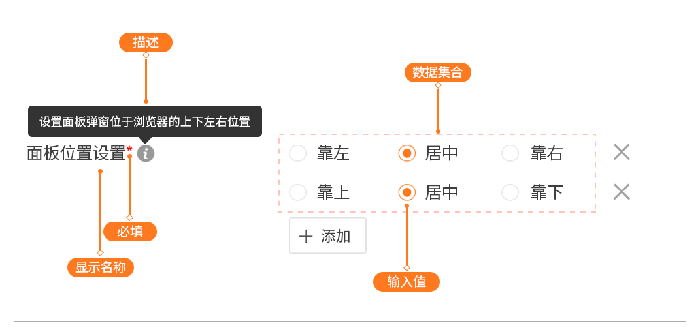

>##### 属性描述
|-|字段名|含义|默认值|描述|必填|
|-|-|-|-|-|-|
|*|type|多行单选|multiple-radio| 控件类型 |是|
|*|key|唯一标识|-| 取值控件唯一标识 |是|
|*|label|显示名称| -| - |-|
|*|value|值|Set<string>| 控件值/默认值 |-|
|*|placeholder|占位符|-| - |-|
|*|description|描述|-| - |-|
|*|hidden|隐藏|false| 控件隐藏 |-|
|*|readonly|只读|false| 控件只读 |-|
|*|required|必填|false| 控件必填 |-|
|*|prefix|控件前缀|-| - |-|
|*|suffix|控件后缀|-| - |-|
||dataset|数据集合|Array<ValueLabelObject>| - |是|

- 数据集 ValueLabelObject
  
  |字段名|含义|默认值|描述|必填|
  |-|-|-|-|-|
  |value|值|-| - |是|
  |label|显示名称|-| - |是|

>##### 代码结构
```JSON
{
  "type": "multiple-radio", 
  "key": "",
  "label": "多行单选",
  //"placeholder": "", 不支持的属性
  "description": "",
  "value": [],//Set<string>
  "hidden": false,
  "readonly": false,
  "required": false,
  "prefix": "",
  "suffix": "",
  "dataset": [ //dataset 数据集 
    //value 选中值  label 显示名称
    {"value": "api","label": "接口数据"},
    {"value": "static","label": "静态数据"},
    {"value": "digitaltwin","label": "孪生体属性"}
  ]
}
```

### 多行多选『 multiple-checkbox 』::配置说明

>##### 控件效果
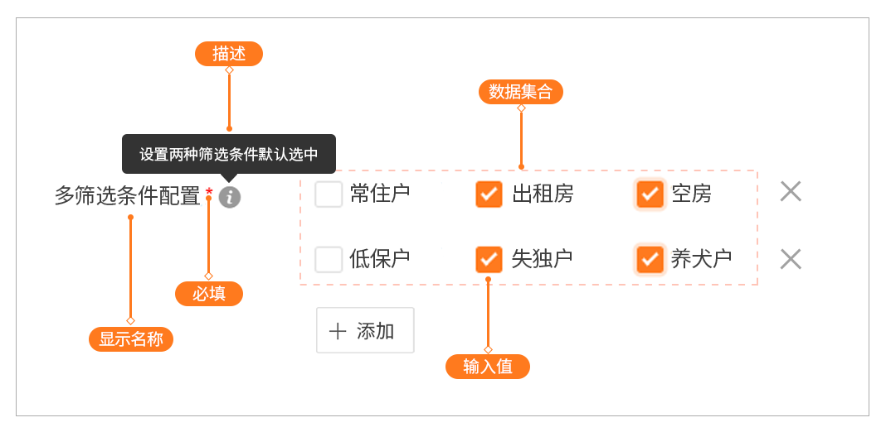

>##### 属性描述
|-|字段名|含义|默认值|描述|必填|
|-|-|-|-|-|-|
|*|type|多行多选|multiple-checkbox| 控件类型 |是|
|*|key|唯一标识|-| 取值控件唯一标识 |是|
|*|label|显示名称| -| - |-|
|*|value|值|Set<Set<string>>| 控件值/默认值 |-|
|*|placeholder|占位符|-| - |-|
|*|description|描述|-| - |-|
|*|hidden|隐藏|false| 控件隐藏 |-|
|*|readonly|只读|false| 控件只读 |-|
|*|required|必填|false| 控件必填 |-|
|*|prefix|控件前缀|-| - |-|
|*|suffix|控件后缀|-| - |-|
||dataset|数据集合|Array<ValueLabelObject>| - |是|

- 数据集 ValueLabelObject
  
  |字段名|含义|默认值|描述|必填|
  |-|-|-|-|-|
  |value|值|-| - |是|
  |label|显示名称|-| - |是|

>##### 代码结构
```JSON
{
  "type": "multiple-checkbox", 
  "key": "",
  "label": "多行多选",
  //"placeholder": "", 不支持的属性
  "description": "",
  "value": [["",""],[""]],//Set<Set<string>>
  "hidden": false,
  "readonly": false,
  "required": false,
  "prefix": "",
  "suffix": "",
  "dataset": [ //dataset 数据集 
    //value 选中值  label 显示名称
    {"value": "api","label": "接口数据"},
    {"value": "static","label": "静态数据"},
    {"value": "digitaltwin","label": "孪生体属性"}
  ]
}
```

### 多行键值『 multiple-keyvalue 』::配置说明

>##### 控件效果
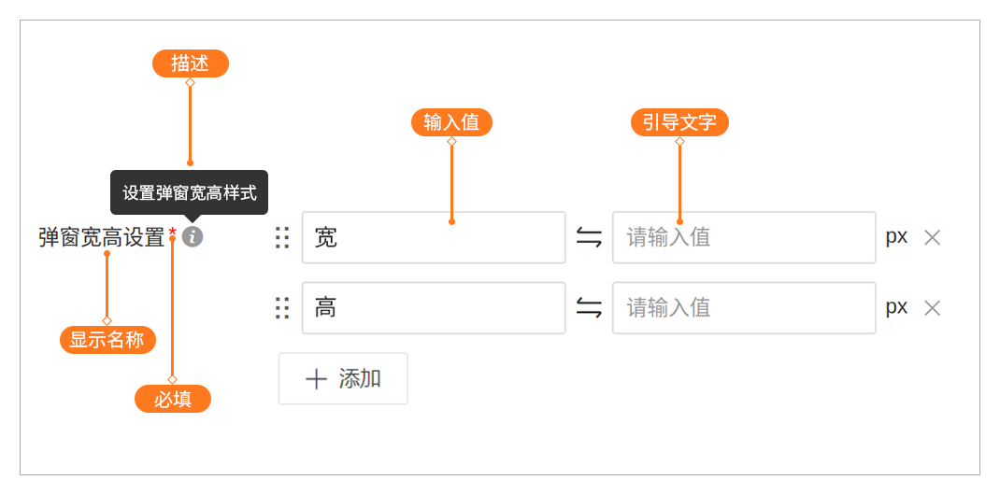

>##### 属性描述
|-|字段名|含义|默认值|描述|必填|
|-|-|-|-|-|-|
|*|type|多行键值|multiple-keyvalue| 控件类型 |是|
|*|key|唯一标识|-| 取值控件唯一标识 |是|
|*|label|显示名称| -| - |-|
|*|value|值|Set<KeyValueObject> ⬇| 控件值/默认值 |-|
|*|placeholder|占位符|-| - |-|
|*|description|描述|-| - |-|
|*|hidden|隐藏|false| 控件隐藏 |-|
|*|readonly|只读|false| 控件只读 |-|
|*|required|必填|false| 控件必填 |-|
|*|prefix|控件前缀|-| - |-|
|*|suffix|控件后缀|-| - |-|

- 值 KeyValueObject
  
  |字段名|含义|默认值|描述|必填|
  |-|-|-|-|-|
  |key|keyvalue 控件的值|-| - |-|
  |value|keyvalue 控件的值|-| - |-|

>##### 代码结构
```JSON
{
  "type": "multiple-keyvalue", 
  "key": "",
  "label": "多行键值",
  "placeholder": "",
  "description": "",
  "value": [
      {"key":"","value":""},
      {"key":"","value":""}
    ],//Set<KeyValueObject>
  "hidden": false,
  "readonly": false,
  "required": false,
  "prefix": "",
  "suffix": ""
}
```

### 多行容器『 multiple-container 』::配置说明

>##### 控件效果
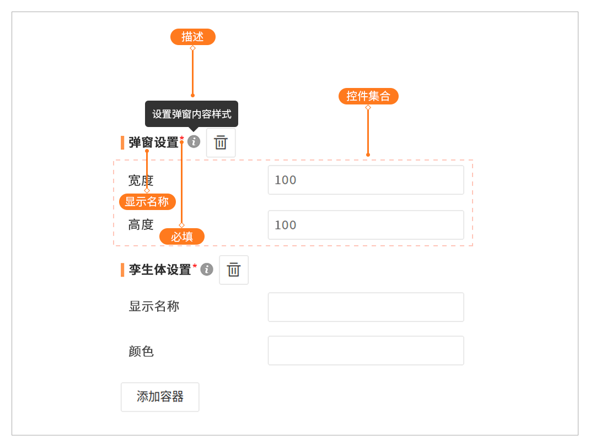

>##### 属性描述
|-|字段名|含义|默认值|描述|必填|
|-|-|-|-|-|-|
|*|type|多行容器|multiple-container| 控件类型 |是|
|*|key|唯一标识|-| 取值控件唯一标识 |是|
|*|label|显示名称| -| - |-|
|*|value|值|Set<ContainerXControlObject> ⬇| 控件值/默认值 |-|
|*|placeholder|占位符|-| - |-|
|*|description|描述|-| - |-|
|*|prefix|控件前缀|-| - |-|
|*|suffix|控件后缀|-| - |-|
||groups|控件集合|Array<XControlObject>| XControlObject是指 除了: *** 所有控件 |-|

- 值 ContainerXControlObject
  
  |字段名|含义|默认值|描述|必填|
  |-|-|-|-|-|
  |XControlKey| groups 内控件的唯一标识|-| - |-|
  |XControlValue|groups 内控件的值|string/Array<string>/boolean| - |-|

>##### 代码结构
```JSON
{
  "type": "multiple-container", 
  "key": "",
  "label": "多行容器",
  //"placeholder": "", 不支持的属性
  "description": "",
  "value": [
      {"动态key1":"动态值Value1","动态key2":"动态值Value2[]"},
      {"动态key1":"动态值Value1","动态key2":"动态值Value2[]"}
    ],//Set<ContainerXControlObject>
  "prefix": "",
  "suffix": "",
  "groups": []//控件;不支持的控件有:
}
```

### 联动单选『 linkage-radio 』::配置说明

>##### 控件效果
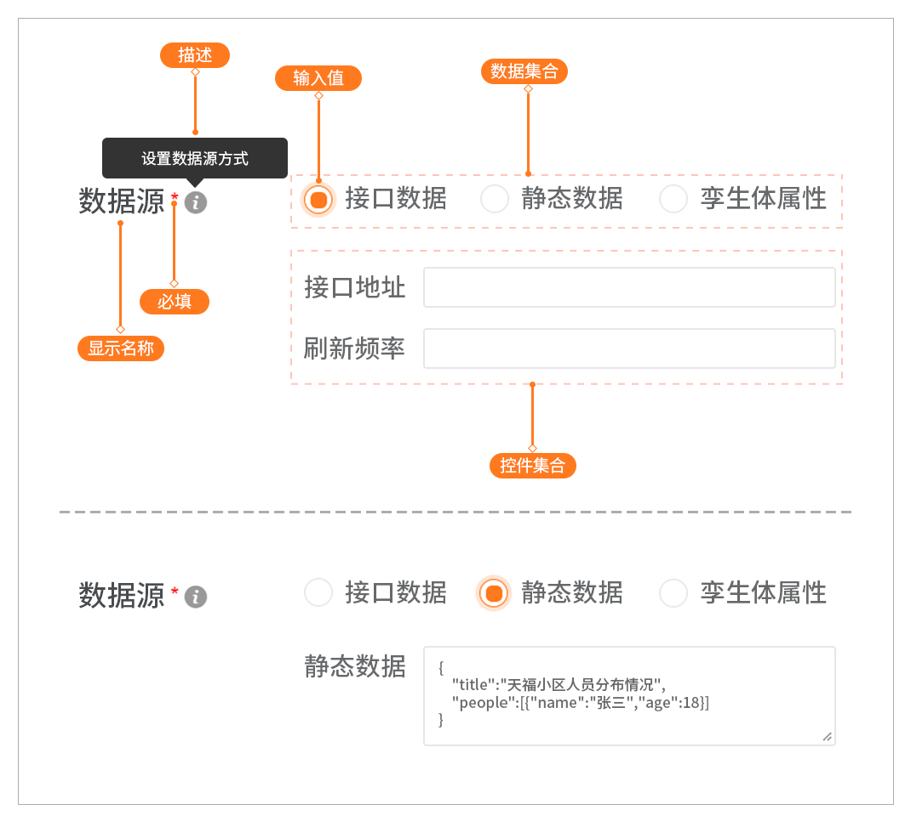

>##### 属性描述
|-|字段名|含义|默认值|描述|必填|
|-|-|-|-|-|-|
|*|type|联动单选|linkage-radio| 控件类型 |是|
|*|key|唯一标识|-| 取值控件唯一标识 |是|
|*|label|显 示名称| -| - |-|
|*|value|值| - | 控件值/默认值 |-|
|*|~~placeholder~~|~~占位符~~|-| - |-|
|*|description|描述|-| - |-|
|*|prefix|控件前缀|-| - |-|
|*|suffix|控件后缀|-| - |-|
||groups|控件集合|Array<XControlObject>| XControlObject是指 除了: *** 所有控件 |-|
||linkage|联动关系|Array<RadioObject> ⬇| - |-|
||dataset|数据集合|Array<ValueLabelObject> ⬇| - |-|

- 联动关系 RadioObject
  
  |字段名|含义|默认值|描述|必填|
  |-|-|-|-|-|
  |key|唯一标识|-| - |是|
  |label|显示名称|-| - |是|
  |value|值|-| - |是|
  |hidden|隐藏|false| - |是|
  |readonly|只读|false| - |是|
  
- 数据集 ValueLabelObject
  
  |字段名|含义|默认值|描述|必填|
  |-|-|-|-|-|
  |value|值|-| - |是|
  |label|显示名称|-| - |是|

>##### 代码结构
```JSON
{
  "type": "linkage-checkbox",
  "key": "",
  "label": "联动多选",
  "value": "api", // 当前控件的数值
  //"placeholder": "", 不支持的属性
  "description": "",
  "prefix": "",
  "suffix": "",
  "linkage":[//读取groups元素控件的结果
        {"key":"text","label":"接口数据","value":"api","hidden":false,"readonly":false},
        {"key":"number","label":"静态数据","value":"static","hidden":false,"readonly":false},
        {"key":"select","label":"孪生体属性","value":"digitaltwin","hidden":false,"readonly":false}
   ],
  "groups": [
    //   {}
    //   {}
    //   ...
  ],//控件;不支持的控件有:
  "dataset": [ //dataset 数据集 
    //value 选中值  label 显示名称
    {"value": "api","label": "接口数据"},
    {"value": "static","label": "静态数据"},
    {"value": "digitaltwin","label": "孪生体属性"}
  ]
}
```

### 联动下拉『 linkage-select 』::配置说明

>##### 控件效果
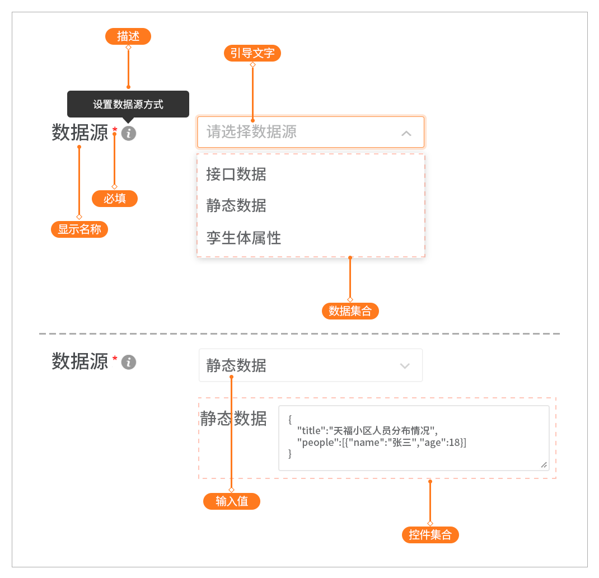

>##### 属性描述
|-|字段名|含义|默认值|描述|必填|
|-|-|-|-|-|-|
|*|type|联动下拉|linkage-select| 控件类型 |是|
|*|key|唯一标识|-| 取值控件唯一标识 |是|
|*|label|显示名称| -| - |-|
|*|value|值| - | 控件值/默认值 |-|
|*|placeholder|占位符|-| - |-|
|*|description|描述|-| - |-|
|*|prefix|控件前缀|-| - |-|
|*|suffix|控件后缀|-| - |-|
||groups|控件集合|Array<XControlObject>| XControlObject是指 除了: *** 所有控件 |-|
||linkage|联动关系|Array<SelectObject> <a href="#mubiao">点击文本</a> ⬇| - |-|
||dataset|数据集合|Array<ValueLabelObject> ⬇| - |-|

- 联动关系 SelectObject
  
  |字段名|含义|默认值|描述|必填|
  |-|-|-|-|-|
  |key|唯一标识|-| - |是|
  |label|显示名称|-| - |是|
  |value|值|-| - |是|
  |hidden|隐藏|false| - |是|
  |readonly|只读|false| - |是|
  
- 数据集 ValueLabelObject
  
  |字段名|含义|默认值|描述|必填|
  |-|-|-|-|-|
  |value|值|-| - |是|
  |label|显示名称|-| - |是|

>##### 代码结构
```JSON
{
  "type": "linkage-select",
  "key": "",
  "label": "联动下拉",
  "value": "api", // 当前控件的数值
  "placeholder": "",
  "description": "",
  "prefix": "",
  "suffix": "",
  "linkage":[//读取groups元素控件的结果
        {"key":"text","label":"接口数据","value":"api","hidden":false,"readonly":false},
        {"key":"number","label":"静态数据","value":"static","hidden":false,"readonly":false},
        {"key":"select","label":"孪生体属性","value":"digitaltwin","hidden":false,"readonly":false}
   ],
  "groups": [
    //   {}
    //   {}
    //   ...
  ],//控件;不支持的控件有:
  "dataset": [ //dataset 数据集 
    //value 选中值  label 显示名称
    {"value": "api","label": "接口数据"},
    {"value": "static","label": "静态数据"},
    {"value": "digitaltwin","label": "孪生体属性"}
  ]
}
```
<h2 id="mubiao">目标位置</h2>

### 联动开关『 linkage-switch 』::配置说明

>##### 控件效果
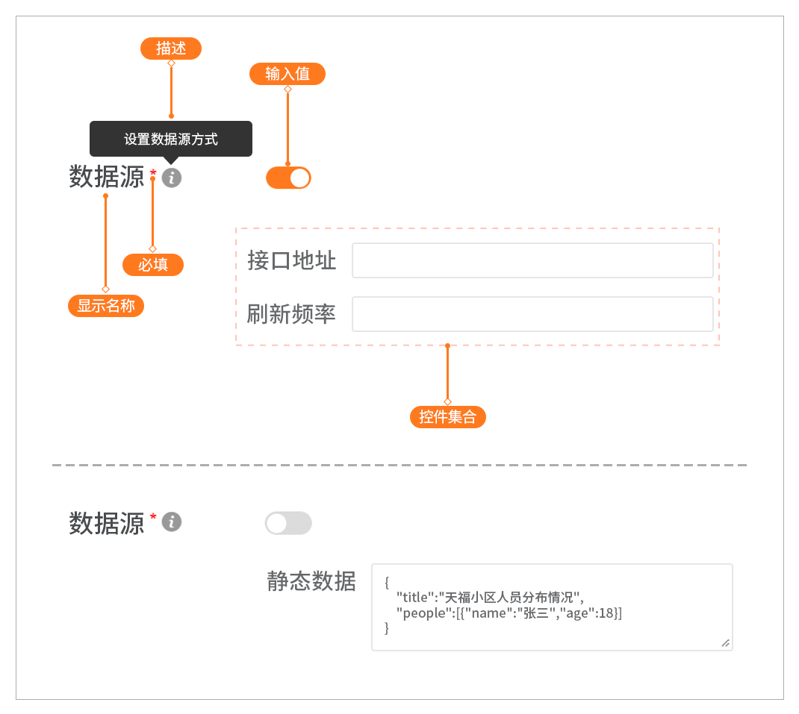

>##### 属性描述
|-|字段名|含义|默认值|描述|必填|
|-|-|-|-|-|-|
|*|type|联动开关|linkage-switch| 控件类型 |是|
|*|key|唯一标识|-| 取值控件唯一标识 |是|
|*|label|显示名称| -| - |-|
|*|value|值| Boolean:true | 控件值/默认值 |-|
|*|~~placeholder~~|~~占位符~~|-| - |-|
|*|description|描述|-| - |-|
|*|prefix|控件前缀|-| - |-|
|*|suffix|控件后缀|-| - |-|
||groups|控件集合|Array<XControlObject>| XControlObject是指 除了: *** 所有控件 |-|
||linkage|联动关系|Array<SwitchObject> ⬇| - |-|

- 联动关系 SwitchObject
  
  |字段名|含义|默认值|描述|必填|
  |-|-|-|-|-|
  |key|唯一标识|-| - |是|
  |label|显示名称|-| - |是|
  |value|值|Boolean| - |是|
  |hidden|隐藏|false| - |是|
  |readonly|只读|false| - |是|

>##### 代码结构
```JSON
{
  "type": "linkage-switch",
  "key": "",
  "label": "联动开关",
  "value": "api", // 当前控件的数值
  //"placeholder": "", 不支持的属性
  "description": "",
  "prefix": "",
  "suffix": "",
  "linkage":[//读取groups元素控件的结果
        {"key":"text","label":"接口数据","value":true,"hidden":false,"readonly":false},
        {"key":"number","label":"静态数据","value":false,"hidden":false,"readonly":false},
        {"key":"select","label":"孪生体属性","value":true,"hidden":false,"readonly":false}
   ],
  "groups": [
    //   {}
    //   {}
    //   ...
  ] //控件;不支持的控件有:
}
```

### 联动多选『 linkage-checkbox 』::配置说明

>##### 控件效果
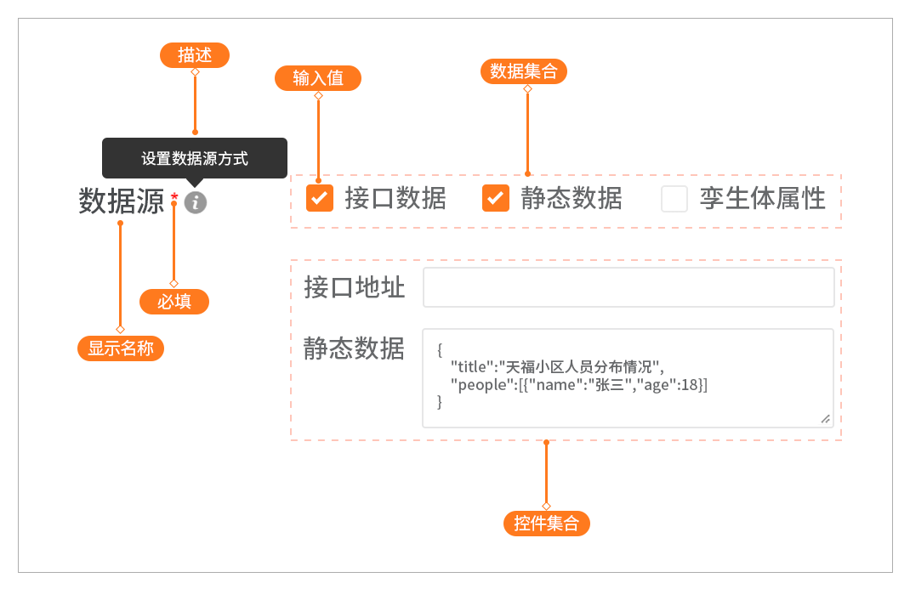

>##### 属性描述
|-|字段名|含义|默认值|描述|必填|
|-|-|-|-|-|-|
|*|type|联动多选|linkage-checkbox| 控件类型 |是|
|*|key|唯一标识|-| 取值控件唯一标识 |是|
|*|label|显示名称| -| - |-|
|*|value|值| Array<string> | 控件值/默认值 |-|
|*|placeholder|占位符|-| - |-|
|*|description|描述|-| - |-|
|*|prefix|控件前缀|-| - |-|
|*|suffix|控件后缀|-| - |-|
||groups|控件集合|Array<XControlObject>| XControlObject是指 除了: *** 所有控件 |-|
||linkage|联动关系|Array<CheckboxObject> ⬇| - |-|
||dataset|数据集合|Array<ValueLabelObject> ⬇| - |-|

- 联动关系 CheckboxObject
  
  |字段名|含义|默认值|描述|必填|
  |-|-|-|-|-|
  |key|唯一标识|-| - |是|
  |label|显示名称|-| - |是|
  |value|值|-| - |是|
  |hidden|隐藏|false| - |是|
  |readonly|只读|false| - |是|
  
- 数据集 ValueLabelObject
  
  |字段名|含义|默认值|描述|必填|
  |-|-|-|-|-|
  |value|值|-| - |是|
  |label|显示名称|-| - |是|

>##### 代码结构
```JSON
{
  "type": "linkage-checkbox",
  "key": "",
  "label": "联动多选",
  "value": ["api","static"], // 当前控件的数值
  //"placeholder": "", 不支持的属性
  "description": "",
  "prefix": "",
  "suffix": "",
  "linkage":[//读取groups元素控件的结果
        {"key":"text","label":"接口数据","value":"api","hidden":false,"readonly":false},
        {"key":"number","label":"静态数据","value":"static","hidden":false,"readonly":false},
        {"key":"select","label":"孪生体属性","value":"digitaltwin","hidden":false,"readonly":false}
   ],
  "groups": [
    //   {}
    //   {}
    //   ...
  ],//控件;不支持的控件有:
  "dataset": [ //dataset 数据集 
    //value 选中值  label 显示名称
    {"value": "api","label": "接口数据"},
    {"value": "static","label": "静态数据"},
    {"value": "digitaltwin","label": "孪生体属性"}
  ]
}
```

### 条件选择器『 selector 』::配置说明

>##### 控件效果
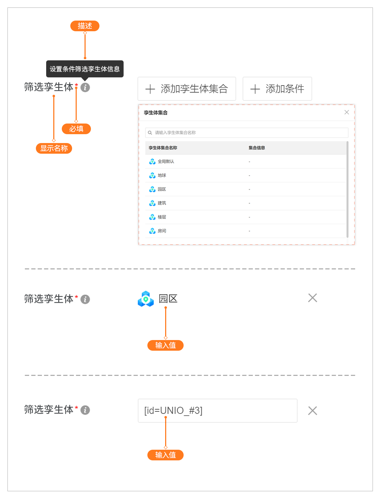

>##### 属性描述
|-|字段名|含义|默认值|描述|必填|
|-|-|-|-|-|-|
|*|type|条件选择器|selector| 控件类型 |是|
|*|key|唯一标识|-| 取值控件唯一标识 |是|
|*|label|显示名称| -| - |-|
|*|value|值| SelectorObject ⬇| 控件值/默认值 |-|
|*|placeholder|引导文字|-| - |-|
|*|description|描述|-| - |-|
|*|hidden|隐藏|false| 控件隐藏 |-|
|*|readonly|只读|false| 控件只读 |-|
|*|required|必填|false| 控件必填 |-|
|*|prefix|控件前缀|-| - |-|
|*|suffix|控件后缀|-| - |-|

- 值 SelectorObject
  
  |字段名|含义|默认值|描述|必填|
  |-|-|-|-|-|
  |condition| 条件值 | TwinObject ⬇或string | 条件为孪生体集合时为TwinObject，为条件表达式时是string |-|

- 孪生体集合对象 TwinObject
  |字段名|含义|默认值|描述|必填|
  |-|-|-|-|-|
  |uid| 孪生体集合唯一标识 | string | |-|
  |name| 孪生体集合名称 | string | |-|
  |type| 图标类型 | number | 此处默认为0|-|  

>##### 代码结构
```JSON
{
  "key": "",
  "type": "selector",
  "label": "",
  "placeholder": "",
  "description": "",
  "value": {
    "condition":{
        "uid": "C94B349DA87000012FD57A40633E7C50",
        "name": "园区",
        "type": 0
      },
   },
  "hidden": false,
  "readonly": false,
  "required": false,
  "prefix": "",
  "suffix": ""
} 

```

### 条件文本『 selector-text 』::配置说明

>##### 控件效果


>##### 属性描述
|-|字段名|含义|默认值|描述|必填|
|-|-|-|-|-|-|
|*|type|条件文本|selector-text| 控件类型 |是|
|*|key|唯一标识|-| 取值控件唯一标识 |是|
|*|label|显示名称| -| - |-|
|*|value|值| SelectorObject ⬇| 控件值/默认值 |-|
|*|placeholder|引导文字|-| - |-|
|*|description|描述|-| - |-|
|*|hidden|隐藏|false| 控件隐藏 |-|
|*|readonly|只读|false| 控件只读 |-|
|*|required|必填|false| 控件必填 |-|
|*|prefix|控件前缀|-| - |-|
|*|suffix|控件后缀|-| - |-|

- 值 SelectorObject
  
  |字段名|含义|默认值|描述|必填|
  |-|-|-|-|-|
  |condition| 条件值 | TwinObject ⬇或string | 条件为孪生体集合时为TwinObject，为条件表达式时是string |-|
  |value| 文本值 | string |  |-|

- 孪生体集合对象 TwinObject
  |字段名|含义|默认值|描述|必填|
  |-|-|-|-|-|
  |uid| 孪生体集合唯一标识 | string | |-|
  |name| 孪生体集合名称 | string | |-|
  |type| 图标类型 | number | 此处默认为0|-|  

>##### 代码结构
```JSON
{
  "key": "",
  "type": "selector-text",
  "label": "",
  "placeholder": "",
  "description": "",
  "value": {
     "condition":{
        "uid": "C94B349DA87000012FD57A40633E7C50",
        "name": "园区",
        "type": 0
      },
     "value":""
   },
  "hidden": false,
  "readonly": false,
  "required": false,
  "prefix": "",
  "suffix": ""
} 

```

### 条件下拉『 selector-select 』::配置说明

>##### 控件效果
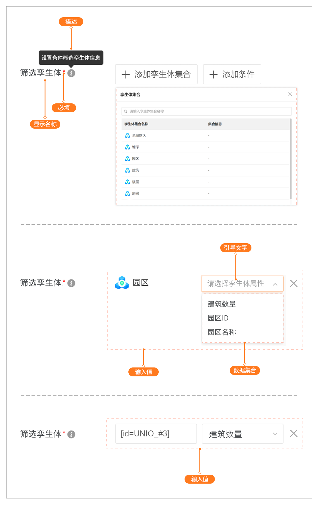

>##### 属性描述
|-|字段名|含义|默认值|描述|必填|
|-|-|-|-|-|-|
|*|type|条件下拉|selector-select| 控件类型 |是|
|*|key|唯一标识|-| 取值控件唯一标识 |是|
|*|label|显示名称| -| - |-|
|*|value|值| SelectorObject ⬇| 控件值/默认值 |-|
|*|placeholder|引导文字|-| - |-|
|*|description|描述|-| - |-|
|*|hidden|隐藏|false| 控件隐藏 |-|
|*|readonly|只读|false| 控件只读 |-|
|*|required|必填|false| 控件必填 |-|
|*|prefix|控件前缀|-| - |-|
|*|suffix|控件后缀|-| - |-|
|*|dataset|数据集合|Array<ValueLabelObject>| - |是|

- 值 SelectorObject
  
  |字段名|含义|默认值|描述|必填|
  |-|-|-|-|-|
  |condition| 条件值 | TwinObject ⬇或string | 条件为孪生体集合时为TwinObject，为条件表达式时是string |-|
  |value| 下拉值 | string |  |-|
  |label| 下拉文本 | string |  |-|

- 孪生体集合对象 TwinObject
  |字段名|含义|默认值|描述|必填|
  |-|-|-|-|-|
  |uid| 孪生体集合唯一标识 | string | |-|
  |name| 孪生体集合名称 | string | |-|
  |type| 图标类型 | number | 此处默认为0|-|  

- 数据集 ValueLabelObject
  
  |字段名|含义|默认值|描述|必填|
  |-|-|-|-|-|
  |label|显示名称|-| - |是|
  |value|值|-| - |是|

>##### 代码结构
```JSON
{
  "key": "",
  "type": "selector-select",
  "label": "",
  "placeholder": "",
  "description": "",
  "value": {
     "condition":{
        "uid": "C94B349DA87000012FD57A40633E7C50",
        "name": "园区",
        "type": 0
      },
     "value":"",
     "label":""
   },
  "hidden": false,
  "readonly": false,
  "required": false,
  "prefix": "",
  "suffix": "",
  "dataset": [ //dataset 数据集 
    //value 选中值  label 显示名称
    {"value": "api","label": "接口数据"},
    {"value": "static","label": "静态数据"},
    {"value": "digitaltwin","label": "孪生体属性"}
  ]
} 

```

### 条件色块『 selector-color 』::配置说明

>##### 控件效果
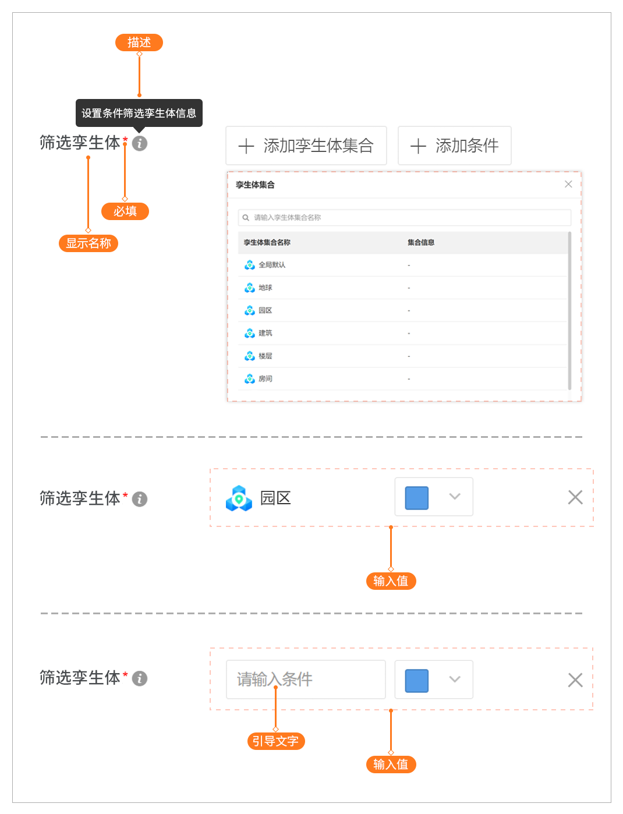

>##### 属性描述
|-|字段名|含义|默认值|描述|必填|
|-|-|-|-|-|-|
|*|type|条件色块|selector-color| 控件类型 |是|
|*|key|唯一标识|-| 取值控件唯一标识 |是|
|*|label|显示名称| -| - |-|
|*|value|值| SelectorObject ⬇| 控件值/默认值 |-|
|*|placeholder|引导文字|-| - |-|
|*|description|描述|-| - |-|
|*|hidden|隐藏|false| 控件隐藏 |-|
|*|readonly|只读|false| 控件只读 |-|
|*|required|必填|false| 控件必填 |-|
|*|prefix|控件前缀|-| - |-|
|*|suffix|控件后缀|-| - |-|
||rgba|颜色空间|false| RGBA是代表Red（红色）Green（绿色）Blue（蓝色）和Alpha的色彩空间。</br>Alpha通道一般用作不透明度参数。|是|

- 值 SelectorObject
  
  |字段名|含义|默认值|描述|必填|
  |-|-|-|-|-|
  |condition| 条件值 | TwinObject ⬇或string | 条件为孪生体集合时为TwinObject，为条件表达式时是string |-|
  |value| 色块值 | RGBA |  |-|

- 孪生体集合对象 TwinObject
  |字段名|含义|默认值|描述|必填|
  |-|-|-|-|-|
  |uid| 孪生体集合唯一标识 | string | |-|
  |name| 孪生体集合名称 | string | |-|
  |type| 图标类型 | number | 此处默认为0|-|  

>##### 代码结构
```JSON
{
  "key": "",
  "type": "selector-color",
  "label": "",
  "placeholder": "",
  "description": "",
  "value": {
     "condition":{
        "uid": "C94B349DA87000012FD57A40633E7C50",
        "name": "园区",
        "type": 0
      },
     "value":""
   },
  "hidden": false,
  "readonly": false,
  "required": false,
  "prefix": "",
  "suffix": "",
  "rgba":false
} 

```

### 条件键值『 selector-keyvalue 』::配置说明

>##### 控件效果
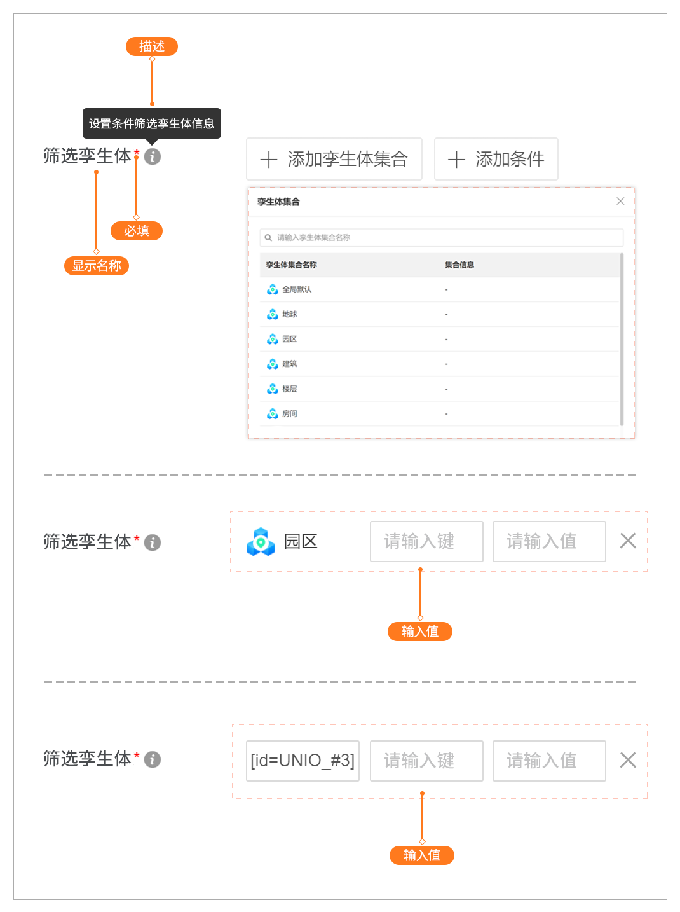

>##### 属性描述
|-|字段名|含义|默认值|描述|必填|
|-|-|-|-|-|-|
|*|type|条件键值|selector-keyvalue| 控件类型 |是|
|*|key|唯一标识|-| 取值控件唯一标识 |是|
|*|label|显示名称| -| - |-|
|*|value|值| SelectorObject ⬇| 控件值/默认值 |-|
|*|placeholder|引导文字|-| - |-|
|*|description|描述|-| - |-|
|*|hidden|隐藏|false| 控件隐藏 |-|
|*|readonly|只读|false| 控件只读 |-|
|*|required|必填|false| 控件必填 |-|
|*|prefix|控件前缀|-| - |-|
|*|suffix|控件后缀|-| - |-|

- 值 SelectorObject
  
  |字段名|含义|默认值|描述|必填|
  |-|-|-|-|-|
  |condition| 条件值 | TwinObject ⬇或string | 条件为孪生体集合时为TwinObject，为条件表达式时是string |-|
  |key| - | - |  |-|
  |value| - | - |  |-|

- 孪生体集合对象 TwinObject
  |字段名|含义|默认值|描述|必填|
  |-|-|-|-|-|
  |uid| 孪生体集合唯一标识 | string | |-|
  |name| 孪生体集合名称 | string | |-|
  |type| 图标类型 | number | 此处默认为0|-|  

>##### 代码结构
```JSON
{
  "key": "",
  "type": "selector-keyvalue",
  "label": "",
  "placeholder": "",
  "description": "",
  "value": {
     "condition":{
        "uid": "C94B349DA87000012FD57A40633E7C50",
        "name": "园区",
        "type": 0
     },
     "key":"",
     "value":""
   },
  "hidden": false,
  "readonly": false,
  "required": false,
  "prefix": "",
  "suffix": ""
} 

```

### 条件标记『 selector-attachment 』::配置说明

>##### 控件效果
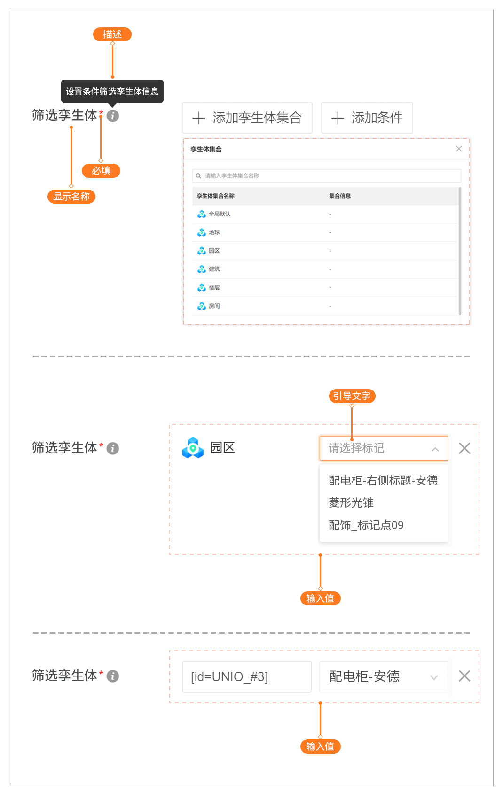

>##### 属性描述
|-|字段名|含义|默认值|描述|必填|
|-|-|-|-|-|-|
|*|type|条件标记|selector-attachment| 控件类型 |是|
|*|key|唯一标识|-| 取值控件唯一标识 |是|
|*|label|显示名称| -| - |-|
|*|value|值| SelectorObject ⬇| 控件值/默认值 |-|
|*|placeholder|引导文字|-| - |-|
|*|description|描述|-| - |-|
|*|hidden|隐藏|false| 控件隐藏 |-|
|*|readonly|只读|false| 控件只读 |-|
|*|required|必填|false| 控件必填 |-|
|*|prefix|控件前缀|-| - |-|
|*|suffix|控件后缀|-| - |-|

- 值 SelectorObject
  
  |字段名|含义|默认值|描述|必填|
  |-|-|-|-|-|
   |condition| 条件值 | TwinObject ⬇或string | 条件为孪生体集合时为TwinObject，为条件表达式时是string |-|
  |value| 标记值 | string |  |-|

- 孪生体集合对象 TwinObject
  |字段名|含义|默认值|描述|必填|
  |-|-|-|-|-|
  |uid| 孪生体集合唯一标识 | string | |-|
  |name| 孪生体集合名称 | string | |-|
  |type| 图标类型 | number | 此处默认为0|-|  

>##### 代码结构
```JSON
{
  "key": "",
  "type": "selector-attachment",
  "label": "",
  "placeholder": "",
  "description": "",
  "value": {
     "condition":{
        "uid": "C94B349DA87000012FD57A40633E7C50",
        "name": "园区",
        "type": 0
     },
     "value":""
   },
  "hidden": false,
  "readonly": false,
  "required": false,
  "prefix": "",
  "suffix": ""
} 

```

### 条件操作集『 selector-action 』::配置说明

>##### 控件效果
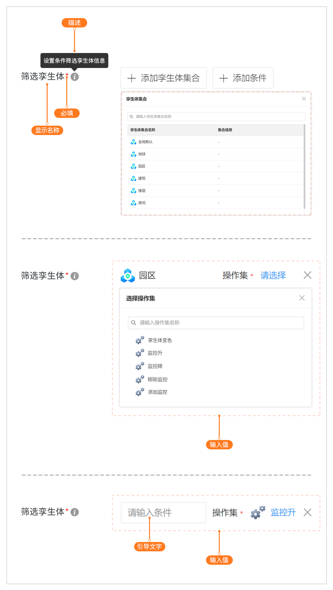

>##### 属性描述
|-|字段名|含义|默认值|描述|必填|
|-|-|-|-|-|-|
|*|type|条件操作集|selector-action| 控件类型 |是|
|*|key|唯一标识|-| 取值控件唯一标识 |是|
|*|label|显示名称| -| - |-|
|*|value|值| SelectorObject ⬇| 控件值/默认值 |-|
|*|placeholder|引导文字|-| - |-|
|*|description|描述|-| - |-|
|*|hidden|隐藏|false| 控件隐藏 |-|
|*|readonly|只读|false| 控件只读 |-|
|*|required|必填|false| 控件必填 |-|
|*|prefix|控件前缀|-| - |-|
|*|suffix|控件后缀|-| - |-|

- 值 SelectorObject
  
  |字段名|含义|默认值|描述|必填|
  |-|-|-|-|-|
  |condition| 条件值 | TwinObject ⬇或string | 条件为孪生体集合时为TwinObject，为条件表达式时是string |-|
  |value| 操作集值 | string |  |-|

- 孪生体集合对象 TwinObject
  |字段名|含义|默认值|描述|必填|
  |-|-|-|-|-|
  |uid| 孪生体集合唯一标识 | string | |-|
  |name| 孪生体集合名称 | string | |-|
  |type| 图标类型 | number | 此处默认为0|-|  

>##### 代码结构
```JSON
{
  "key": "",
  "type": "selector-action",
  "label": "",
  "placeholder": "",
  "description": "",
  "value": {
     "condition":{
        "uid": "C94B349DA87000012FD57A40633E7C50",
        "name": "园区",
        "type": 0
     },
     "value":""
   },
  "hidden": false,
  "readonly": false,
  "required": false,
  "prefix": "",
  "suffix": ""
} 

```

### 多行选择器『 multiple-selector 』::配置说明

>##### 控件效果
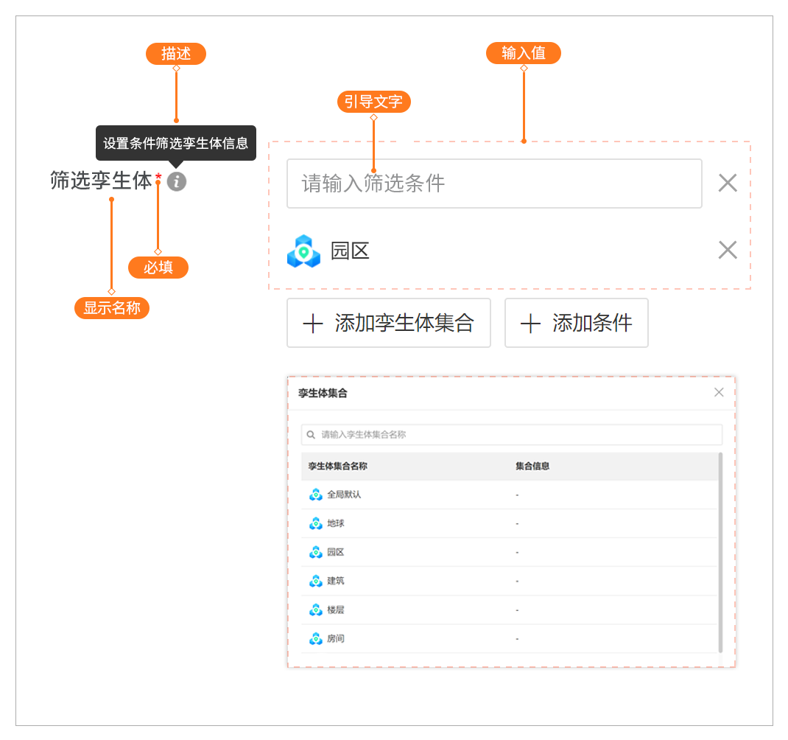

>##### 属性描述
|-|字段名|含义|默认值|描述|必填|
|-|-|-|-|-|-|
|*|type|多行选择器|multiple-selector| 控件类型 |是|
|*|key|唯一标识|-| 取值控件唯一标识 |是|
|*|label|显示名称| -| - |-|
|*|value|值| Array<SelectorObject> ⬇| 控件值/默认值 |-|
|*|placeholder|引导文字|-| - |-|
|*|description|描述|-| - |-|
|*|hidden|隐藏|false| 控件隐藏 |-|
|*|readonly|只读|false| 控件只读 |-|
|*|required|必填|false| 控件必填 |-|
|*|prefix|控件前缀|-| - |-|
|*|suffix|控件后缀|-| - |-|

- 值 SelectorObject
  
  |字段名|含义|默认值|描述|必填|
  |-|-|-|-|-|
  |condition| 条件值 | TwinObject ⬇或string | 条件为孪生体集合时为TwinObject，为条件表达式时是string |-|

- 孪生体集合对象 TwinObject
  |字段名|含义|默认值|描述|必填|
  |-|-|-|-|-|
  |uid| 孪生体集合唯一标识 | string | |-|
  |name| 孪生体集合名称 | string | |-|
  |type| 图标类型 | number | 此处默认为0|-|  

>##### 代码结构
```JSON
{
  "key": "",
  "type": "multiple-selector",
  "label": "",
  "placeholder": "",
  "description": "",
  "value": [
     {
       "condition":{
          "uid": "C94B349DA87000012FD57A40633E7C50",
          "name": "园区",
          "type": 0
       }
     },
     {
      "condition":""
     }
  ],
  "hidden": false,
  "readonly": false,
  "required": false,
  "prefix": "",
  "suffix": ""
} 
```

### 多条件文本『 multiple-selector-text 』::配置说明

>##### 控件效果


>##### 属性描述
|-|字段名|含义|默认值|描述|必填|
|-|-|-|-|-|-|
|*|type|多条件文本|multiple-selector-text| 控件类型 |是|
|*|key|唯一标识|-| 取值控件唯一标识 |是|
|*|label|显示名称| -| - |-|
|*|value|值| Array<SelectorObject> ⬇| 控件值/默认值 |-|
|*|placeholder|引导文字|-| - |-|
|*|description|描述|-| - |-|
|*|hidden|隐藏|false| 控件隐藏 |-|
|*|readonly|只读|false| 控件只读 |-|
|*|required|必填|false| 控件必填 |-|
|*|prefix|控件前缀|-| - |-|
|*|suffix|控件后缀|-| - |-|

- 值 SelectorObject
  
  |字段名|含义|默认值|描述|必填|
  |-|-|-|-|-|
  |condition| 条件值 | TwinObject ⬇或string | 条件为孪生体集合时为TwinObject，为条件表达式时是string |-|
  |value| 文本值 | string |  |-|

- 孪生体集合对象 TwinObject
  |字段名|含义|默认值|描述|必填|
  |-|-|-|-|-|
  |uid| 孪生体集合唯一标识 | string | |-|
  |name| 孪生体集合名称 | string | |-|
  |type| 图标类型 | number | 此处默认为0|-|  

>##### 代码结构
```JSON
{
  "key": "",
  "type": "multiple-selector-text",
  "label": "",
  "placeholder": "",
  "description": "",
  "value": [
    {
      "condition":{
         "uid": "C94B349DA87000012FD57A40633E7C50",
         "name": "园区",
         "type": 0
      },
      "value":""
    },
    {
      "condition":"","value":""
    }
  ],
  "hidden": false,
  "readonly": false,
  "required": false,
  "prefix": "",
  "suffix": ""
} 

```

### 多条件下拉『 multiple-selector-select 』::配置说明

>##### 控件效果
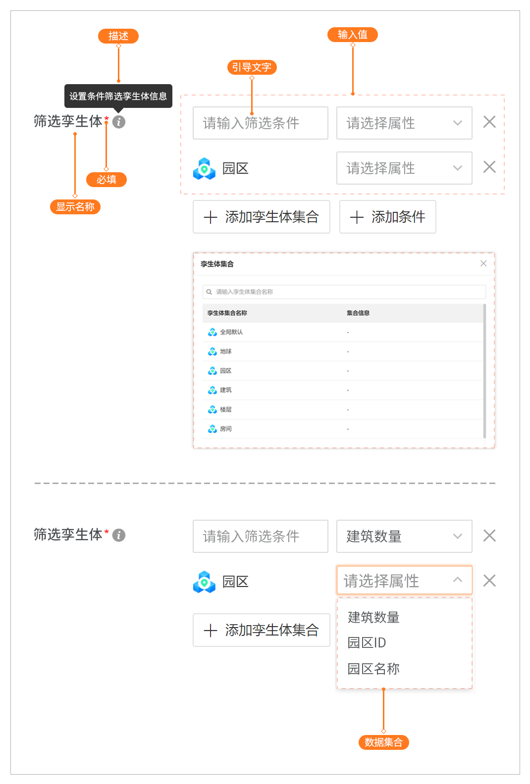

>##### 属性描述
|-|字段名|含义|默认值|描述|必填|
|-|-|-|-|-|-|
|*|type|多条件下拉|multiple-selector-select| 控件类型 |是|
|*|key|唯一标识|-| 取值控件唯一标识 |是|
|*|label|显示名称| -| - |-|
|*|value|值| Array<SelectorObject> ⬇| 控件值/默认值 |-|
|*|placeholder|引导文字|-| - |-|
|*|description|描述|-| - |-|
|*|hidden|隐藏|false| 控件隐藏 |-|
|*|readonly|只读|false| 控件只读 |-|
|*|required|必填|false| 控件必填 |-|
|*|prefix|控件前缀|-| - |-|
|*|suffix|控件后缀|-| - |-|
|*|dataset|数据集合|Array<ValueLabelObject>| - |是|

- 值 SelectorObject
  
  |字段名|含义|默认值|描述|必填|
  |-|-|-|-|-|
  |condition| 条件值 | TwinObject ⬇或string | 条件为孪生体集合时为TwinObject，为条件表达式时是string |-|
  |value| 下拉值 | string |  |-|
  |label| 下拉文本 | string |  |-|

- 数据集 ValueLabelObject
  
  |字段名|含义|默认值|描述|必填|
  |-|-|-|-|-|
  |label|显示名称|-| - |是|
  |value|值|-| - |是|

- 孪生体集合对象 TwinObject
  |字段名|含义|默认值|描述|必填|
  |-|-|-|-|-|
  |uid| 孪生体集合唯一标识 | string | |-|
  |name| 孪生体集合名称 | string | |-|
  |type| 图标类型 | number | 此处默认为0|-|  

>##### 代码结构
```JSON
{
  "key": "",
  "type": "multiple-selector-select",
  "label": "",
  "placeholder": "",
  "description": "",
  "value": [
     {
       "condition":{
          "uid": "C94B349DA87000012FD57A40633E7C50",
          "name": "园区",
          "type": 0
       },
       "value":"","label":""
     },
     {
     "condition":"","value":"","label":""
     }
  ],
  "hidden": false,
  "readonly": false,
  "required": false,
  "prefix": "",
  "suffix": "",
  "dataset": [ //dataset 数据集 
    //value 选中值  label 显示名称
    {"value": "api","label": "接口数据"},
    {"value": "static","label": "静态数据"},
    {"value": "digitaltwin","label": "孪生体属性"}
  ]
} 
```

### 多条件色块『 multiple-selector-color 』::配置说明

>##### 控件效果
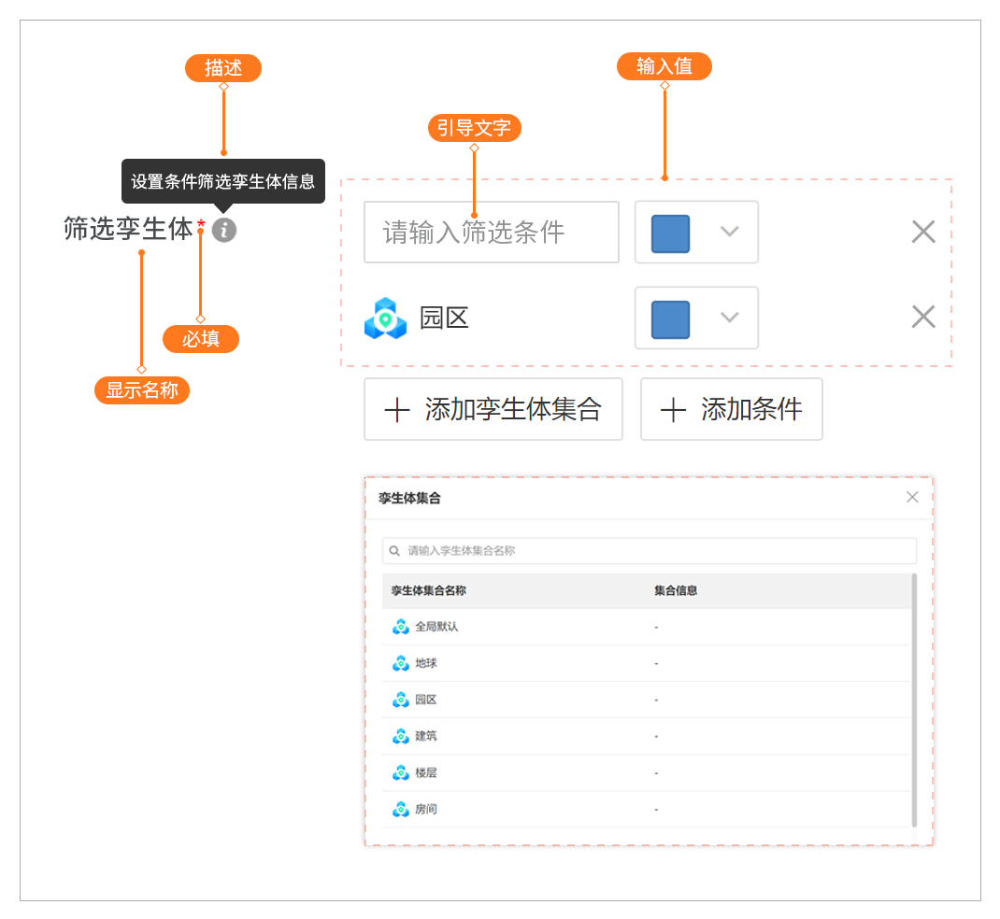

>##### 属性描述
|-|字段名|含义|默认值|描述|必填|
|-|-|-|-|-|-|
|*|type|多条件色块|multiple-selector-color| 控件类型 |是|
|*|key|唯一标识|-| 取值控件唯一标识 |是|
|*|label|显示名称| -| - |-|
|*|value|值| Array<SelectorObject> ⬇| 控件值/默认值 |-|
|*|placeholder|引导文字|-| - |-|
|*|description|描述|-| - |-|
|*|hidden|隐藏|false| 控件隐藏 |-|
|*|readonly|只读|false| 控件只读 |-|
|*|required|必填|false| 控件必填 |-|
|*|prefix|控件前缀|-| - |-|
|*|suffix|控件后缀|-| - |-|
||rgba|颜色空间|false| RGBA是代表Red（红色）Green（绿色）Blue（蓝色）和Alpha的色彩空间。</br>Alpha通道一般用作不透明度参数。|是|

- 值 SelectorObject
  
  |字段名|含义|默认值|描述|必填|
  |-|-|-|-|-|
  |condition| 条件值 | TwinObject ⬇或string | 条件为孪生体集合时为TwinObject，为条件表达式时是string |-|
  |value| 色块值 | RGBA |  |-|

- 孪生体集合对象 TwinObject
  |字段名|含义|默认值|描述|必填|
  |-|-|-|-|-|
  |uid| 孪生体集合唯一标识 | string | |-|
  |name| 孪生体集合名称 | string | |-|
  |type| 图标类型 | number | 此处默认为0|-|  

>##### 代码结构
```JSON
{
  "key": "",
  "type": "multiple-selector-color",
  "label": "",
  "placeholder": "",
  "description": "",
  "value": [
     {
       "condition":{
          "uid": "C94B349DA87000012FD57A40633E7C50",
          "name": "园区",
          "type": 0
        },
        "value":""
     },
     {
       "condition":"","value":""
     }
  ],
  "hidden": false,
  "readonly": false,
  "required": false,
  "prefix": "",
  "suffix": "",
  "rgba": false
} 
```

### 多条件键值『 multiple-selector-keyvalue 』::配置说明

>##### 控件效果
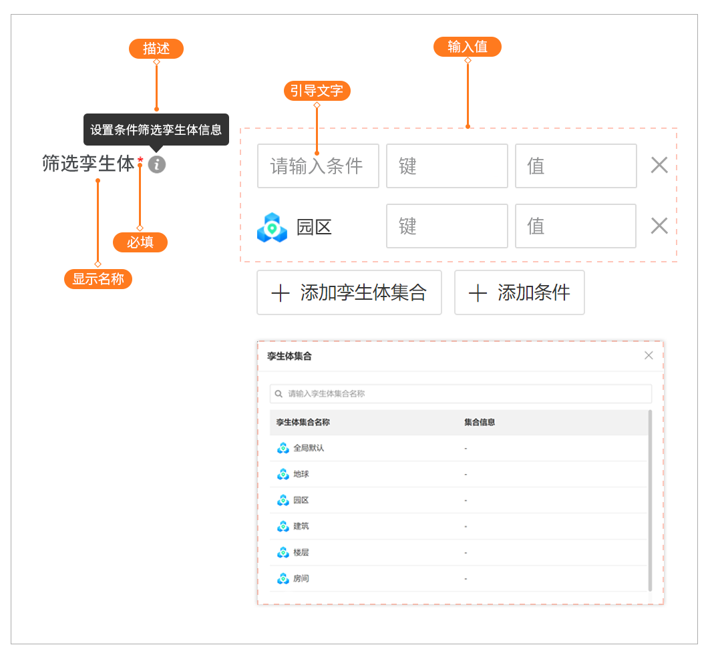

>##### 属性描述
|-|字段名|含义|默认值|描述|必填|
|-|-|-|-|-|-|
|*|type|多条件键值|multiple-selector-keyvalue| 控件类型 |是|
|*|key|唯一标识|-| 取值控件唯一标识 |是|
|*|label|显示名称| -| - |-|
|*|value|值| Array<SelectorObject> ⬇| 控件值/默认值 |-|
|*|placeholder|引导文字|-| - |-|
|*|description|描述|-| - |-|
|*|hidden|隐藏|false| 控件隐藏 |-|
|*|readonly|只读|false| 控件只读 |-|
|*|required|必填|false| 控件必填 |-|
|*|prefix|控件前缀|-| - |-|
|*|suffix|控件后缀|-| - |-|

- 值 SelectorObject
  
  |字段名|含义|默认值|描述|必填|
  |-|-|-|-|-|
  |condition| 条件值 | TwinObject ⬇或string | 条件为孪生体集合时为TwinObject，为条件表达式时是string |-|
  |key| - | - |  |-|
  |value| - | - |  |-|

- 孪生体集合对象 TwinObject
  |字段名|含义|默认值|描述|必填|
  |-|-|-|-|-|
  |uid| 孪生体集合唯一标识 | string | |-|
  |name| 孪生体集合名称 | string | |-|
  |type| 图标类型 | number | 此处默认为0|-|  

>##### 代码结构
```JSON
{
  "key": "",
  "type": "multiple-selector-keyvalue",
  "label": "",
  "placeholder": "",
  "description": "",
  "value": [
     {
        "condition":{
          "uid": "C94B349DA87000012FD57A40633E7C50",
          "name": "园区",
          "type": 0
        },
       "key":"",
       "value":""
    },
    {
      "condition":"",
      "key":"",
      "value":""
    }
  ],
  "hidden": false,
  "readonly": false,
  "required": false,
  "prefix": "",
  "suffix": ""
} 
```

### 多条件标记『 multiple-selector-attachment 』::配置说明

>##### 控件效果
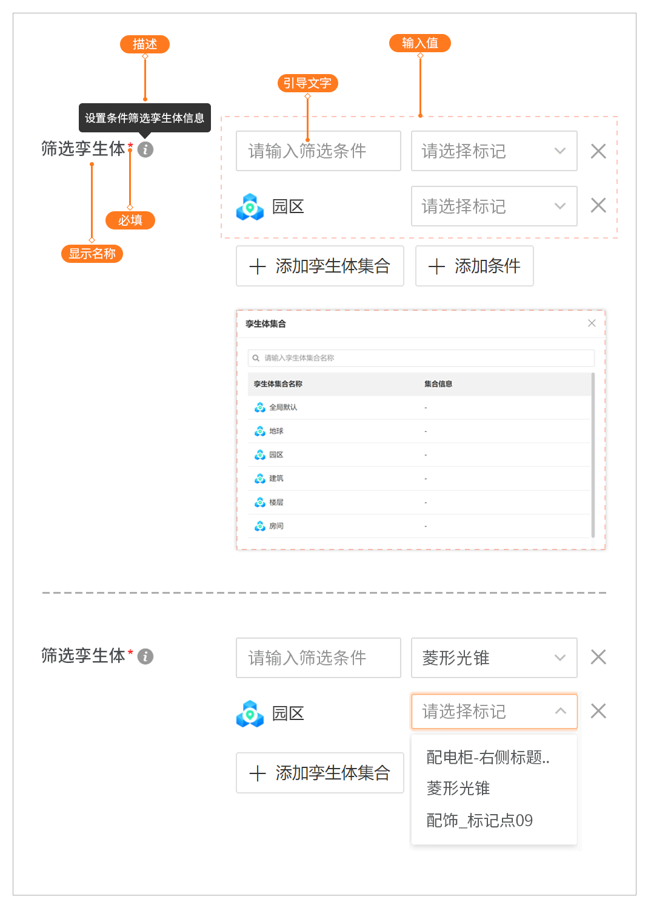

>##### 属性描述
|-|字段名|含义|默认值|描述|必填|
|-|-|-|-|-|-|
|*|type|多条件标记|multiple-selector-attachment| 控件类型 |是|
|*|key|唯一标识|-| 取值控件唯一标识 |是|
|*|label|显示名称| -| - |-|
|*|value|值| Array<SelectorObject> ⬇| 控件值/默认值 |-|
|*|placeholder|引导文字|-| - |-|
|*|description|描述|-| - |-|
|*|hidden|隐藏|false| 控件隐藏 |-|
|*|readonly|只读|false| 控件只读 |-|
|*|required|必填|false| 控件必填 |-|
|*|prefix|控件前缀|-| - |-|
|*|suffix|控件后缀|-| - |-|

- 值 SelectorObject
  
  |字段名|含义|默认值|描述|必填|
  |-|-|-|-|-|
  |condition| 条件值 | TwinObject ⬇或string | 条件为孪生体集合时为TwinObject，为条件表达式时是string |-|
  |value| 标记值 | string |  |-|

- 孪生体集合对象 TwinObject
  |字段名|含义|默认值|描述|必填|
  |-|-|-|-|-|
  |uid| 孪生体集合唯一标识 | string | |-|
  |name| 孪生体集合名称 | string | |-|
  |type| 图标类型 | number | 此处默认为0|-|  

>##### 代码结构
```JSON
{
  "key": "",
  "type": "multiple-selector-attachment",
  "label": "",
  "placeholder": "",
  "description": "",
  "value": [
    {
      "condition":{
        "uid": "C94B349DA87000012FD57A40633E7C50",
        "name": "园区",
        "type": 0
       },
       "value":""
    },
    {
      "condition":"","value":""
    }
  ],
  "hidden": false,
  "readonly": false,
  "required": false,
  "prefix": "",
  "suffix": ""
} 
```

### 多条件操作集『 multiple-selector-action 』::配置说明

>##### 控件效果
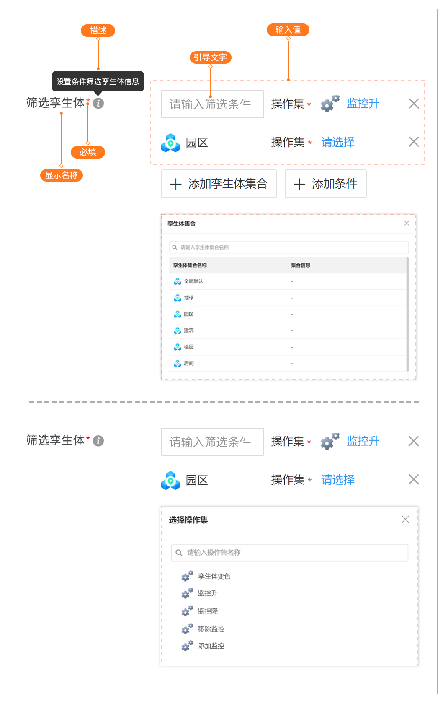

>##### 属性描述
|-|字段名|含义|默认值|描述|必填|
|-|-|-|-|-|-|
|*|type|多条件操作集|multiple-selector-action| 控件类型 |是|
|*|key|唯一标识|-| 取值控件唯一标识 |是|
|*|label|显示名称| -| - |-|
|*|value|值| Array<SelectorObject> ⬇| 控件值/默认值 |-|
|*|placeholder|引导文字|-| - |-|
|*|description|描述|-| - |-|
|*|hidden|隐藏|false| 控件隐藏 |-|
|*|readonly|只读|false| 控件只读 |-|
|*|required|必填|false| 控件必填 |-|
|*|prefix|控件前缀|-| - |-|
|*|suffix|控件后缀|-| - |-|

- 值 SelectorObject
  
  |字段名|含义|默认值|描述|必填|
  |-|-|-|-|-|
  |condition| 条件值 | TwinObject ⬇或string | 条件为孪生体集合时为TwinObject，为条件表达式时是string |-|
  |value| 操作集值 | string |  |-|

- 孪生体集合对象 TwinObject
  |字段名|含义|默认值|描述|必填|
  |-|-|-|-|-|
  |uid| 孪生体集合唯一标识 | string | |-|
  |name| 孪生体集合名称 | string | |-|
  |type| 图标类型 | number | 此处默认为0|-|  

>##### 代码结构
```JSON
{
  "key": "",
  "type": "multiple-selector-action",
  "label": "",
  "placeholder": "",
  "description": "",
  "value":  [
    {
      "condition":{
         "uid": "C94B349DA87000012FD57A40633E7C50",
         "name": "园区",
         "type": 0
      },
      "value":""
    },
    {
      "condition":"","value":""
    }
  ],
  "hidden": false,
  "readonly": false,
  "required": false,
  "prefix": "",
  "suffix": ""
} 
```

### 字典『 dictionary 』::配置说明

>##### 控件效果
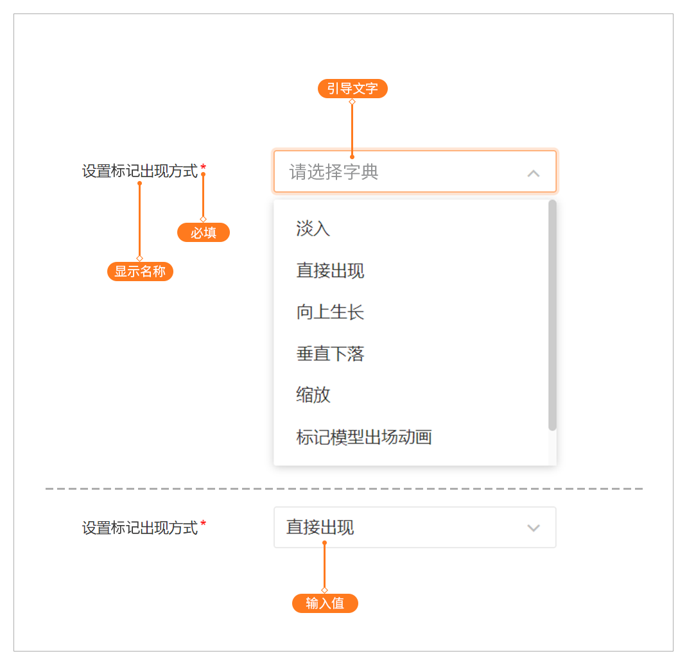

>##### 属性描述
|-|字段名|含义|默认值|描述|必填|
|-|-|-|-|-|-|
|*|type|字典|dictionary| 控件类型 |是|
|*|key|唯一标识|-| 取值控件唯一标识 |是|
|*|label|显示名称| -| - |-|
|*|value|值| DictionaryObject ⬇| 控件值/默认值 |-|
|*|~~placeholder~~|~~引导文字~~|-| - |-|
|*|~~description~~|~~描述~~|-| - |-|
|*|hidden|隐藏|false| 控件隐藏 |-|
|*|readonly|只读|false| 控件只读 |-|
|*|required|必填|false| 控件必填 |-|
|*|prefix|控件前缀|-| - |-|
|*|suffix|控件后缀|-| - |-|
||dataset|字典设置 DictionarySettingObject ⬇|-| - |-|

- 值 DictionaryObject
  
  |字段名|含义|默认值|描述|必填|
  |-|-|-|-|-|
  |type| 字典类型 | string |  |是|
  |value| 字典值 | string |  |是|
  |label| 字典名称 | string |  |否|

- 字典设置 DictionarySettingObject
  
  |字段名|含义|默认值|描述|是否必填|
  |-|-|-|-|-|
  |type| 字典类型 | string |  |是|
  |placeholder| 字典引导文字 | 优先级高于外部配置 |  |否|
  |description| 字典描述 | 优先级高于外部配置|  |否|

>##### 代码结构
```JSON
{
  "key": "",
  "type": "dictionary",
  "label": "",
  //"placeholder": "", 不支持的属性
  //"description": "", 不支持的属性
  "value": {
     "type":"",
     "value":"",
     "label":""
   },
  "hidden": false,
  "readonly": false,
  "required": false,
  "prefix": "",
  "suffix": "",
  "dataset":{
    "type":"",
    "placeholder":"",
    "description":""
  }
} 
```

### 效果『 effect 』::配置说明

>##### 控件效果
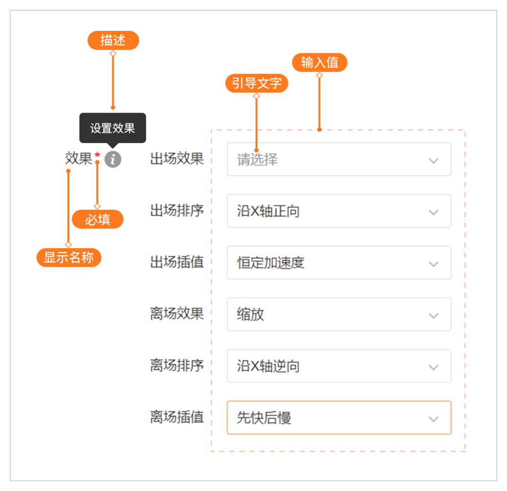

>##### 属性描述
|-|字段名|含义|默认值|描述|必填|
|-|-|-|-|-|-|
|*|type|效果|effect| 控件类型 |是|
|*|key|唯一标识|-| 取值控件唯一标识 |是|
|*|label|显示名称| -| - |-|
|*|value|值| Array<DictionaryObject> ⬇| 控件值/默认值 |-|
|*|placeholder|引导文字|-| - |-|
|*|description|描述|-| - |-|
|*|hidden|隐藏|false| 控件隐藏 |-|
|*|readonly|只读|false| 控件只读 |-|
|*|required|必填|false| 控件必填 |-|
|*|prefix|控件前缀|-| - |-|
|*|suffix|控件后缀|-| - |-|

- 值 DictionaryObject
  
  |字段名|含义|默认值|描述|必填|
  |-|-|-|-|-|
  |type| 字典类型 | effect1::出场类型、effect2::出场排序、effect3::出场插值</br>effect4::离场效果、effect5::离场排序、effect6::离场插值 |  |-|
  |value| 字典值 | string |  |-|
  |label| 字典名称 | string |  |-|


>##### 代码结构
```JSON
{
  "key": "",
  "type": "effect",
  "label": "",
  "placeholder": "",
  "description": "",
  "value":[
      //  {"type":"effect1","value":"fadeln","label":"出场类型"},
      //  {"type":"effect2","value":"none","label":"出场排序"},
      //  {"type":"effect3","value":"Liner.None","label":"出场插值"},
      //  {"type":"effect4","value":"fadeOut","label":"离场效果"},
      //  {"type":"effect5","value":"none","label":"离场排序"},
      //  {"type":"effect6","value":"Liner.None","label":"离场插值"},
  ],
  "hidden": false,
  "readonly": false,
  "required": false,
  "prefix": "",
  "suffix": ""
} 
```

### 文章『 articles 』::配置说明

>##### 控件效果
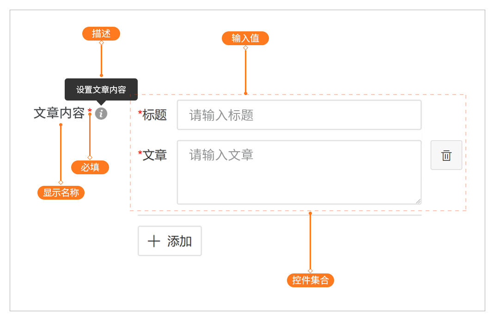

>##### 属性描述
|-|字段名|含义|默认值|描述|必填|
|-|-|-|-|-|-|
|*|type|文章|articles| 控件类型 |是|
|*|key|唯一标识|-| 取值控件唯一标识 |是|
|*|label|显示名称| -| - |-|
|*|value|值| Array<ArticlesObject> ⬇| 控件值/默认值 |-|
|*|description|描述|-| - |-|
||dataset|控件集合| MAP<XObject> ⬇||-|

- 值 KeyValueObject
  
  |字段名|含义|默认值|描述|必填|
  |-|-|-|-|-|
  |title| 标题控件值|string| - |-|
  |context|内容控件值| string| - |-|

- 控件集合 XObject
  
  |字段名|含义|默认值|描述|必填|
  |-|-|-|-|-|
  |title| 键控件 | XTextObject | 文本控件 |-|
  |context|值控件 | XTextareaObject | 文本域控件 |-|


>##### 代码结构
```JSON
{
  "key": "", //属性识别
  "type": "articles",//分类
  "label": "",//显示名称
  "description": "",//描述
  "value": [
    {"title":"","context":""},
    {"title":"","context":""}
  ],
  "dataset":{
          "title":{
            "type":"text",
            // "key":"",
            "label":"标题",
            "placeholder": "",
            "description": "",  
            "hidden": false,
            "readonly": false,
            "required": false,
            "prefix": "",
            "suffix": "",
          } ,
          "context":{
            "type":"textarea",
            // "key":"",
            "label":"内容",
            "placeholder": "",
            "description": "",  
            "hidden": false,
            "readonly": false,
            "required": false,
            "prefix": "",
            "suffix": "",               
          }
   }
}
```

### 对象配置『 keyobjects 』::配置说明

>##### 控件效果
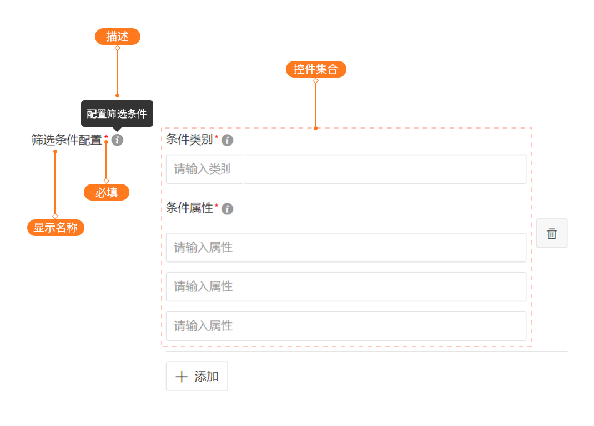

>##### 属性描述
|-|字段名|含义|默认值|描述|必填|
|-|-|-|-|-|-|
|*|type|对象配置|keyobjects| 控件类型 |是|
|*|key|唯一标识|-| 取值控件唯一标识 |是|
|*|value|值| Array<KeyobjectsObject> ⬇| 控件值/默认值 |-|
|*|hidden|隐藏|false| 控件隐藏 |-|
|*|readonly|只读|false| 控件只读 |-|
|*|required|必填|false| 控件必填 |-|
||dataset|控件集合| - ⬇||-|

- 值 KeyobjectsObject
  
  |字段名|含义|默认值|描述|必填|
  |-|-|-|-|-|
  |key| key控件值|string| - |-|
  |objects|对象控件值| Array<string>| - |-|

- 控件集合 -
  
  ```JSON
  {
    "key": {
      "type":"text",
      "value":"",
      "label":"直接出现",
      "prefix": "",
      "suffix": "",
      "description": ""
    },
    "objects":{
      "type":"objects",
      "label":"",
      "description": "",
      "dataset":[
         {"type":"text","value":"","prefix": "","suffix": ""},
         {"type":"text","value":"","prefix": "","suffix": ""},
         {"type":"text","value":"","prefix": "","suffix": ""},
       ]
    }
  }
  ```


>##### 代码结构
```JSON
{
  "key": "", //属性识别
  "type": "keyobjects",//分类
  "value": [{
      "key":"","objects":[]
  },{
      "key":"","objects":[]
  }],//默认值
  "dataset":{
    "key": {
      "type":"text",
      "value":"",
      "label":"",
      "prefix": "",
      "suffix": "",
      "description": ""
    },
    "objects":{
      "type":"objects",
      "label":"",
      "description": "",
      "dataset":[
         {"type":"text","prefix": "","suffix": ""},
         {"type":"text","prefix": "","suffix": ""},
         {"type":"text","prefix": "","suffix": ""}
       ]
    }
  },
  "hidden": false,
  "readonly": false,
  "required": false
}

```

### 标题『 title 』::配置说明
>##### 控件效果
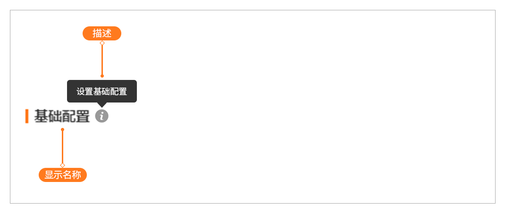

>#####  属性描述
|-|字段名|含义|默认值|描述|必填|
|-|-|-|-|-|-|
|*|type|标题|title| 控件类型 |是|
|*|key|唯一标识|-| 取值控件唯一标识 |是|
|*|label|显示名称| -| - |-|
||description|描述|-| - |-|

>##### 代码结构
```JSON
{
  "type": "title", 
  "key": "",
  "label": "基础配置",
  "description": ""
}
```


### 模型『 model 』::配置说明

>##### 控件效果
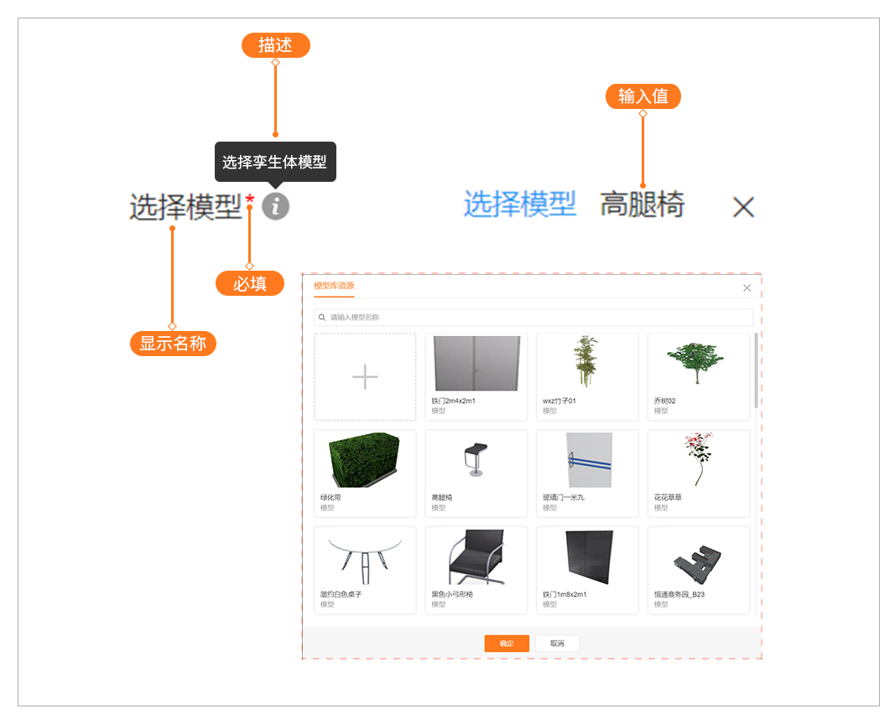

>##### 属性描述
|-|字段名|含义|默认值|描述|必填|
|-|-|-|-|-|-|
|*|type|模型|model| 控件类型 |是|
|*|key|唯一标识|-| 取值控件唯一标识 |是|
|*|label|显示名称| -| - |-|
|*|value|值| modelObject | 控件值/默认值 |-|
|*|~~placeholder~~|~~引导文字~~|-| - |-|
|*|description|描述|-| - |-|
|*|hidden|隐藏|false| 控件隐藏 |-|
|*|readonly|只读|false| 控件只读 |-|
|*|required|必填|false| 控件必填 |-|
|*|prefix|控件前缀|-| - |-|
|*|suffix|控件后缀|-| - |-|

- 值 modelObject
  
  |字段名|含义|默认值|描述|必填|
  |-|-|-|-|-|
  |animation| 模型动画 | array |  |-|
  |code| 模型ID | string |  |-|
  |faces| 模型面数 | number |  |-|
  |fileSize| 模型文件大小 | number |  |-|
  |formatFileSize| 模型文件大小 | string |  |-|
  |id| 模型记录ID | number |  |-|
  |modelTime| 更新时间 | string |  |-|  
  |preview| 预览图 | string |  |-|  
  |size| 模型长宽高 | array<number> |  |-|
  |title| 模型名称 | string |  |-|
  |url| 模型url | string |  |-|
  |userModels| 孪生体型号 | array|  |-|
  |studio| bundle.json中的一些字段 | string |  |-|
  |path| 资源路径 | string |  |-|
---

>##### 代码结构
```JSON
{
  "key": "",
  "type": "model",
  "label": "",
  //"placeholder": "", 不支持的属性
  "description": "",
  "value": {
      "animation": [],
      "code": "3a831a5a8d114fb1a001a2355a2680e7",
      "faces": 3292,
      "fileSize": 433249,
      "formatFileSize": "423.09KB",
      "id": 581127599656576,
      "modelTime": "2020-09-09 20:57:24",
      "preview": "/product/modelItems/webgl/3a55a2680e7.jpg",
      "size": [
          0.416052,
          1.00074,
          0.482593
       ],
      "title": "高腿椅",
      "url": "/product/modelItems/webgl/3aa2355a2680e7/",
      "userModels": [],
      "path": ""
  },
  "hidden": false,
  "readonly": false,
  "required": false,
  "prefix": "",
  "suffix": ""
} 
```

### 事件『 event 』::配置说明

>##### 控件效果
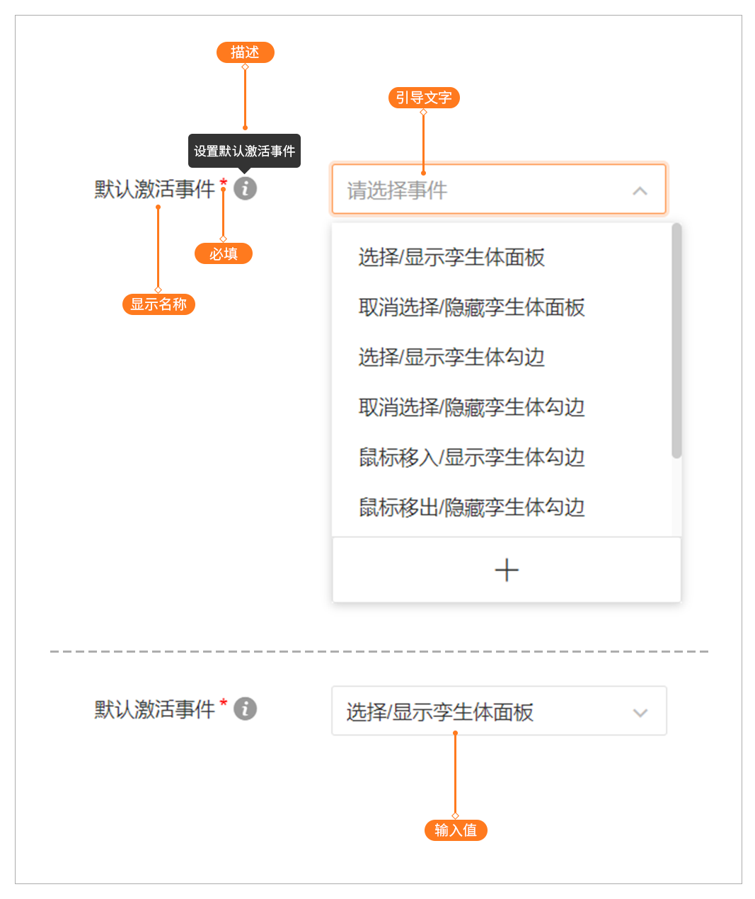

>##### 属性描述
|-|字段名|含义|默认值|描述|必填|
|-|-|-|-|-|-|
|*|type|事件|event| 控件类型 |是|
|*|key|唯一标识|-| 取值控件唯一标识 |是|
|*|label|显示名称| -| - |-|
|*|value|值| - | 控件值/默认值 |-|
|*|placeholder|引导文字|-| - |-|
|*|description|描述|-| - |-|
|*|hidden|隐藏|false| 控件隐藏 |-|
|*|readonly|只读|false| 控件只读 |-|
|*|required|必填|false| 控件必填 |-|
|*|prefix|控件前缀|-| - |-|
|*|suffix|控件后缀|-| - |-|
---

>##### 代码结构
```JSON
{
  "key": "",
  "type": "event",
  "label": "",
  "placeholder": "",
  "description": "",
  "value": "",
  "hidden": false,
  "readonly": false,
  "required": false,
  "prefix": "",
  "suffix": ""
} 
```

### 标记『 attachment 』::配置说明

>##### 控件效果
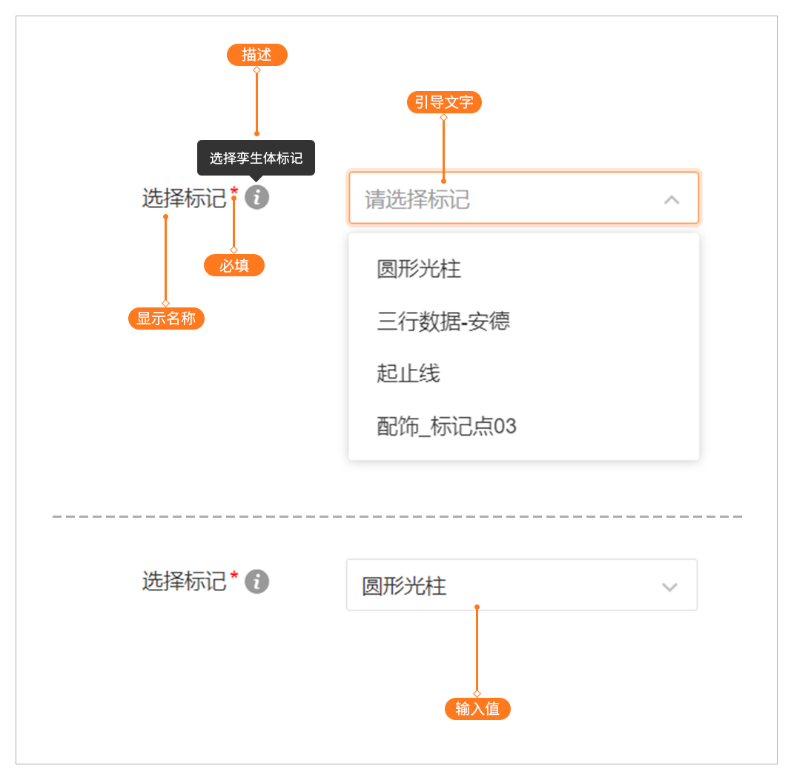

>##### 属性描述
|-|字段名|含义|默认值|描述|必填|
|-|-|-|-|-|-|
|*|type|标记|attachment| 控件类型 |是|
|*|key|唯一标识|-| 取值控件唯一标识 |是|
|*|label|显示名称| -| - |-|
|*|value|值| - | 控件值/默认值 |-|
|*|placeholder|引导文字|-| - |-|
|*|description|描述|-| - |-|
|*|hidden|隐藏|false| 控件隐藏 |-|
|*|readonly|只读|false| 控件只读 |-|
|*|required|必填|false| 控件必填 |-|
|*|prefix|控件前缀|-| - |-|
|*|suffix|控件后缀|-| - |-|
---

>##### 代码结构
```JSON
{
  "key": "",
  "type": "attachment",
  "label": "",
  "placeholder": "",
  "description": "",
  "value": "",
  "hidden": false,
  "readonly": false,
  "required": false,
  "prefix": "",
  "suffix": ""
} 
```

### 操作集『 action 』::配置说明

>##### 控件效果
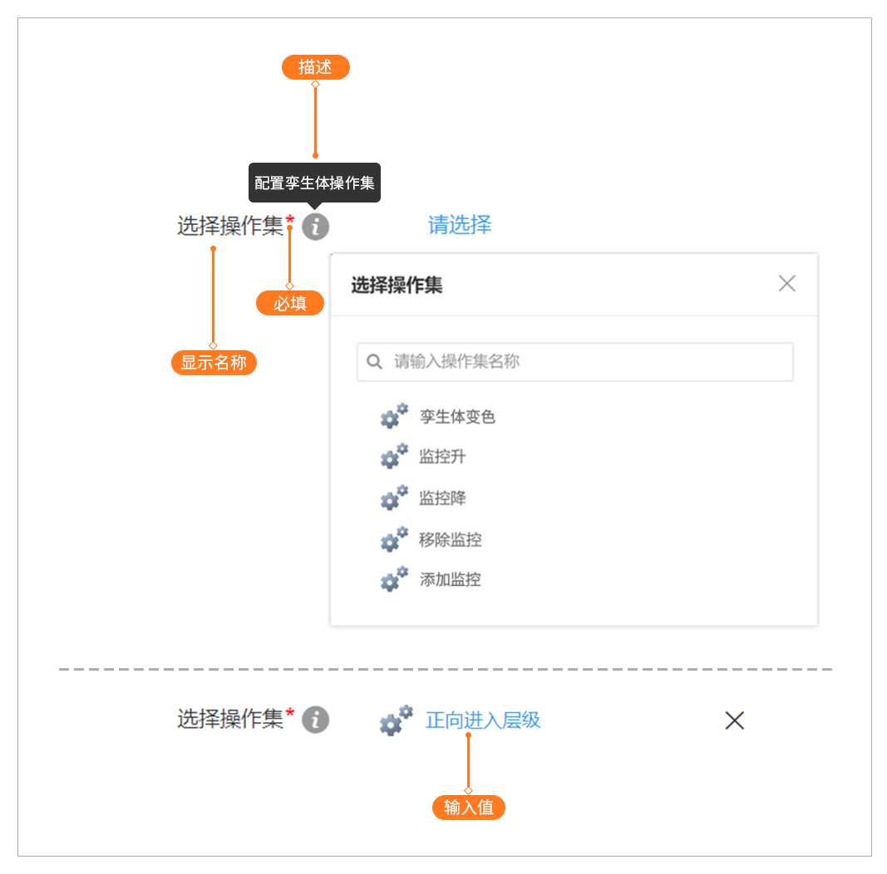

>##### 属性描述
|-|字段名|含义|默认值|描述|必填|
|-|-|-|-|-|-|
|*|type|操作集|action| 控件类型 |是|
|*|key|唯一标识|-| 取值控件唯一标识 |是|
|*|label|显示名称| -| - |-|
|*|value|值| - | 控件值/默认值 |-|
|*|~~placeholder~~|~~引导文字~~|-| - |-|
|*|description|描述|-| - |-|
|*|hidden|隐藏|false| 控件隐藏 |-|
|*|readonly|只读|false| 控件只读 |-|
|*|required|必填|false| 控件必填 |-|
|*|prefix|控件前缀|-| - |-|
|*|suffix|控件后缀|-| - |-|
---

>##### 代码结构
```JSON
{
  "key": "",
  "type": "action",
  "label": "",
  //"placeholder": "", 不支持的属性
  "description": "",
  "value": "",
  "hidden": false,
  "readonly": false,
  "required": false,
  "prefix": "",
  "suffix": ""
} 
```

### 互斥标记『 mutex-attachment 』::配置说明

>##### 控件效果
```

    互斥标记 mutex-attachment 
	...
	...
```
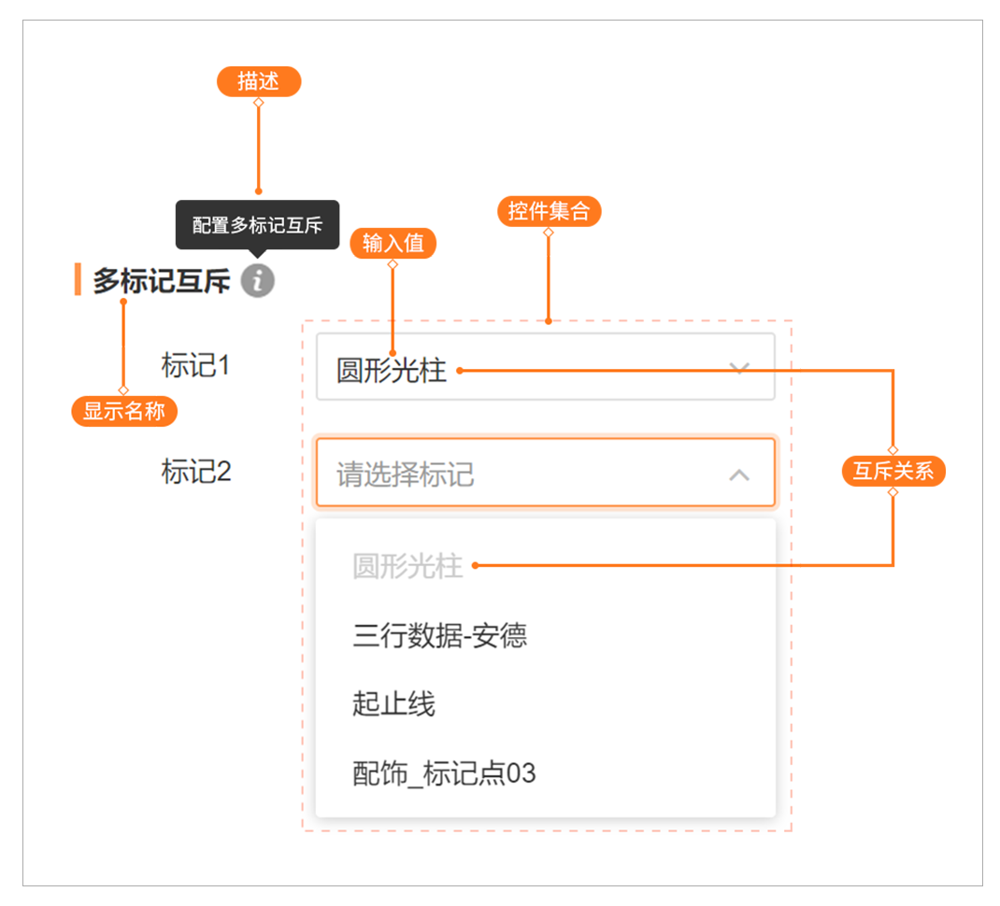

>##### 属性描述
|-|字段名|含义|默认值|描述|必填|
|-|-|-|-|-|-|
|*|type|互斥标记|mutex-attachment| 控件类型 |是|
|*|key|唯一标识|-| 取值控件唯一标识 |是|
|*|label|显示名称| -| - |-|
|*|value|值| KeyValueObject ⬇| 控件值/默认值 |-|
|~~*|~~~~placeholder~~~~|~~~~引导文字~~~~|~~~~-~~~~|~~ - |-|
|*|description|描述|-| - |-|
|*|prefix|控件前缀|-| - |-|
|*|suffix|控件后缀|-| - |-|
||mutex|互斥关系| Array<MutexObject> ⬇| - |-|
||groups|控件集合| Array<XAttachment>| - |-|

- 值 KeyValueObject
  
  |字段名|含义|默认值|描述|必填|
  |-|-|-|-|-|
  |key| 互斥元素key | string |  |-|
  |value| 互斥元素值 | string ⬇|  |-|

- 互斥关系 MutexObject
  
  |字段名|含义|默认值|描述|必填|
  |-|-|-|-|-|
  |key| 条件值 | string |  |-|
  |label| 效果对象 | EffectObject ⬇|  |-|
  |mutex| 与value是否互斥 | boolean |  |-|

>##### 代码结构
```JSON
{
  "key": "",
  "type": "mutex-attachment",
  "label":"",
  //"placeholder": "", 不支持的属性
  "description": "",
  "value":[
      // {"value":"","key":""},
      // {"value":"","key":""},
      // {"value":"","key":""}
  ],
  "mutex":[
      {"key":"id11","label":"API","mutex":true},
      {"key":"id12","label":"静态数据","mutex":true},
      {"key":"id12","label":"静态数据","mutex":false}
  ],
  "groups": [
      // {元素}  仅支持attachment 元组件 

      // {
      //   "key": "",
      //   "type": "attachment",
      //   "label": "",
      //   "placeholder": "",
      //   "description": "",
      //   "value": "",
      //   "hidden": false,
      //   "readonly": false,
      //   "required": false,
      //   "prefix": "",
      //   "suffix": "",
      //   "prefix_icon": "",
      //   "suffix_icon": "",
      // } 
  ],
  "prefix": "",
  "suffix": ""
} 
```

### 孪生体分类『 category 』::配置说明

>##### 控件效果
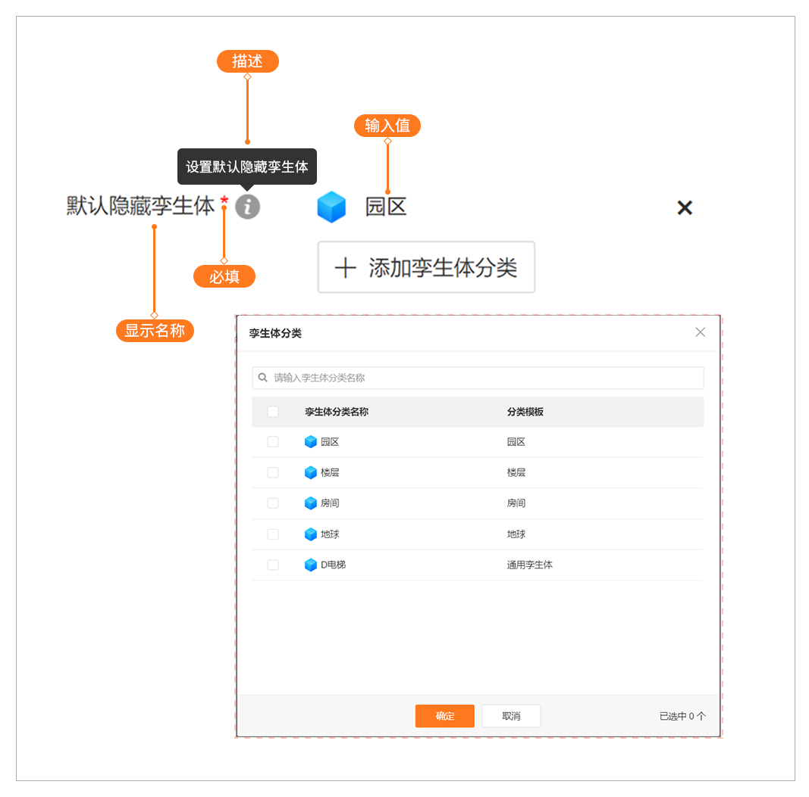

>##### 属性描述
|-|字段名|含义|默认值|描述|必填|
|-|-|-|-|-|-|
|*|type|孪生体分类|category| 控件类型 |是|
|*|key|唯一标识|-| 取值控件唯一标识 |是|
|*|label|显示名称| -| - |-|
|*|value|值| - | 控件值/默认值 |-|
|*|~~placeholder~~|~~引导文字~~|-| - |-|
|*|description|描述|-| - |-|
|*|hidden|隐藏|false| 控件隐藏 |-|
|*|readonly|只读|false| 控件只读 |-|
|*|required|必填|false| 控件必填 |-|
|*|prefix|控件前缀|-| - |-|
|*|suffix|控件后缀|-| - |-|
---

>##### 代码结构
```JSON
{
  "key": "",
  "type": "category",
  "label": "",
  //"placeholder": "", 不支持的属性
  "description": "",
  "value": [
     {
       "id": 581127599652266,
       "className": "地球"
     },
     {
       "id": 581121234652266,
       "className": "园区"
     },
  ],
  "hidden": false,
  "readonly": false,
  "required": false,
  "prefix": "",
  "suffix": ""
} 
```

### 资源选择器『 selector-resource 』::配置说明

>##### 控件效果
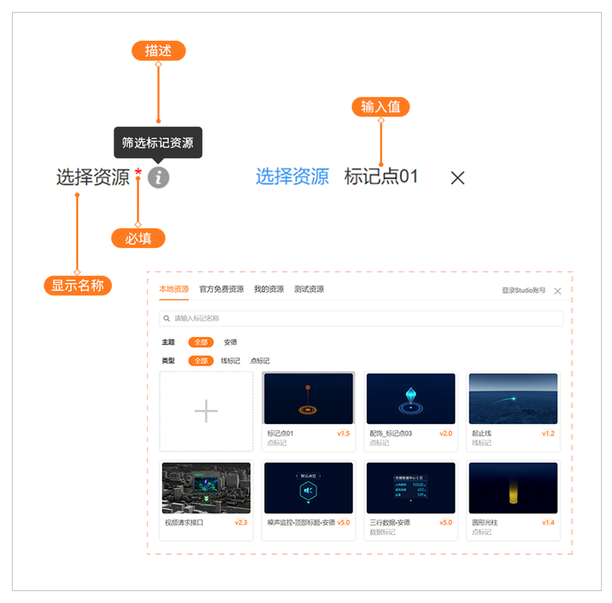

>##### 属性描述
|-|字段名|含义|默认值|描述|必填|
|-|-|-|-|-|-|
|*|type|资源选择器|selector-resource| 控件类型 |是|
|*|key|唯一标识|-| 取值控件唯一标识 |是|
|*|label|显示名称| -| - |-|
|*|value|值| resourceObject ⬇| 控件值/默认值 |-|
|*|~~placeholder~~|~~引导文字~~|-| - |-|
|*|description|描述|-| - |-|
|*|hidden|隐藏|false| 控件隐藏 |-|
|*|readonly|只读|false| 控件只读 |-|
|*|required|必填|false| 控件必填 |-|
|*|prefix|控件前缀|-| - |-|
|*|suffix|控件后缀|-| - |-|
||filter|资源应用条件|string| 可选择条件</br>decor: '标记'</br>theme_campus: '园区效果模板'</br>theme_map: '地图效果模板'</br>theme: '效果模板'</br>layer: '场景图层模板'</br>panel: '孪生体面板'</br>monitor: '监控插件', // 现已弃用</br>control: '场景控制插件'</br>chart: '图表'</br>business: '业务模板'</br>action: '操作原子'</br>core: '系统插件'</br>expand: '扩展插件'</br>skin_business: '业务栏皮肤插件'</br>skin_panels: '图表面板皮肤插件'</br>skin_layer: '场景图层皮肤插件'</br>skin_objectpanel: '孪生体面板皮肤插件'</br>skin_control: '场景控制皮肤插件'</br>skin_image: '界面底图皮肤插件'|-|

- 值 resourceObject
  
  |字段名|含义|默认值|描述|必填|
  |-|-|-|-|-|
  |date| 插件开发日期 | string |  |-|
  |desc| 插件描述 | string |  |-|
  |encryptType| 加密方式 | string | 可选AES或没有该字段 |-|
  |file| 文件名称 | string |  |-|
  |id| 数据库保存时生成id | number |  |-|
  |modifyTime| 更新时间 | number |  |-|
  |name| 插件名称 | string |  |-|  
  |path| 插件所在相对路径 | string |  |-|  
  |preview| 插件预览图相对路径 | string |  |-|
  |rType| 插件类型 | string | 如图表 |-|
  |rTypeGroup| 插件二级分类 | string | 如柱状图 |-|
  |resourceJson| 插件扩展内容 | string |  |-|
  |studio| bundle.json中的一些字段 | string |  |-|
  |theme| 插件主题 | string |  |-|
  |uuid| 唯一id | string |  |-|
  |version| 插件版本 | string |  |-|

>##### 代码结构
```JSON
{
  "type": "selector-resource",
  "key": "",
  "label": "资源选择器",
  //"placeholder": "", 不支持的属性
  "description": "",
  "value": {
      "date": "2022-08-19 15:26:38",
      "desc": "",
      "encryptType": "",
      "file": "标记点01.zip",
      "id": 780046814151447,
      "modifyTime": 20220822152058,
      "name": "标记点01",
      "path": "/configure/decor/1207/",
      "preview": "/configure/decor/1207/preview.png",
      "rType": "",
      "rTypeGroup": "点标记",
      "resourceJson": "{\"themePath_\":\"配饰/点配饰/模型点标记\",\"_title_\":\"测试extend\",\"theme\":\"\",\"rTypeGroup\":\"点标记\",\"theme_\":\"\"}",
      "theme": "",
      "tid": "",
      "uuid": "1207",
      "version": "1.5"
  },
  "hidden": false,
  "readonly": false,
  "required": false,
  "prefix": "",
  "suffix": "",
  "filter": "" //筛选资源应用类型	
}
```


### 选择器效果文本『 selector-effect-text 』::配置说明

>##### 控件效果
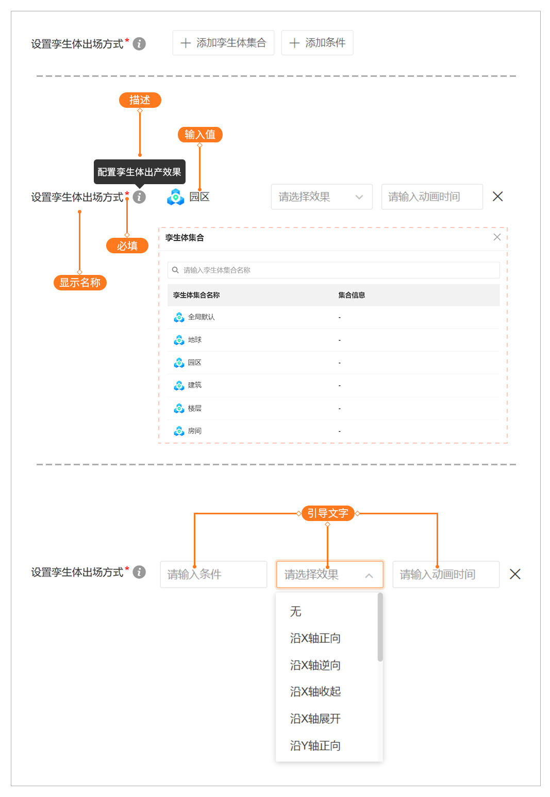

>##### 属性描述
|-|字段名|含义|默认值|描述|必填|
|-|-|-|-|-|-|
|*|type|选择器效果文本|selector-effect-text| 控件类型 |是|
|*|key|唯一标识|-| 取值控件唯一标识 |是|
|*|label|显示名称| -| - |-|
|*|value|值| SelectorEffectTextObject ⬇| 控件值/默认值 |-|
|*|placeholder|引导文字|-| - |-|
|*|description|描述|-| - |-|
|*|hidden|隐藏|false| 控件隐藏 |-|
|*|readonly|只读|false| 控件只读 |-|
|*|required|必填|false| 控件必填 |-|
|*|prefix|控件前缀|-| - |-|
|*|suffix|控件后缀|-| - |-|

- 值 SelectorEffectTextObject
  
  |字段名|含义|默认值|描述|必填|
  |-|-|-|-|-|
  |condition| 条件值 | TwinObject ⬇或string | 条件为孪生体集合时为TwinObject，为条件表达式时是string |-|
  |effect| 效果对象 | EffectObject ⬇|  |-|
  |value| 文本值 | string |  |-|
  
  - 效果对象  EffectObject
    
    |字段名|含义|默认值|描述|必填|
    |-|-|-|-|-|
    |type| 效果类型 | effect1::出场类型、effect2::出场排序、effect3::出场插值、</br>effect4::离场效果、effect5::离场排序、effect6::离场插值、 |  |-|
    |value| 效果值 | string |  |-|
    |label| 效果描述 | string |  |-|

- 孪生体集合对象 TwinObject
  |字段名|含义|默认值|描述|必填|
  |-|-|-|-|-|
  |uid| 孪生体集合唯一标识 | string | |-|
  |name| 孪生体集合名称 | string | |-|
  |type| 图标类型 | number | 此处默认为0|-|  

>##### 代码结构
```JSON
{
  "key": "",
  "type": "selector-effect-text",
  "label": "",
  "placeholder": "",
  "description": "",
  "value": {
     "condition":{
         "uid": "C94B349DA87000012FD57A40633E7C50",
         "name": "园区",
         "type": 0
     },
     "effect":{"type":"","label":"","value":""},
     "value":""
   },
  "hidden": false,
  "readonly": false,
  "required": false,
  "prefix": "",
  "suffix": ""
} 
```

### 选择器文本标记『 selector-text-attachment 』::配置说明

>##### 控件效果
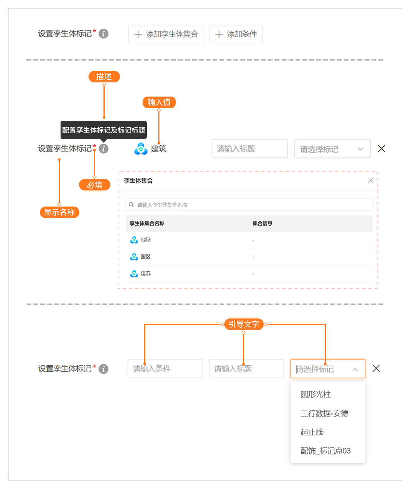

>##### 属性描述
|-|字段名|含义|默认值|描述|必填|
|-|-|-|-|-|-|
|*|type|选择器文本标记|selector-text-attachment| 控件类型 |是|
|*|key|唯一标识|-| 取值控件唯一标识 |是|
|*|label|显示名称| -| - |-|
|*|value|值| SelectorTextAttachmentObject ⬇| 控件值/默认值 |-|
|*|placeholder|引导文字|-| - |-|
|*|description|描述|-| - |-|
|*|hidden|隐藏|false| 控件隐藏 |-|
|*|readonly|只读|false| 控件只读 |-|
|*|required|必填|false| 控件必填 |-|
|*|prefix|控件前缀|-| - |-|
|*|suffix|控件后缀|-| - |-|

- 值 SelectorTextAttachmentObject
  
  |字段名|含义|默认值|描述|必填|
  |-|-|-|-|-|
  |condition| 条件值 | TwinObject ⬇或string | 条件为孪生体集合时为TwinObject，为条件表达式时是string |-|
  |key| 文本值 | string |  |-|
  |value| 标记值 | string |  |-|

- 孪生体集合对象 TwinObject
  |字段名|含义|默认值|描述|必填|
  |-|-|-|-|-|
  |uid| 孪生体集合唯一标识 | string | |-|
  |name| 孪生体集合名称 | string | |-|
  |type| 图标类型 | number | 此处默认为0|-|  

>##### 代码结构
```JSON
{
  "key": "",
  "type": "selector-text-attachment",
  "label": "",
  "placeholder": "",
  "description": "",
  "value": {
     "condition":{
         "uid": "C94B349DA87000012FD57A40633E7C50",
         "name": "园区",
         "type": 0
     },
     "key":"",
     "value":""
   },
  "hidden": false,
  "readonly": false,
  "required": false,
  "prefix": "",
  "suffix": ""
} 
```

### 选择器色块文本『 selector-color-text 』::配置说明

>##### 控件效果
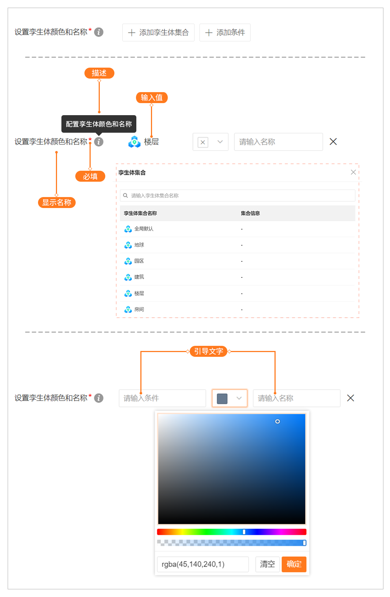

>##### 属性描述
|-|字段名|含义|默认值|描述|必填|
|-|-|-|-|-|-|
|*|type|选择器色块文本|selector-color-text| 控件类型 |是|
|*|key|唯一标识|-| 取值控件唯一标识 |是|
|*|label|显示名称| -| - |-|
|*|value|值| SelectorColorTextObject ⬇| 控件值/默认值 |-|
|*|placeholder|引导文字|-| - |-|
|*|description|描述|-| - |-|
|*|hidden|隐藏|false| 控件隐藏 |-|
|*|readonly|只读|false| 控件只读 |-|
|*|required|必填|false| 控件必填 |-|
|*|prefix|控件前缀|-| - |-|
|*|suffix|控件后缀|-| - |-|

- 值 SelectorColorTextObject
  
  |字段名|含义|默认值|描述|必填|
  |-|-|-|-|-|
  |condition| 条件值 | TwinObject ⬇或string | 条件为孪生体集合时为TwinObject，为条件表达式时是string |-|
  |key| 色块值 | string |  |-|
  |value| 文本值 | string |  |-|

- 孪生体集合对象 TwinObject
  |字段名|含义|默认值|描述|必填|
  |-|-|-|-|-|
  |uid| 孪生体集合唯一标识 | string | |-|
  |name| 孪生体集合名称 | string | |-|
  |type| 图标类型 | number | 此处默认为0|-|  

>##### 代码结构
```JSON
{
  "key": "",
  "type": "selector-color-text",
  "label": "",
  "placeholder": "",
  "description": "",
  "value": {
     "condition":{
         "uid": "C94B349DA87000012FD57A40633E7C50",
         "name": "园区",
         "type": 0
     },
     "key":"",
     "value":""
   },
  "hidden": false,
  "readonly": false,
  "required": false,
  "prefix": "",
  "suffix": ""
} 
```