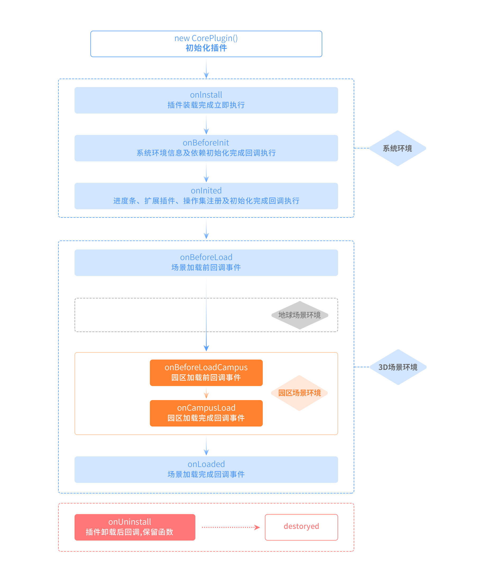

<!-- @import "[TOC]" {cmd="toc" depthFrom=1 depthTo=6 orderedList=false} -->

<!-- code_chunk_output -->

- [ThingJS-X 插件二次开发规范(插件) 修订版](#thingjs-x-插件二次开发规范插件-修订版)
  - [插件资源规范](#插件资源规范)
  - [描述文件规范](#描述文件规范)
  - [配置项规范](#配置项规范)
  - [入口文件规范](#入口文件规范)
  - [入口文件分类](#入口文件分类)
    - [系统插件`规范`](#系统插件规范)
    - [扩展插件`规范`](#扩展插件规范)
    - [场景图层插件`规范`](#场景图层插件规范)
    - [场景控制插件`规范`](#场景控制插件规范)
    - [面板插件`规范`](#面板插件规范)

<!-- /code_chunk_output -->

# ThingJS-X 插件二次开发规范(插件) 修订版

## 插件资源规范
* 介绍
  > 一个插件资源(包)是ThingJS-X 定义的一种插件资源类型    
  > 一个插件资源(包)是实现一种特定的ThingJS-X能力,用于补充完善ThingJS-X 的相关实现和能力扩展    
  > 一个插件资源(包)理论上功能不要过于聚合,过于聚合的插件能力将会失去插件定义的意义   
* 结构
  >插件资源包包含主要三种(`描述文件`、`配置项文件`、`入口文件`)类型的文件,其中配置项文件内容包含在入口文件内
  ```javascript
  `插件资源包.zip`      //插件资源压缩包, 支持 .zip 或 .bundle 两种格式
  | --- bundle.json   //插件描述文件,其内可定义插件入口文件名称等相关插件资源信息
  | --- frame.js      //插件入口文件,名称可以定义,推荐使用frame.js
  | +-- resources     //资源目录,建议将相关资源放置在该目录内
  |   --- preview.png //插件预览图,名称和目录可在描述文件定义,推荐使用 preview.png
  | --- README.md     //插件使用说明文档
  ```
* 解构
  >描述文件介绍
  ```javascript
   定义了插件资源(包)结构,相关文件关系,入口文件等相关插件配置
  ```
  >配置项介绍
  ```javascript
   定义了插件配置项相关内容及结构,用于辅助插件资源的配置信息设置和获取
  ```
  >入口文件介绍
  ```javascript
   定义了插件相关生命周期函数,用于插件整体功能的实现
  ```

## 描述文件规范
* 介绍
  > ThingJS-X 插件资源(包)中描述文件`bundle.json`规定了插件资源(包)的相关结构及内容定义  
  > 该文件属于插件资源(包)的核心文件,文件结构为语义化JSON结构,对使用者及阅读者都能够有很好的理解体验    
  > 插件可识别的描述文件名称及类型必须为 `bundle.json`    
* 解构
  > `bundle.json` 插件描述文件完整示例结构
  ```javascript
  {
    "name": "温度云图",                                 //插件名称
    "type": "plugin",                                 //插件类型(插件资源包固定类型:plugin)      
    "id": "iamthefastestmanalive",                    //插件唯一标识,建议不超过21位
    "version": "1.1.0",                               //插件版本号
    "author": "zhangguang@uino.com",                  //插件作者
    "description": "The Plugin of ThingJS-X System",  //插件介绍
    "main": "frame.js",                               //插件入口文件(插件的主要功能实现)
    "dependencies": {                                 //插件相关依赖,目前仅依支持依赖
        "thingjs": "1.2.7.17",
        "dpdVersion": ">1.0.2 <=2.3.4"
    },
    "external": {                                     //描述文件扩展定义
        "use-standard":"0",                           //资源收费类型(免费资源:0,收费资源:1)
        "standard": "Revision",                       //插件开发参考的规范(当前最新规范:Revision)
        "encrypt-files": [                            //资源包中需要加密的文件 
            "frame.js"                                //推荐将入口文件进行加密配置
        ],
        "preview": "./resources/preview.png",         //预览图
        "thingjs-x": {                                //ThingJS-X 插件资源描述信息
            "plugin-type": "layer",                   //ThingJS-X 插件一级分类
            "license": "",                            //版权信息(e.g.:优锘科技版权所有)
            "date": "",                               //创建日期(格式:2022-04-21 10:32:13)
            "theme": "",                              //ThingJS-X 主题 
            "theme-path": "",                         //ThingJS-X 主题路径  
            "extend": {                               //ThingJS-X 自定义扩展字段
                "r-type-group": "地图",                //ThingJS-X 插件二级分类
                "r-type": "",                         //ThingJS-X 插件三级分类
            }
        }
    }
  }
  ```
!> *Types supported at plug-in first-level*  
`系统插件`  `"plugin-type": "core"`   
`扩展插件`  `"plugin-type": "expand"`  
`场景图层插件`  `"plugin-type": "layer"`  
`场景控制插件`  `"plugin-type": "control"`  
`面板插件`  `"plugin-type": "panel"`  

  > `bundle.json` 插件描述文件字段说明
   
  |  字段   | 支持标准 | 描述 | 必填 |
  |  ---- | ---- | ---- | ---- |
  | type  | Revision | 资源包类型,插件资源固定类型为:plugin | 是 |  
  | id  | Revision | 资源唯一标识 | 是 |  
  | name  | Revision | 资源名称 | 是 |
  | version  | Revision | 资源版本:1.1.0 | 是 |
  | author  | Revision | 资源包作者 | 是 |
  | description  | Revision | 资源描述 | - |
  | main  | Revision | 资源入口文件(主文件) | 是 |
  | dependencies  | Revision | 资源包依赖 | 是 |
  | external  | Revision | 资源包扩展字段 | 是 |  
  | use-standard  | Revision | 资源收费类型(免费资源:0,收费资源:1) | 是 |
  | standard  | Revision | 开发参考的规范(当前最新规范:Revision) | 是 |  
  | encrypt-files  | Revision | 资源包中需要加密的文件 | - |
  | preview  | Revision | 资源预览图 | - |  
  | thingjs-x  | Revision | ThingJS-X 插件自定义字段 | 是 |
  | plugin-type  | Revision | 插件一级分类:</br>(目前支持的插件类型有 </br>core:系统插件、expand:扩展插件、layer:场景图层插件、</br>control:场景控制插件、panel:面板插件) | 是 |
  | license  | Revision | 版权信息(e.g.:优锘科技版权所有) | 是 |
  | date  | Revision | 创建日期(格式:2022-04-21 10:32:13) | 是 |
  | theme  | Revision | 主题资源 | - |
  | theme-path  | Revision | 资源主题目录路径 | - |  
  | extend  | Revision | ThingJS-X 自定义扩展字段 | - | 
  | r-type-group  | Revision | ThingJS-X 插件二级分类 | - | 
  | r-type  | Revision | ThingJS-X 插件三级分类 | - |     
  |  |  |  |  |    

* 插件资源(包)支持类型 与ThingJS-X 版本对照表
  
  ?> ThingJS-X V4.2.0
  - [x] `系统插件模板:core` 
  - [x] `扩展插件模板:expand`
  - [x] `场景图层插件模板:layer`
  - [x] `场景控制插件模板:control`
  - [x] `面板插件模板:panel`
  - [ ] ~~`原子插件模板:action`~~
  - [ ] ~~`界面模板插件模板:skin`~~
  - [ ] ~~`预制件插件模板:未定义代码`~~
 
  ?> ThingJS-X V4.6.0
  - [x] `系统插件模板:core`  
  - [x] `扩展插件模板:expand`
  - [x] `面板插件模板:panel`
  - [x] `场景图层插件模板:layer`
  - [x] `场景控制插件模板:control`
  - [x] <mark>`原子插件模板:action`</mark>
  - [x] <mark>`界面模板插件模板:skin`</mark>
  - [ ] ~~`预制件插件模板:未定义代码`~~

## 配置项规范
* 介绍
  > ThingJS-X 插件中定义了配置项规范,用于配置插件的相关设置     
  > 配置项在插件中分为配置数据和获取数据,配置数据是插件使用者对插件相关信息进行设置,     
  > 获取数据是插件开发中获取到使用者配置的相关数据,进行插件能力的相关体现      
  > 配置项设置在ThingJS-X 系统中进行设置,针对配置项依据`W3C`及`开发者共识`标准进行了配置项控件相关规范的定义        
* 规范
  > 请参考  
  > `文档传送门:` <a href="#/xplugin-configuration">**《配置项控件规范文档》**</a>  
  > `可视化配置工具传送门:` <a href="http://10.100.32.63/xelement/xelement.zip">**xelement 工具下载**</a>

* `itemConfig` 开发解构
  
  !> 插件开发`主入口文件`内规定了插件的相关结构,其中`配置项`属于`主入口文件` `itemConfig` 字段内容      

  > `itemConfig` 字段内容简易示例      
  ```javascript
    //插件入口文件主要结构
    {
        //... 代码结构1
        //... 代码结构2
        //itemConfig 配置项结构
        itemConfig:[                    //配置项结构
            {                           //配置项控件(第一个)
             "type": "text",                //控件类型(文本框)
             "key": "roomId",               //控件唯一标识,用于获取控件值
             "label": "温度云图半径",         //配置项显示名称
                "placeholder": "",          //占位符 
                "description": "",          //描述
                "value": "房间"             //配置项控件值
            },
            {                           //配置项控件(第二个)
             "type": "number",              //控件类型(数字框)
             "key": "radiusId",             //控件唯一标识,用于获取控件值
             "label": "温度云图半径",         //配置项显示名称
                "placeholder": "",          //占位符 
                "description": "",          //描述
                "value": "5"                //配置项控件值
            }
            ...                         //配置项控件(第三个)
            ...                         //配置项控件(第四个)
            ...                         //配置项控件(第五个)
            ... //更多配置项控件
            ︾
        ]

    }
  ```

## 入口文件规范
?> **入口文件**     
ThingJS-X 插件开发规范中插件的`入口文件`支持及定义包含内容为  
`系统插件`、`扩展插件`、`场景图层插件`、`场景控制插件`、`面板插件`、`原子插件` 五部分入口文件规范

* 介绍
    >`入口文件`是程序项目或者系统被访问请求的时候第一个被访问到的文件,  
    >所有的指令功能都是从`入口文件`分发出去,再找相对应的代码模块进行逻辑处理,该文件可以根据不同的请求去调用框架不同的模块   
    >ThingJS-X `插件入口文件`就是插件的唯一入口文件,文件内将插件的`回调函数`及`功能函数`进行统一分发处理    
    >使插件能够按照指定的`生命周期`和`功能`运行
* 结构
    >插件`入口文件`包含主要字段
    ```javascript
    `frame.js`          //插件入口文件,名称(支持)自定义,需与bundle.json描述文件配置一致
    | --- code              //逻辑代码
    | --- itemConfig        //配置项控件代码
    | --- debugger          //调试代码(非必须) 
    | --- deployment        //部署代码(非必须) { type:"core",operation: "reload.run"}
    ```
* 解构
    > `frame.js` 插件`入口文件` 结构
    ```javascript
    // 插件完整代码结构
    {
      code: `插件逻辑代码`,                                 //逻辑代码部分
      itemConfig: `Array<配置项控件>`,                      //配置项代码部分
      debugger: {"condition":{},config:{}},               //调试代码部分(需与配置项结合使用)   
      deployment: { type:"core",operation: "reload.run"}  //部署代码部分,设置运行代码逻辑   
    }
    
    ```
    > `frame.js` 插件`入口文件` 字段说明
   
    |  字段   | 支持标准 | 描述 | 必填 |
    |  ---- | ---- | ---- | ---- |
    |  code | Revision | 插件逻辑代码,拥有插件完整的生命周期函数 | 是 |
    |  itemConfig | Revision | 插件配置项代码 | 是 |
    |  debugger | Revision | 在线调试代码,{conifg:{配置项配置值}} | - |
    |  deployment | Revision | 在线调试部署模式 | - |
 

* 公共属性及方法 
    
!>插件公共`属性`和`方法`,规定所有类型插件皆拥有的属性及方法,以保证插件`回调和功能`的完整性 
    ```javascript
        - 插件公共属性和方法,其中公共属性及方法包括不限于
        /*
        * @property readonly name 获取资源(插件)名称
        * @property readonly uri 获取资源(插件)包路径
        * @property readonly config 获取资源(插件)配置项值信息
        * @property readonly app 获取3D操作类库(同 THING.App.current)
        * @property readonly thing 获取thingjs 3D操作类库
        * @property readonly map 获取3D.地图操作类库(同 CMAP) 
        * @property readonly thingx 获取ThingJS-X 操作类库 API
        * @method setName(name:string):void 设置定义插件名称
        */

        - 系统回调方法
        /*
        * @method setURI(uri:string):void 设置资源(插件)包路径
        * @method setConfig(config:Object):void 设置资源(插件)配置项信息 
        * @method onInstall::生命周期函数,插件安装完成载入执行
        */
    ```

    >name 获取资源`插件`名称
    ```javascript
        /**
        * @description 获取资源(插件)名称
        */
        get name(){}

        /**
        * @description 设置资源(插件)名称
        * @param name 资源名称
        */
        setName(name:string):void; 
    ```
    >uri 获取资源`插件`包路径
    ```javascript
        /**
        * @description  获取资源(插件)包路径
        */
        get uri() {}

        /**
        * @description  设置资源(插件)统一资源标识符
        * @param uri 统一资源标识符
        */
        setURI(uri:string):void; 
    ```
    >config 获取资源`插件`配置项值信息
    ```javascript
        /**
        *  @description 获取资源(插件)配置项值信息
        */
        get config() {}

        /**
        * @description 设置资源(插件)配置项信息
        * @param config 配置项值信息
        *    config:{
        *       "配置项唯一标识1":"配置项对应的值1"
        *       "配置项唯一标识2":"配置项对应的值2"
        *       ...
        *    }
        */
        setConfig(config:Object):void; 
    ```
    >app 获取3D操作类库(THING.App.current)
    ```javascript
        /**
        *  @description 获取3D操作类库(THING.App.current)
        */
        get app() {
            return THING.App.current;
        }
        //不需要 提供setApp完成THING.App 注册,THING 为全局类库
    ```
    >thing 获取thingjs 3D操作类库
    ```javascript
        /**
        * @description 获取ThingJS-X 操作类库 API
        */
        get thingx() {
            return THINGX;
        }
    ```
    >thingx 获取ThingJS-X 操作类库 API
    ```javascript
        /**
        * @description 获取ThingJS-X 操作类库 API
        */
        get thingx() {
            return THINGX;
        }
    ```
    >onInstall::生命周期函数,插件安装完成载入执行
    ```javascript
        /**
        * @description 生命周期函数,插件安装完成载入执行
        */    
        onInstall() {
        }
    ```
    >ThingJS-X 系统回调函数
   
    |  函数名称   | 支持标准 | 描述 | 支持异步 |
    |  ---- | ---- | ---- | ---- |
    |  setURI(uri:string):void | Revision | 设置资源(插件)包路径，</br>回调后传入资源包全路径 | - |
    |  setConfig(config:Object):void | Revision | 设置资源(插件)配置项信息，</br>回调后传入插件配置项控件唯一标识</br>及对应该控件的值 | - |
    |  onInstall() | Revision | 插件安装完成载入执行</br>回调后可进行插件的相关功能开发 | 是 |
    |   |  |  |  |


## 入口文件分类
?> 入口文件分类介绍 `系统插件规范`、`扩展插件规范`、`场景图层插件规范`、`场景控制插件规范`、`面板插件规范`

### 系统插件`规范`
* 系统插件定义
    > 系统通用功能函数库,通用功能函数给其它插件提供通用能力     
    > 系统引擎类函数库,完成部分非界面功能的功能加载,拥有完整的生命周期函数,例如：       
    > 可通过“websocket 消息监听“系统插件、“iframe 消息监听“系统插件 接收或发送指令,控制或通知场景变化
* 是否受层级变化影响
    >`否`, `单实例`,主要在`场景加载`过程中执行
* 是否支持非自定义组件
    >`不支持`自定义组件
* ThingJS-X 版本支持
    > ThingJS-X `V4.2.0` 开始支持
* 生命周期逻辑图
    > **01-`独立园区`场景插件生命周期**
    
    > **02-`地球`场景(`园区预加载模式`)插件生命周期**
    .png)
    > **03-`地球`场景(`园区懒加载模式`)插件生命周期**
    .png)
* 生命周期回调函数
  >`系统插件`全生命周期回调函数
  ```javascript
        /*
        * ... ..
        * ... 公共属性
        * ... 公共方法
        * ... ..  
        * ... ..  系统插件全生命周期函数
        * @method onInstall::插件安装载入完成
        * @method onUninstall::插件卸载销毁完成
        * @method onBeforeInit::系统初始化前载入
        * @method onInited::系统初始化完成载入
        * @method onBeforeLoad::场景加载前载入
        * @method onBeforeLoadEarth::地球场景加载前载入
        * @method onEarthLoaded::地球场景加载完成载入
        * @method onBeforeLoadCampus::园区场景加载前载入
        * @method onCampusLoaded::园区场景加载完成载入
        * @method onLoaded::场景加载完成后载入
        * /
  ```
    |  函数名称   | 支持标准 | 描述 | 支持异步 |
    |  ---- | ---- | ---- | ---- |
    |  setURI(uri:string):void | Revision | 设置资源(插件)包路径，</br>回调后传入资源包全路径 | - |
    |  setConfig(config:Object):void | Revision | 设置资源(插件)配置项信息，</br>回调后传入插件配置项控件唯一标识</br>及对应该控件的值 | - |
    |  onInstall() | Revision | 插件安装完成载入执行</br>回调后可进行插件的相关功能开发 | 是 |
    |  onUninstall() | Revision | 插件卸载完成载入执行 | 是 |
    |  onBeforeInit() | Revision | 系统初始化前载入执行 | 是 |
    |  onInited() | Revision | 系统初始化完成载入执行 | 是 |
    |  onBeforeLoad() | Revision | 场景加载前载入执行 | 是 |
    |  onBeforeLoadEarth() | Revision | 地球场景加载前载入执行 | 是 |
    |  onEarthLoaded() | Revision | 地球场景加载完成载入执行 | 是 |
    |  onBeforeLoadCampus() | Revision | 园区场景加载前载入执行 | 是 |
    |  onCampusLoaded() | Revision | 园区场景加载完成载入执行 | 是 |
    |  onLoaded() | Revision | 场景加载完成后载入执行</br>回调后可进行相关逻辑能力开发,例如:</br>场景载入完成后要执行的相关能力函数 | 是 |
    |   |  |  |  |

* 插件`入口文件`结构完整示例
    ```javascript

        /***
        *  定义插件结构规范:
        *   get xxx 获取属性值 (readonly)
        *   setXxx 设置属性值 (setURI、setConfig定义主要由系统调用)
        *   onXxxx 生命周期函数,主要功能由开发者实现功能,系统会在适合的生命周期相应节点调用
        */

        //第一步: 模板代码,定义逻辑代码模板
        class CoreClass {

            //配置项值
            #config;
            //插件名称
            #name;
            //插件资源包资源地址
            #uri;

            constructor(name) {
                this.#name = name;
            }

            /**
            *  @description 获取资源(插件)名称
            */
            get name() {
                return this.#name;
            }
            /**
            *  @description 获取资源(插件)配置项值信息
            */
            get config() {
                return this.#config;
            }
            /**
            *  @description  获取资源(插件)包路径
            */
            get uri() {
                return this.#uri;
            }

            /**
            *  @description 获取3D操作类库(THING.App.current)
            */
            get app() {
                return THING.App.current;
            }
            get map() {
                return CMAP;
            }
            /**
            *  @description 获取thingjs 3D操作类库
            */
            get thing() {
                return THING;
            }
            /**
            * @description 获取ThingJS-X 操作类库 API
            */
            get thingx() {
                return THINGX;
            }
            /**
            * @description 设置插件名称
            */
            setName(name) {
                this.#name = name;
            }
            /**
            * @description 系统回调配置项值传入
            */        
            setConfig(config) {

                if (config === "" || config === undefined) {
                    throw new TypeError("『 XPlugin::setConfig 』parameter cannot be empty");
                }
                this.#config = config;
            }
            /**
            * @description 系统回调插件资源包资源地址传入
            */         
            setURI(uri) {
                if (uri === "" || uri === undefined) {
                    throw new TypeError("『 XPlugin::setURI 』parameter cannot be empty");
                }
                this.#uri = uri;
            }

            /**
            * @description 生命周期函数,插件安装完成载入执行
            */
            onInstall() {
                console.info('%c『 系统插件 』 onInstall', 'color:#ff6600;font-weiht:600;');
            }
            /**
            * @description 生命周期函数,插件卸载完成载入执行
            */
            onUninstall() {
                console.info('%c『 系统插件 』 onUninstall', 'color:#ff6600;font-weiht:600;');
            }
            /**
            * @description 系统初始化前载入
            */
            onBeforeInit() {
                console.info('%c『 系统插件 』onBeforeInit', 'color:#ff0000;font-weiht:600;');
            }
            /**
            * @description 系统初始化完成载入
            */
            onInited() {
                console.info('%c『 系统插件 』onInited', 'color:#336600;font-weiht:600;');
            }
            /**
            * @description 场景加载前载入
            */
            onBeforeLoad() {
                console.info('%c『 系统插件 』onBeforeLoad', 'color:#333399;font-weiht:600;');
            }
            /**
            * @description 地球场景加载前载入
            */
            onBeforeLoadEarth() {
                console.info('%c『 系统插件 onBeforeLoadEarth', 'color:#993399;font-weiht:600;');
            }
            /**
            * @description 地球场景加载完成载入
            */
            onEarthLoaded() {
                console.info('%c『 系统插件 』onEarthLoaded', 'color:#ff0099;font-weiht:600;');
            }
            /**
            * @description 园区场景加载前载入
            */
            onBeforeLoadCampus() {
                console.info('%c『 系统插件 』onBeforeLoadCampus', 'color:#33cc66;font-weiht:600;');
            }
            /**
            * @description 园区场景加载完成载入
            */
            onCampusLoaded() {
                console.info('%c『 系统插件 』onCampusLoaded', 'color:#33ccff;font-weiht:600;');
            }
            /**
            * @description 场景加载完成后载入
            */
            onLoaded() {
                console.info('%c『 系统插件 』onLoaded', 'color:#242424;font-weiht:600;');
            }
        }

        //第二步: 模板代码,定义插件配置项结构
        const itemConfig = [
                    // 配置项信息可独立参考配置项定义文档,以完善配置项信息
                    {
                        "type": "text",
                        "key": "layerName",
                        "label": "图层名称",
                        "placeholder": "",
                        "description": "",
                        "value": "温度云图"
                    },
                    {
                        "type": "number",
                        "key": "effect",
                        "label": "效果半径",
                        "placeholder": "",
                        "description": "",
                        "value": 10
                    }
                ];

        //第三步: 模板代码,定义插件主入口函数
        const Index = () => {
            return {
                code: new CoreClass("定义的插件名称"),
                itemConfig //或 itemConfig : itemConfig
            }
        };
        //执行插件主入口函数
        Index();

    ```
!> 复制以上代码片段,可直接在浏览器 `F12` `调试模式`下的`控制台`执行,查看输出结果


### 扩展插件`规范`
* 扩展插件定义
    >`可以`带有界面功能的插件,不受层级控制影响    
    >没有过多的生命周期函数,系统场景加载完成后进行初始实例化,例如：     
    >可通过`“层级导航”`扩展插件,控制场景层级变化或切换、可通过`“指北针”`扩展插件,展示场景方向或控制场景方向变化 
* 是否受层级变化影响
    >`否`,`单实例` 主要在场景加载完成后`实例化`执行
* 是否支持非自定义组件
    >`支持` 非自定义组件
* ThingJS-X 版本支持
    > ThingJS-X `V4.2.0` 开始支持
* 生命周期逻辑图
    > 04-`扩展插件`(单实例)生命周期逻辑图
    .png)
* 生命周期回调函数
    >`扩展插件`全生命周期回调函数
    ```javascript
        /*
        * ... ..
        * ... 公共属性
        * ... 公共方法
        * ... ..  
        * ... ..  扩展插件全生命周期函数
        * @method onInstall::插件安装载入完成
        * @method onUninstall::插件卸载载入完成    
        * readonly viewName:string;::vue组件UI注册的名称
        * @method onActivate ::插件被激活完成后
        * @method onDeactivate ::插件切换取消激活完成后载入      
        * 
        * /
    ```
    |  函数名称   | 支持标准 | 描述 | 支持异步 |
    |  ---- | ---- | ---- | ---- |
    |  setURI(uri:string):void | Revision | 设置资源(插件)包路径,回调后传入资源包全路径 | - |
    |  setConfig(config:Object):void | Revision | 设置资源(插件)配置项信息,</br>回调后传入插件配置项控件唯一标识及对应该控件的值 | - |
    |  onInstall() | Revision | 插件安装完成载入执行</br>回调后可进行插件的相关功能开发 | 是 |
    |  onUninstall() | Revision | 插件卸载完成载入执行 | 是 |
    |  onActivate(widget: Object) | Revision | 插件激活事件回调 | 是 |
    |  onDeactivate(widget: Object) | Revision | 取消激活事件回调 | 是 |    
    |   |  |  |  |


* 插件`入口文件`结构完整示例
    ```javascript
        /***
        *  定义插件结构规范:
        *   get xxx 获取属性值 (readonly)
        *   setXxx 设置属性值 (setURI、setConfig定义主要由系统调用)
        *   onXxxx 生命周期函数,主要功能由开发者实现功能,系统会在适合的生命周期相应节点调用
        *
        * 一些说明:
        *  存在界面UI情况下目前支持vue 子组件开发方式进行开发,开发者可以使用
        *  Vue提供的创建组件API：Vue.component和Vue.extend 等进行插件组件渲染
        *  
        *  其中,Vue.extend  使用基础 Vue 构造器，创建一个“子类” Vue.extend需要手动执行new运算创建组件
        *  或使用 直接使用 Vue.component  创建子组件而Vue.component是在$mount阶段自动执行new运算,推荐使用
        *  可借鉴阅读学习: https://blog.csdn.net/s1879046/article/details/84677223 
        */

        //模板代码
        //第一步: 模板代码,定义逻辑代码模板
        class ExpandClass {
            //配置项值
            #config;
            //插件名称
            #name;
            //插件资源包资源地址
            #uri;
            //ui 组件的定义名称,动态生成
            #VueComponentName;

            constructor(name) {
                this.#name = name;
                this.#install();
            }

            #install() {
                this.#VueComponentName = "XpluginX".concat("iamthefastestmanalive");
                if (window && window.Vue) {
                    Vue.component(this.#VueComponentName, {
                        template: '<div>UI 组件,{{str}}</div>',
                        //name:this.#VueComponentName,
                        data() {
                            return {
                                str: 'Hello ThingJS-X'
                            }
                        },
                    });
                    return;
                }
                console.warn("The operation of UI subcomponents depends on the Vue environment, and the Vue instance is not found");
            }
            
            /**
            *  @description UI 组件的名称
            */
            get viewName() {
                return this.#VueComponentName;
            }

            /**
            *  @description 获取资源(插件)名称
            */
            get name() {
                return this.#name;
            }
            /**
            *  @description 获取资源(插件)配置项值信息
            */
            get config() {
                return this.#config;
            }
            /**
            *  @description  获取资源(插件)包路径
            */
            get uri() {
                return this.#uri;
            }

            /**
            *  @description 获取3D操作类库(THING.App.current)
            */
            get app() {
                return THING.App.current;
            }
            get map() {
                return CMAP;
            }
            /**
            *  @description 获取thingjs 3D操作类库
            */
            get thing() {
                return THING;
            }
            /**
            * @description 获取ThingJS-X 操作类库 API
            */
            get thingx() {
                return THINGX;
            }
            /**
            * @description 设置插件名称
            */
            setName(name) {
                this.#name = name;
            }
            /**
            * @description 系统回调配置项值传入
            */        
            setConfig(config) {

                if (config === "" || config === undefined) {
                    throw new TypeError("『 XPlugin::setConfig 』parameter cannot be empty");
                }
                this.#config = config;
            }
            /**
            * @description 系统回调插件资源包资源地址传入
            */         
            setURI(uri) {
                if (uri === "" || uri === undefined) {
                    throw new TypeError("『 XPlugin::setURI 』parameter cannot be empty");
                }
                this.#uri = uri;
            }

            /**
            * @description 生命周期函数,插件安装完成载入执行
            */
            onInstall() {
                console.info('%c『 扩展插件 』 onInstall', 'color:#ff6600;font-weiht:600;');
            }
            /**
            * @description 生命周期函数,插件卸载完成载入执行
            */
            onUninstall() {
                console.info('%c『 扩展插件 』 onUninstall', 'color:#ff6600;font-weiht:600;');
            }

            /**
            * @description 插件被激活完成后
            * @param widget  图层关联 VUE组件实例
            *           widget.$xHide(); //x组件扩展内置方法,用于对该组件UI的隐藏
            *           widget.$xShow(); //x组件扩展内置方法,用于对该组件UI的显示
            */
            onActivate(widget) {
                console.info('%c『 扩展插件::%s 』onActivate', 'color: #6a3427;font-weight: bold;', this.name);
            }
            /**
            * @description 场景图层切换取消激活完成后载入
            * @param widget  图层关联 VUE组件实例
            *           widget.$xHide(); //x组件扩展内置方法,用于对该组件UI的隐藏
            *           widget.$xShow(); //x组件扩展内置方法,用于对该组件UI的显示
            */        
            onDeactivate(widget) {
                console.info('%c『 扩展插件::%s 』onDeactivate', 'color: #6a3427;font-weight: bold;', this.name);
            }

        }

        //第二步: 模板代码,定义插件配置项结构
        const itemConfig = [
                    // 配置项信息可独立参考配置项定义文档,以完善配置项信息
                    {
                        "type": "text",
                        "key": "layerName",
                        "label": "图层名称",
                        "placeholder": "",
                        "description": "",
                        "value": "温度云图"
                    },
                    {
                        "type": "number",
                        "key": "effect",
                        "label": "效果半径",
                        "placeholder": "",
                        "description": "",
                        "value": 10
                    }
                ];

        //第三步: 模板代码,定义插件主入口函数
        const Index = () => {
            return {
                code: new ExpandClass("定义的插件名称"),
                itemConfig //或 itemConfig : itemConfig
            }
        };
        //执行插件主入口函数
        Index();    

    ```
!> 复制以上代码片段,可直接在浏览器 `F12` `调试模式`下的`控制台`执行,查看输出结果    
由于扩展插件存在`界面UI`模块,需要依赖`vue框架`,在`非vue`环境下执行会得到一条告警输出  
`The operation of UI subcomponents depends on the Vue environment, and the Vue instance is not found`


### 场景图层插件`规范`
* 场景图层插件定义
    > 场景中通过控制孪生体集合,展示其属性信息、空间分布或变化   
    > 场景中根据孪生体属性（如温度、空间位置）使其以特定方式呈现（如变色、显示/隐藏）,便于对孪生体进行分析、监控和管理,例如：   
    > 可通过“显示配饰”场景图层插件,呈现孪生体空间分布关系或展示相关信息

* 是否受层级变化影响
    >`是`, `层级单实例`,主要在场景操作过程中执行,层级改变,场景图层插件实例销毁再实例化创建
* 是否支持非自定义组件
    > `支持`,回调函数会将自定义组件`实例回传`    
* ThingJS-X 版本支持
    > ThingJS-X `V4.2.0` 开始支持
* 生命周期逻辑图
    > 05-`场景图层`插件(多实例)生命周期逻辑图
    .png)
* 生命周期回调函数
    >`场景图层插件`全生命周期回调函数
    ```javascript
        /*
        * ... ..
        * ... 公共属性
        * ... 公共方法
        * ... ..  
        * ... ..  场景图层插件全生命周期函数
        * readonly viewName:string;vue组件UI注册的名称    
        * @method onInstall::场景图层插件插件安装载入完成
        * @method onUninstall::插件卸载载入完成        
        * @method onInited ::场景图层插件初始化完成后载入
        * @method onActivate ::场景图层插件被激活完成后
        * @method onDeactivate ::场景图层插件切换取消激活完成后载入
        *
        * /
    ```
    |  函数名称   | 支持标准 | 描述 | 支持异步 |
    |  ---- | ---- | ---- | ---- |
    |  setURI(uri:string):void | Revision | 设置资源(插件)包路径，</br>回调后传入资源包全路径 | - |
    |  setConfig(config:Object):void | Revision | 设置资源(插件)配置项信息，</br>回调后传入插件配置项控件唯一标识</br>及对应该控件的值 | - |
    |  onInstall() | Revision | 插件安装完成载入执行</br>回调后可进行插件的相关功能开发 | 是 |
    |  onUninstall() | Revision | 插件卸载完成载入执行 | 是 |
    |  onInited( layer: {name:string,plugins: Array<string>},widget: Object) | Revision | - | - |
    |  onActivate(layer: {name:string,plugins: Array<string>},widget: Object) | Revision | - | 是 |
    |  onDeactivate(layer: {name:string,plugins: Array<string>},widget: Object) | Revision | - | 是 |
    |   |  |  |  |


* 插件入口文件结构完整示例
    ```javascript
        /***
        *  定义插件结构规范:
        *   get xxx 获取属性值 (readonly)
        *   setXxx 设置属性值 (setURI、setConfig定义主要由系统调用)
        *   onXxxx 生命周期函数,主要功能由开发者实现功能,系统会在适合的生命周期相应节点调用
        *
        *
        * 一些说明:
        *  存在界面UI情况下目前支持vue 子组件开发方式进行开发,开发者可以使用
        *  Vue提供的创建组件API：Vue.component和Vue.extend 等进行插件组件渲染
        *  
        *  其中,Vue.extend  使用基础 Vue 构造器，创建一个“子类” Vue.extend需要手动执行new运算创建组件
        *  或使用 直接使用 Vue.component  创建子组件而Vue.component是在$mount阶段自动执行new运算,推荐使用
        *  可借鉴阅读学习: https://blog.csdn.net/s1879046/article/details/84677223 
        */

        //模板代码
        //第一步: 模板代码,定义逻辑代码模板
        class LayerClass {
            //配置项值
            #config;
            //插件名称
            #name;
            //插件资源包资源地址
            #uri;
            //ui 组件的定义名称,动态生成
            #VueComponentName;

            constructor(name) {
                this.#name = name;
                this.#install();
            }

            #install() {
                this.#VueComponentName = "XpluginX".concat("iamthefastestmanalive");
                if (window && window.Vue) {
                    Vue.component(this.#VueComponentName, {
                        template: '<div>场景图层::UI 组件,{{str}}</div>',
                        //name:this.#VueComponentName,
                        data() {
                            return {
                                str: 'Hello ThingJS-X'
                            }
                        },
                    });
                    return;
                }
                console.warn("The operation of UI subcomponents depends on the Vue environment, and the Vue instance is not found");
            }
            /**
            *  @description UI 组件的名称
            */
            get viewName() {
                return this.#VueComponentName;
            }

            /**
            *  @description 获取资源(插件)名称
            */
            get name() {
                return this.#name;
            }
            /**
            *  @description 获取资源(插件)配置项值信息
            */
            get config() {
                return this.#config;
            }
            /**
            *  @description  获取资源(插件)包路径
            */
            get uri() {
                return this.#uri;
            }

            /**
            *  @description 获取3D操作类库(THING.App.current)
            */
            get app() {
                return THING.App.current;
            }
            get map() {
                return CMAP;
            }
            /**
            *  @description 获取thingjs 3D操作类库
            */
            get thing() {
                return THING;
            }
            /**
            * @description 获取ThingJS-X 操作类库 API
            */
            get thingx() {
                return THINGX;
            }
            /**
            * @description 设置插件名称
            */
            setName(name) {
                this.#name = name;
            }
            /**
            * @description 系统回调配置项值传入
            */        
            setConfig(config) {

                if (config === "" || config === undefined) {
                    throw new TypeError("『 XPlugin::setConfig 』parameter cannot be empty");
                }
                this.#config = config;
            }
            /**
            * @description 系统回调插件资源包资源地址传入
            */         
            setURI(uri) {
                if (uri === "" || uri === undefined) {
                    throw new TypeError("『 XPlugin::setURI 』parameter cannot be empty");
                }
                this.#uri = uri;
            }

            /**
            * @description 生命周期函数,插件安装完成载入执行
            */
            onInstall() {
                console.info('%c『 场景图层插件 』 onInstall', 'color:#ff6600;font-weiht:600;');
            }
            /**
            * @description 生命周期函数,插件卸载完成载入执行
            */
            onUninstall() {
                console.info('%c『 场景图层插件 』 onUninstall', 'color:#ff6600;font-weiht:600;');
            }
            /**
            * @description 场景图层插件初始化完成后载入
            * @param layer 场景图层基础信息
            *            {
            *                name:string, //场景图层插件名称
            *                plugins: Array<string>//当前场景图层插件兄弟场景图层插件的名词
            *            } 
            * @param widget  图层关联 VUE组件实例
            *           widget.$xHide(); //x组件扩展内置方法,用于对该组件UI的隐藏
            *           widget.$xShow(); //x组件扩展内置方法,用于对该组件UI的显示
            */
            onInited(layer, widget) {

                console.info('%c『 场景图层插件 』onInited', 'color: #6a3427;font-weight: bold;');
            }

            /**
            * @description 场景图层被激活完成后
            * @param layer 场景图层基础信息
            *            {
            *                name:string, //场景图层插件名称
            *                plugins: Array<string>//当前场景图层插件兄弟场景图层插件的名词
            *            } 
            * @param widget  图层关联 VUE组件实例
            *           widget.$xHide(); //x组件扩展内置方法,用于对该组件UI的隐藏
            *           widget.$xShow(); //x组件扩展内置方法,用于对该组件UI的显示
            */
            onActivate(layer, widget) {
                console.info('%c『 场景图层插件 』onActivate', 'color: #6a3427;font-weight: bold;');
            }
            /**
            * @description 场景图层切换取消激活完成后载入
            * @param layer 场景图层基础信息
            *            {
            *                name:string, //场景图层插件名称
            *                plugins: Array<string>//当前场景图层插件兄弟场景图层插件的名词
            *            } 
            * @param widget  图层关联 VUE组件实例
            *           widget.$xHide(); //x组件扩展内置方法,用于对该组件UI的隐藏
            *           widget.$xShow(); //x组件扩展内置方法,用于对该组件UI的显示
            */        
            onDeactivate(layer, widget) {
                console.info('%c『 场景图层插件 』onDeactivate', 'color: #6a3427;font-weight: bold;');
            }

        }

        //第二步: 模板代码,定义插件配置项结构
        const itemConfig = [
                    // 配置项信息可独立参考配置项定义文档,以完善配置项信息
                    {
                        "type": "text",
                        "key": "layerName",
                        "label": "图层名称",
                        "placeholder": "",
                        "description": "",
                        "value": "温度云图"
                    },
                    {
                        "type": "number",
                        "key": "effect",
                        "label": "效果半径",
                        "placeholder": "",
                        "description": "",
                        "value": 10
                    }
                ];

        //第三步: 模板代码,定义插件主入口函数
        const Index = () => {
            return {
                code: new LayerClass("定义的插件名称"),
                itemConfig //或 itemConfig : itemConfig
            }
        };
        //执行插件主入口函数
        Index();    
    ```
!> 复制以上代码片段,可直接在浏览器 `F12` `调试模式`下的`控制台`执行,查看输出结果    
由于场景图层插件存在`界面UI`模块,需要依赖`vue框架`,在`非vue`环境下执行会得到一条告警输出  
`The operation of UI subcomponents depends on the Vue environment, and the Vue instance is not found`

### 场景控制插件`规范`
* 场景控制插件定义
    > 浏览控制场景的角度和方式及场景内孪生体在场景中的呈现形式      
    > 可实现浏览场景时转换不同角度,例如:可通过“第一人称角度”场景控制插件,呈现第一人称场景视角       
    > 可实现浏览场景时控制孪生体形态,例如:可通过“楼层展开”场景控制插件,呈现建筑楼层分离形态,以便观察        

* 是否受层级变化影响
    >`是`, `层级单实例`, 主要在场景操作过程中执行
* 是否支持非自定义组件
    > `不支持`非自定义组件
* ThingJS-X 版本支持
    > ThingJS-X `V4.2.0` 开始支持
* 生命周期逻辑图
    ```
  TODO: ThingJS-X V4.2.0 开始支持后进行逻辑图描述
    ```
* 生命周期回调函数
    >场景控制插件全生命周期回调函数
    ```javascript
        /*
        * ... ..
        * ... 公共属性
        * ... 公共方法
        * ... ..  
        * ... ..  场景控制插件全生命周期函数
        * @method onInstall::插件插件安装载入完成
        * @method onUninstall::插件卸载载入完成        
        * @method onInited ::场景控制插件初始化完成后载入
        * @method onActivate ::场景控制插件被激活完成后
        * @method onDeactivate ::场景控制插件切换取消激活完成后载入
        * @method setActivateImage ::设置激活态按钮背景图片
        * @method setDeactivateImage ::设置非激活态按钮背景图片
        *
        * /
    ```
    |  函数名称   | 支持标准 | 描述 | 支持异步 |
    |  ---- | ---- | ---- | ---- |
    |  setURI(uri:string) | Revision | 设置资源(插件)包路径,回调后传入资源包全路径 | - |
    |  setConfig(config:Object) | Revision | 设置资源(插件)配置项信息，</br>回调后传入插件配置项控件唯一标识及对应该控件的值 | - |
    |  onInstall() | Revision | 插件安装完成载入执行回调后可进行插件的相关功能开发 | 是 |
    |  onUninstall() | Revision | 插件卸载完成载入执行 | 是 | 
    |  onInited() | Revision | - | - |
    |  onActivate() | Revision | 激活事件回调执行 | 是 |
    |  onDeactivate() | Revision | 取消激活回调执行 | 是 |
    |  setActivateImage(filename:string) | Revision | 设置场景控制激活状态按钮图片 | - |
    |  setDeactivateImage(filename:string) | Revision | 设置场景控制取消激活状态下按钮图片 | - |    
    |   |  |  |  |


* 插件入口文件结构完整示例
    ```javascript

        /***
        *  定义插件结构规范:
        *   get xxx 获取属性值 (readonly)
        *   setXxx 设置属性值 (setURI、setConfig定义主要由系统调用)
        *   onXxxx 生命周期函数,主要功能由开发者实现功能,系统会在适合的生命周期相应节点调用
        *
        */
        //模板代码
        //第一步: 模板代码,定义逻辑代码模板
        class ControlClass {
            //配置项值
            #config;
            //插件名称
            #name;
            //插件资源包资源地址
            #uri;

            #ACTIVATED = Symbol("activated");
            #DEACTIVATED = Symbol("deactivated");
            //默认
            #controlbuttonImages = new Map().set(this.#ACTIVATED, "control-activated.png").set(this.#DEACTIVATED, "control-deactivated.png");

            constructor(name) {
                this.#name = name;
            }

            /**
            *  @description 获取资源(插件)名称
            */
            get name() {
                return this.#name;
            }
            /**
            *  @description 获取资源(插件)配置项值信息
            */
            get config() {
                return this.#config;
            }
            /**
            *  @description  获取资源(插件)包路径
            */
            get uri() {
                return this.#uri;
            }

            /**
            *  @description 获取3D操作类库(THING.App.current)
            */
            get app() {
                return THING.App.current;
            }
            get map() {
                return CMAP;
            }
            /**
            *  @description 获取thingjs 3D操作类库
            */
            get thing() {
                return THING;
            }
            /**
            * @description 获取ThingJS-X 操作类库 API
            */
            get thingx() {
                return THINGX;
            }
            /**
             * @property  buttonImages
            * 获取场景控制按钮背景图片
            */
            get buttonImages() {
                //静态资源目录resources
                let returnArray = new Array();
                returnArray.push("./resources/".concat(this.#controlbuttonImages.get(this.#ACTIVATED)));
                returnArray.push("./resources/".concat(this.#controlbuttonImages.get(this.#DEACTIVATED)));
                return returnArray;
            }

            /**
            * @description 设置插件名称
            */
            setName(name) {
                this.#name = name;
            }
            /**
            * @description 系统回调配置项值传入
            */        
            setConfig(config) {

                if (config === "" || config === undefined) {
                    throw new TypeError("『 XPlugin::setConfig 』parameter cannot be empty");
                }
                this.#config = config;
            }
            /**
            * @description 系统回调插件资源包资源地址传入
            */         
            setURI(uri) {
                if (uri === "" || uri === undefined) {
                    throw new TypeError("『 XPlugin::setURI 』parameter cannot be empty");
                }
                this.#uri = uri;
            }

            /**
             * @description 设置场景控制激活状态按钮图片
            * @method setActivateImage
            * @param filename 文件名称 e.g. control-activated.png
            */
            setActivatedImage(filename) {
                this.#controlbuttonImages.set(this.#ACTIVATED, filename);
                return this;
            }
            /**
             * @description 设置场景控制取消激活状态下按钮图片
            * @method setDeactivatedImage
            * @param filename  文件名称 e.g. control-deactivated.png
            */
            setDeactivatedImage(filename) {
                this.#controlbuttonImages.set(this.#DEACTIVATED, filename);
                return this;
            }

            /**
            * @description 生命周期函数,插件安装完成载入执行
            */
            onInstall() {
                console.info('%c『 场景控制插件 』 onInstall', 'color:#ff6600;font-weiht:600;');
            }
            /**
            * @description 生命周期函数,插件卸载完成载入执行
            */
            onUninstall() {
                console.info('%c『 场景控制插件 』 onUninstall', 'color:#ff6600;font-weiht:600;');
            }        
            /**
             * @description 场景控制插件初始化完成后载入
            */
            onInited() {
                console.info('%c『 场景控制插件 』onInited', 'color: #6a3427;font-weight: bold;');
            }
            /**
             * @description 场景控制插件被激活完成后
            */        
            onActivated() {
                console.info('%c『 场景控制插件 』onActivated', 'color: #6a3427;font-weight: bold;');
            }
            /**
             * @description 场景控制插件切换取消激活完成后载入
            */        
            onDeactivated() {
                console.info('%c『 场景控制插件 』onDeactivated', 'color: #6a3427;font-weight: bold;');
            }        

        }

        //第二步: 模板代码,定义插件配置项结构
        const itemConfig = [
                    // 配置项信息可独立参考配置项定义文档,以完善配置项信息
                    {
                        "type": "text",
                        "key": "layerName",
                        "label": "图层名称",
                        "placeholder": "",
                        "description": "",
                        "value": "温度云图"
                    },
                    {
                        "type": "number",
                        "key": "effect",
                        "label": "效果半径",
                        "placeholder": "",
                        "description": "",
                        "value": 10
                    }
                ];

        //第三步: 模板代码,定义插件主入口函数
        const Index = () => {
            return {
                code: new ControlClass("定义的插件名称"),
                itemConfig //或 itemConfig : itemConfig
            }
        };
        //执行插件主入口函数
        Index(); 
    ```
!> 复制以上代码片段,可直接在浏览器 `F12` `调试模式`下的`控制台`执行,查看输出结果


### 面板插件`规范`
* 面板插件定义
    > 场景中以面板嵌入图表的形式呈现孪生体属性(或自定义)数据    
    > 例如:     
    > 可配置`“基础信息”`孪生体面板插件,呈现孪生体属性相关信息     
    > 可配置`“实时数据”`孪生体面板插件,呈现孪生体指标相关信息   
    > 可配置`“反向控制”`孪生体面板插件,控制孪生体形态变化     
    > 可配置`“图表”`面板插件,业务激活时显示业务图表区域图表或图表插件   

* 是否受层级变化影响
    >`否`,主要在场景操作过程中执行
* 是否支持非自定义组件
    > `支持`,回调函数会将自定义组件`实例回传`
* ThingJS-X 版本支持
    > ThingJS-X `V4.2.0` 开始支持
* 生命周期逻辑图
    ```
    TODO: ThingJS-X V4.2.0 开始支持后进行逻辑图描述
    ```
* 生命周期回调函数
    >`面板插件`全生命周期回调函数
    ```javascript
        /*
        * ... ..
        * ... 公共属性
        * ... 公共方法
        * ... ..  
        * ... ..   面板插件全生命周期函数
        * @property readonly viewName 资源UI名称
        * @method onInstall::插件插件安装载入完成
        * @method onUninstall::插件卸载载入完成       
        * @method onInited::面板插件初始化完成后载入
        * @method onActivate::面板插件被激活完成后
        * @method onDeactivate::面板插件切换取消激活完成后载入
        * @method onLevelChange::层级切换完成后载入
        *
        * /
    ```
    |  函数名称   | 支持标准 | 描述 | 支持异步 |
    |  ---- | ---- | ---- | ---- |
    |  setURI(uri:string):void | Revision | 设置资源(插件)包路径,回调后传入资源包全路径 | - |
    |  setConfig(config:Object):void | Revision | 设置资源(插件)配置项信息，</br>回调后传入插件配置项控件唯一标识</br>及对应该控件的值 | - |
    |  onInstall() | Revision | 插件安装完成载入执行</br>回调后可进行插件的相关功能开发 | 是 |
    |  onUninstall() | Revision | 插件卸载完成载入执行 | 是 |      
    |  onInited(widget: Object, xHostObject: Object) | Revision | - | - |
    |  onActivate(widget: Object, xHostObject: Object)  | Revision | - | 是 |
    |  onDeactivate(widget: Object, xHostObject: Object)  | Revision | - | 是 |
    |  onLevelChange(current: any, previous: any, widget: Object, xHostObject: Object) | Revision | - | - |
    |  setCategory(category:string):void; | Revision | 宿主 `xtwin`、`xchart` | - |    
    |   |  |  |  |

* 插件入口文件结构完整示例
    ```javascript

        /***
        *  定义插件结构规范:
        *   get xxx 获取属性值 (readonly)
        *   setXxx 设置属性值 (setURI、setConfig定义主要由系统调用)
        *   onXxxx 生命周期函数,主要功能由开发者实现功能,系统会在适合的生命周期相应节点调用
        *
        *
        * 一些说明:
        *  存在界面UI情况下目前支持vue 子组件开发方式进行开发,开发者可以使用
        *  Vue提供的创建组件API：Vue.component和Vue.extend 等进行插件组件渲染
        *  
        *  其中,Vue.extend  使用基础 Vue 构造器，创建一个“子类” Vue.extend需要手动执行new运算创建组件
        *  或使用 直接使用 Vue.component  创建子组件而Vue.component是在$mount阶段自动执行new运算,推荐使用
        *  可借鉴阅读学习: https://blog.csdn.net/s1879046/article/details/84677223 
        */

        //模板代码
        //第一步: 模板代码,定义逻辑代码模板
        class PanelClass {
            //配置项值
            #config;
            //插件名称
            #name;
            //插件资源包资源地址
            #uri;
            //ui 组件的定义名称,动态生成
            #VueComponentName;
            //宿主对象分类 a.孪生体面板(xtwin) b.业务面板(xbusiness)
            #xcategory = "xtwin";

            constructor(name) {
                this.#name = name;
                this.#install();
            }

            #install() {
                this.#VueComponentName = "XpluginX".concat("iamthefastestmanalive");
                if (window && window.Vue) {
                    Vue.component(this.#VueComponentName, {
                        template: '<div>面板插件::UI 组件,{{str}}</div>',
                        //name:this.#VueComponentName,
                        data() {
                            return {
                                str: 'Hello ThingJS-X'
                            }
                        },
                    });
                    return;
                }
                console.warn("The operation of UI subcomponents depends on the Vue environment, and the Vue instance is not found");
            }
            /**
            *  @description UI 组件的名称
            */
            get viewName() {
                return this.#VueComponentName;
            }

            /**
            *  @description 获取资源(插件)名称
            */
            get name() {
                return this.#name;
            }
            /**
            *  @description 获取资源(插件)配置项值信息
            */
            get config() {
                return this.#config;
            }
            /**
            *  @description  获取资源(插件)包路径
            */
            get uri() {
                return this.#uri;
            }

            /**
            *  @description 获取3D操作类库(THING.App.current)
            */
            get app() {
                return THING.App.current;
            }
            get map() {
                return CMAP;
            }
            /**
            *  @description 获取thingjs 3D操作类库
            */
            get thing() {
                return THING;
            }
            /**
            * @description 获取ThingJS-X 操作类库 API
            */
            get thingx() {
                return THINGX;
            }
            /**
            * @description 设置插件名称
            */
            setName(name) {
                this.#name = name;
            }
            /**
            * @description 系统回调配置项值传入
            */        
            setConfig(config) {

                if (config === "" || config === undefined) {
                    throw new TypeError("『 XPlugin::setConfig 』parameter cannot be empty");
                }
                this.#config = config;
            }
            /**
            * @description 系统回调插件资源包资源地址传入
            */         
            setURI(uri) {
                if (uri === "" || uri === undefined) {
                    throw new TypeError("『 XPlugin::setURI 』parameter cannot be empty");
                }
                this.#uri = uri;
            }
            /**
            * @description  宿主
            * @param xcategory 分类 xtwin、xbusiness
            */
            setXHostCategory(xcategory) {
                if (!("xtwin" === xcategory || "xbusiness" === xcategory)) {

                    throw new TypeError("『 面板插件::方法 setXHostCategory 』parameter only supports xtwin or xbusiness");
                }
                this.#xcategory = xcategory;
            }
            
            /**
            * @description 生命周期函数,插件安装完成载入执行
            */
            onInstall() {
                console.info('%c『 面板插件 』 onInstall', 'color:#ff6600;font-weiht:600;');
            }
            /**
            * @description 生命周期函数,插件卸载完成载入执行
            */
            onUninstall() {
                console.info('%c『 面板插件 』 onUninstall', 'color:#ff6600;font-weiht:600;');
            }          
            /**
             * @description 面板初始化完成载入(面板UI渲染完成)
            * @param xhost 分类对象(宿主对象)，xtwin:孪生体对象实例、xbusiness:业务面板实例对象
            * @param widget 面板关联 VUE组件实例
            *           widget.$xHide(); //x组件扩展内置方法,用于对该组件UI的隐藏
            *           widget.$xShow(); //x组件扩展内置方法,用于对该组件UI的显示
            */
            onInited(widget, xhost) {
                console.info('%c『 面板插件 』onInited', 'color: #6a3427;font-weight: bold;');
            }
            /**
             * @description 面板被激活完成后载入
            * @param xhost 分类对象(宿主对象)
            * @param widget 面板关联 VUE组件实例
            *           widget.$xHide(); //x组件扩展内置方法,用于对该组件UI的隐藏
            *           widget.$xShow(); //x组件扩展内置方法,用于对该组件UI的显示
            * @returns boolean | Promise<boolean>
            */        
            onActivate(widget, xhost) {
                console.info('%c『 面板插件 』onActivate', 'color: #6a3427;font-weight: bold;');
                return true;
            }
            /**
             * @description 孪生体面板被取消激活完成后载入
            * @param xhost 分类对象(宿主对象)，xtwin:孪生体对象实例、xbusiness:面板实例对象
            * @param widget 面板关联 VUE组件实例
            *           widget.$xHide(); //x组件扩展内置方法,用于对该组件UI的隐藏
            *           widget.$xShow(); //x组件扩展内置方法,用于对该组件UI的显示
            * @returns boolean | Promise<boolean>
            */        
            onDeactivate(widget, xhost) {
                console.info('%c『 面板插件 』onDeactivate', 'color: #6a3427;font-weight: bold;');
                return true;
            }
            /**
             * @description 层级切换完成后载入(如果面板已渲染显示,未失去焦点仍然保持显示)
            * @param current 当前层级实例
            * @param previous 上一层级实例
            * @param xhost 分类对象(宿主对象)，xtwin:孪生体对象实例、xbusiness:面板实例对象
            * @param widget 面板关联 VUE组件实例
            *           widget.$xHide(); //x组件扩展内置方法,用于对该组件UI的隐藏
            *           widget.$xShow(); //x组件扩展内置方法,用于对该组件UI的显示
            */        
            onLevelChange(current, previous, widget, xhost) {
                console.info('%c『 面板插件 』onLevelChange', 'color: #6a3427;font-weight: bold;');
            }       

        }

        //第二步: 模板代码,定义插件配置项结构
        const itemConfig = [
                    // 配置项信息可独立参考配置项定义文档,以完善配置项信息
                    {
                        "type": "text",
                        "key": "layerName",
                        "label": "图层名称",
                        "placeholder": "",
                        "description": "",
                        "value": "温度云图"
                    },
                    {
                        "type": "number",
                        "key": "effect",
                        "label": "效果半径",
                        "placeholder": "",
                        "description": "",
                        "value": 10
                    }
                ];

        //第三步: 模板代码,定义插件主入口函数
        const Index = () => {
            return {
                code: new PanelClass("定义的插件名称"),
                itemConfig //或 itemConfig : itemConfig
            }
        };
        //执行插件主入口函数
        Index();    
    ```
!> 复制以上代码片段,可直接在浏览器 `F12` `调试模式`下的`控制台`执行,查看输出结果    
由于场景图层插件存在`界面UI`模块,需要依赖`vue框架`,在`非vue`环境下执行会得到一条告警输出  
`The operation of UI subcomponents depends on the Vue environment, and the Vue instance is not found`