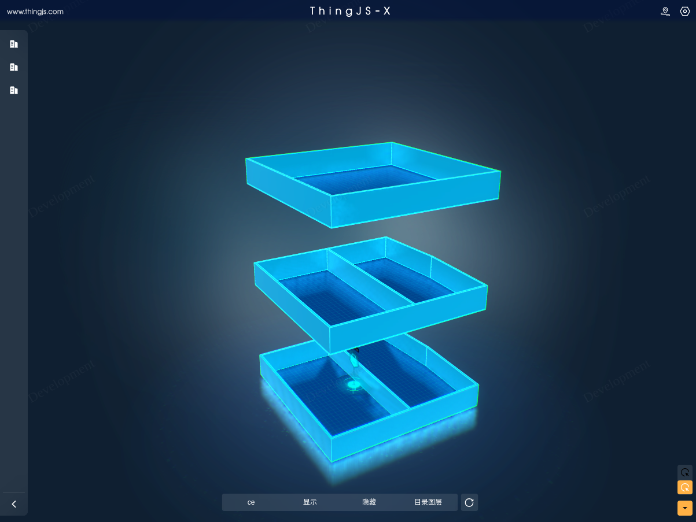

<!-- @import "[TOC]" {cmd="toc" depthFrom=1 depthTo=6 orderedList=false} -->

<!-- code_chunk_output -->

- [开发帮助(我的第一个扩展插件::指北针插件)](#开发帮助我的第一个扩展插件指北针插件)
  - [插件能力](#插件能力)
  - [文件解构说明](#文件解构说明)
  - [开发注意事项](#开发注意事项)
  - [插件开发逻辑](#插件开发逻辑)
  - [打包上传及部署](#打包上传及部署)
  - [错误及特别注意 🧐](#错误及特别注意-)

<!-- /code_chunk_output -->


## 教程示例模板(建筑展开插件)
> 插件类型: 扩展插件
```text
   在数字孪生场景/层级中,堆叠在一起而且没有名称导引的建筑楼层,无法清晰进行查看,该插件工具实现在园区、建筑层级进行建筑楼层的自动展开进行查看
```

## 效果展示



## 资源介绍

> 配置项说明
 
||名称|描述|必填|多选|
|-|----|----|----|----|
|基础配置||||
||-|-|-|-|


## 使用场景
> 建筑展开插件使用场景
```text
   当进入某个园区场景或建筑层级时,希望清楚看到建筑的楼层整体结构及建筑内部细节,实现对场景建筑结构的观察等以便进行有效分析
```
> 场景应用案例

>> 案例介绍
```javascript
   园区管理人员需要掌握园区建筑的楼层结构情况
```
>> 配置步骤
```javascript
  第1步：给园区孪生体集合添加该场景控制插件。通过场景控制插件激活与取消实现对园区层级下查看建筑楼层结构的情况。
  第2步：给建筑孪生体集合添加该场景控制插件。通过进入建筑层级实现可在建筑层级进行建筑楼层结构情况的查看。
```
>> 效果展示


# 开发帮助(我的第一个扩展插件::指北针插件)

## 插件能力
> 在数字孪生场景/层级中,对场景建筑结构的检查查看,该工具插件用来将建筑楼层进行展开,实现对场景建筑楼层结构的有效分析


## 文件解构说明
> /src/expand/index.js 开发入口文件(主要逻辑)
```javascript

      /**
      * 该文件提供了相关插件生命周期函数,可进行插件逻辑功能实现
      * onInstall 		  -- 场景未加载前进行插件资源加载安装 
      * onInited			  -- 层级切换发生改变 
      * onActivate 		  -- 插件被激活 
      * onDeactivate 	  -- 插件激活状态被取消 
      * onUninstall     -- 插件被卸载安装 
      * /
	
      // 激活后该函数被调用	
      onActivate(){
        console.warn("^_^:%s 建筑展开被激活");
      }

      ...
      ...
```

> /src/expand/index.json 配置项控件文件
```javascript
	
	//插件配置项能力属于ThingJS 插件重要组成部分,需要对该部门内容有一定的了解
	//可参考 ThingJS-X 零代码-X4 插件/开发指南/ThingJS-X插件开发规范/ThingJS-X插件配置项介绍
	//U知地址:  https://wiki.uino.com/book/thingjsx40-plugin/634e85f03f63452f069b8cb9.html

	/**
	 * 	配置项控件可视化工具
	 *	为配置项开发提效进行了配置项规范的工具化落地,可参考使用工具快速完成配置项设计开发工作
	 *	离线配置项工具下载地址: http://123.124.196.193:2023/api/index.html#/xplugin-specification?id=%e9%85%8d%e7%bd%ae%e9%a1%b9%e8%a7%84%e8%8c%83
	 *	下载后解压安装(推荐管理员)即可使用,使用方式和方法请参考工具内文档
	 *	
	 */
	
```

> /src/expand/bundle.js 插件资源描述文件
```javascript

	//插件资源描述文件是针对插件资源进行描述解释的文件
	//相关描述信息可参考插件开发规范,资源描述文件介绍部分
	//可设置插件相关的作者、版权、入口文件等信息
	
	/**
	 * 在进行该文件开发处理时,可以忽略该文件使用
	 * 该文件支持两种开发方式,默认使用javacript 方式,
	 * 另一种可以是直接粘贴json格式内容
	 */
	
	//方式一(引入描述文件库SDK,通过API进行设置):
	
	import BundlePluginLayer from "@thingjs-x/xplugin-bundle/dist/plugin/BundlePluginLayer";

	export default class extends BundlePluginLayer {

	    constructor() {
	        super();

	        //设置插件作者为 张光的邮箱
	        this.bundle.setAuthor("zhangguang@uino.com");
	        //设置插件的能力描述
	        this.bundle.setDescription("在数字孪生场景/层级中,对场景建筑结构的检查查看,该工具插件用来将建筑楼层进行展开,实现对场景建筑楼层结构的有效分析")
	        //设置插件版权
	        this.bundle.external.thingjsX.setLicense("XXX 科技有限公司版权所有");
	    }
	}


	//方式二(JSON结构):
  {
    "name": "xplugin-template-demo-building-expand",
    "type": "plugin",
    "id": "7008308225896349696",
    "version": "1.0.0",
    "author": "",
    "main": "frame.js",
    "dependencies": {
      "thingjs": "1.2.7.17",
      "dpdVersion": ">1.0.2 <=2.3.4"
    },
    "external": {
      "use-standard": "0",
      "encrypt-files": [
        "frame.js"
      ],
      "standard": "Revision",
      "preview": "./resources/preview.png",
      "thingjs-x": {
        "plugin-type": "control",
        "license": "北京优锘科技有限公司 版权所有",
        "date": "2022/12/13 16:04:24",
        "extend": {}
      }
    }
  }


```
> /config/index.js 环境配置文件(不建议进行更改的文件)

```javascript
	//目前该文件中主要配置了 ThingJS-X 环境地址
	//开发者可更改该地址进行环境切换
	//也可在实时运行环境下进行更改
```


## 开发注意事项
> 1. 插件开发前需要具备插件相关概念的了解及如何在ThingJS-X 系统使相关插件的方法论
```javascript
	可参考: (零代码ThingJS-X4) https://wiki.uino.com/book/thingjs-x40
	可参考: (零代码-X4 插件章节) https://wiki.uino.com/book/thingjsx40-plugin
```
> 2. 注意私有变量和私有方法的使用
```javascript
	如果使用@thingjs-x/xplugin-cli 开发插件,推荐使用 es6 class 针对私有变量和方法的最新提案

	? Why not use the "private" keyword, like Java or C#? #14
	一方面简化写法,另一方面出于性能考虑
	可参考：https://github.com/tc39/proposal-private-fields/issues/14

```
> 3. ThingJS-X 插件开发API 使用参考
```javascript

	ThingJS-X 插件开发前应先熟悉ThingJS-X API，以便于实现定制开发扩展能力的实现
	同时需要了解 ThingJS 低代码相关API,ThingJS-X API 是对ThingJS API的能力扩展
	以增强ThingJS API 在业务侧相关能力的补充,可定制开发功能更加丰富的ThingJS-X插件

	一定要注意两套API 命名空间不同,
	ThingJS API 在插件开发内被暴露于场景全局,THING 命名空间下
	ThingJS-X API 在插件开发内被暴露于场景全局, THINGX 命名空间下
	THING 命名空间API 的使用(可参考: https://docs.thingjs.com/cn/apidocs/)
	THINGX 命名空间API 的使用(可参考: http://123.124.196.193:2023/api/index.html#/01%E7%B3%BB%E7%BB%9F%E8%B0%83%E8%AF%95%E5%99%A8(THINGX.Debugger))

```
> 4. 禁用uinv （即将弃用,强烈不推荐使用,推荐使用THINGX）
```javascript
	//主要针对有过 ThingJS-X 4.0 以下版本开发的同学,习惯性的使用 uinv命名空间
	//该空间即将弃用不再支持,在将来版本中很快会被移除,所以不再推荐使用,切记、切记
```
> 5. ThingJS-X 插件开源模板
```javascript
	针对ThingJS-X 最新开发规范及对应插件开源模板&开源示例
	可直接访问参考: 
		https://github.com/GuangGuangZhang/xplugin-template 
		或
		https://gitee.com/GuangGuangZhang/xplugin-template 	(备份仓库,定期同步)
	该仓库代码是遵循了ThingJS-X 最新开发规范撰写的插件模板,一方面可以用于借鉴学习,另一方面
	可直接fork示例代码快速修改满足插件交付(或生产)需求
```

> 6. 环境配置(高级)
	
```javascript
	/config/index.js 离线开发场景配置文件

	该文件为环境配置文件,开发环境场景相关可在该文件下进行配置
```	

> 7. 环境检查(一般主要针对首次开发插件的环境检查)

```javascript
	//开发工具包推荐使用 nodejs version 16+ & npm version 8+
	//首次开发插件的环境经常性已经安装了相关nodejs版本
	//打包插件报错找不到原因,针对首次开发插件的开发者
	//在构建脚手架开发工具包创建插件工程后,可使用如下命令进行环境检测
	npn run test 进行环境依赖检查,确保开发环境处于插件开发要求内
	- INFO  XPlugin  linux OS : xplugin compile environment probe passed.  检测通过符合插件开发要求
	- 提示需要依赖相关版本nodejs等信息,则检测不通过,需要进行相关依赖版本的安装
```

## 插件开发逻辑
> 以 建筑展开插件为例 进行插件开发流程介绍

>> 1. 依据插件能力需求进行插件设计
```javascript
      建筑展开插件主要能力体现在在场景中需要对建筑楼层进行展开以便查看建筑楼层内部的堆叠结构
         1. 生效的层级,园区可以查看建筑结构、建筑层级可以查看建筑结构

      涉及到相关使用的api
	    #showAllRoofs 显示/隐藏所有屋顶（房顶）
        - https://docs.thingjs.com/cn/apidocs/THING.Building.html#showAllRoofs
      #expandFloors 展开楼层
        - https://docs.thingjs.com/cn/apidocs/THING.Building.html#expandFloors
      #unexpandFloors 合并楼层
        - https://docs.thingjs.com/cn/apidocs/THING.Building.html#unexpandFloors
	   
```
>> 2. 配置项控件设计

无

>> 3. 入口主逻辑开发&快速开始

```javascript
	/***
	 * 1. 具体逻辑代码可详细阅读 /src/expand/index.js 开发入口文件
	 * 2. 快速开始可继续阅读或直接访问: https://wiki.uino.com/book/thingjsx40-plugin/63564184cd00484b78b06a1a.html
	 * 3. 使用插件开发工具包访问地址: https://www.npmjs.com/package/@thingjs-x/xplugin-cli
	 */
	
	1. 安装工具包脚手架 npm install -g @thingjs-x/xplugin-cli
	2. 创建工程,选择开发插件的模板
	   
		> xplugin init 插件工程名称

		> 选择插件类型:
			* 系统插件模板
			* 扩展插件模板
			* 面板插件模板
			* 场景控制插件模板
			* 场景图层插件模板
			
		> 是否使用工程名称作为插件名称?
			是则使用创建名称作为插件名称
			否则输入名称作为插件名称 
			
		> 创建完毕,生成插件模板代码,进行插件开发

	3. 工具包命令一览
		- npm install          -- to install dependencies
		- npm run test         -- environmental testing,测试运行环境是否满足要求
		- npm run dev          -- to build the project for development
		- npm run start        -- to run the project
		- npm run mocha        -- to perform a unit test
		- npm run build:prod   -- to build the project for production
		- npm run build:pack   -- to pack the project for production
		- xplugin upgrade      -- 升级模板代码	

	4. 创建完成工程后进入工程目录,参考模板代码及相关命令进行开发即可
		- 首先执行 npm install 安装依赖
		- 再次执行 npn run test 进行环境依赖检查,确保开发环境处于插件开发要求内(一般主要针对首次开发插件的环境检查)
		- 然后可进行逻辑开发
			
```

## 打包上传及部署

```javascript
	- npm run build:pack   -- to pack the project for production
	使用该命令打包插件工程后,在该工程下生成lib目录内的插件zip压缩包
	将该压缩包上传到部署的ThingJS-X 环境即可使用
```


## 错误及特别注意 🧐

> 1. 配置项控件使用错误(需要简单了解配置项相关内容)

> 2. 禁用uinv （即将弃用,强烈不推荐使用,推荐使用THINGX）

> 3. npm run test 检测插件工程依赖环境的可用性


