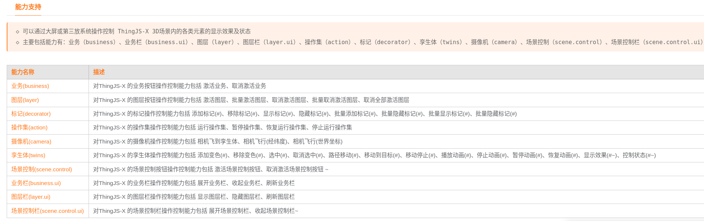
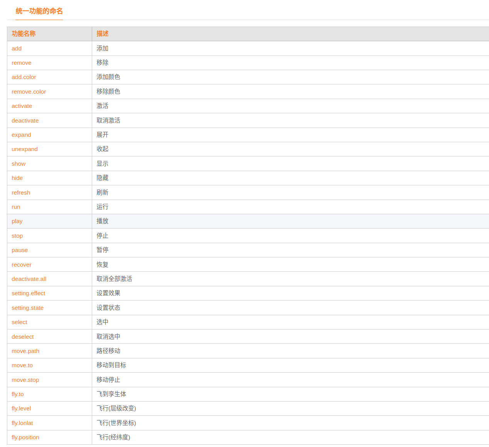

<!-- @import "[TOC]" {cmd="toc" depthFrom=1 depthTo=6 orderedList=false} -->

<!-- code_chunk_output -->

- [开发帮助(我的第一个系统插件开发::消息监听)](#开发帮助我的第一个系统插件开发消息监听)
  - [插件能力](#插件能力)
  - [文件解构说明](#文件解构说明)
  - [开发注意事项](#开发注意事项)
  - [插件开发逻辑](#插件开发逻辑)
  - [打包上传及部署](#打包上传及部署)
  - [错误及特别注意 🧐](#错误及特别注意-)

<!-- /code_chunk_output -->

# 开发帮助(我的第一个系统插件开发::消息监听)

## 插件能力
>  使数字孪生场景中能够监听接收第三方页系统面中向ThingJS-X平台发送的事件消息
   使ThingJS-X 具有接收消息的能力,从而进行场景(内)的一些列控制操作等


## 文件解构说明
> /src/layer/index.js 开发入口文件(主要逻辑)
```javascript
	/**
	 * 该文件提供了相关图层生命周期函数,可进行插件逻辑功能实现
	 *
	 * onInstall 			-- 场景未加载前进行插件资源加载安装
	 * onBeforeInit 		-- 场景初始化前执行
	 * onInited				-- 场景初始化
	 * onBeforeLoad 		-- 场景加载前
	 * onBeforeLoadEarth 	-- 地球场景加载前执行
	 * onEarthLoaded 		-- 地球场景加载完成
	 * onBeforeLoadCampus 	-- 园区场景加载前执行(园区在地球场景加载中有存在多次回调的情况)
	 * onCampusLoaded 		-- 园区场景加载完成
	 * onLoaded 			-- 场景加载完成(场景所指的是3D场景,而非系统加载完成)
	 * onUninstall 			-- 插件被卸载安装
	 * 
	 */
	
	// 场景加载完成后调用	
	 onLoaded(){
	 	console.warn("^_^: 场景加载完成激活");
	 }

	 ...
	 ...
```

> /src/layer/index.json 配置项控件文件
```javascript
	
	//插件配置项能力属于ThingJS 插件重要组成部分,需要对该部门内容有一定的了解
	//可参考 ThingJS-X 零代码-X4 插件/开发指南/ThingJS-X插件开发规范/ThingJS-X插件配置项介绍
	//U知地址:  https://wiki.uino.com/book/thingjsx40-plugin/634e85f03f63452f069b8cb9.html

	/**
	 * 	配置项控件可视化工具
	 *	为配置项开发提效进行了配置项规范的工具化落地,可参考使用工具快速完成配置项设计开发工作
	 *	离线配置项工具下载地址: http://10.100.32.63/xelement/xelement.zip
	 *	下载后解压安装(推荐管理员)即可使用,使用方式和方法请参考工具内文档
	 *	
	 */

	
```

> /src/layer/bundle.js 插件资源描述文件
```javascript

	//插件资源描述文件是针对插件资源进行描述解释的文件
	//相关描述信息可参考插件开发规范,资源描述文件介绍部分
	//可设置插件相关的作者、版权、入口文件等信息
	
	/**
	 * 在进行该文件开发处理时,可以忽略该文件使用
	 * 该文件支持两种开发方式,默认使用javacript 方式,
	 * 另一种可以是直接粘贴json格式内容
	 */
	
	//方式一(引入描述文件库SDK,通过API进行设置):
		
	import BundlePluginCore from "@thingjs-x/xplugin-bundle/dist/plugin/BundlePluginCore";

	export default class extends BundlePluginCore {

	    constructor() {
	        super();

	        //设置插件作者为 张光的邮箱
	        this.bundle.setAuthor("zhangguang@uino.com");
	        //设置插件的能力描述
	        this.bundle.setDescription("三方系统通过iframe与ThingJS-X 系统集成,使得三方系统与ThingJS-X可以进行集成交互控制场景与反向驱动数据变化")
	        //设置插件版权
	        this.bundle.external.thingjsX.setLicense("XXX 科技有限公司版权所有");
	    }
	}


	//方式二(JSON结构):
	{
	    "name": "教程示例模板(iframe消息监听集成插件)",
	    "type": "plugin",
	    "id": "6988728693405253632",
	    "version": "1.0.0",
	    "author": "zhangguang@uino.com",
	    "description": "三方系统通过iframe与ThingJS-X 系统集成,使得三方系统与ThingJS-X可以进行集成交互控制场景与反向驱动数据变化",
	    "main": "frame.js",
	    "dependencies": {
	        "thingjs": "1.2.7.17",
	        "dpdVersion": ">1.0.2 <=2.3.4"
	    },
	    "external": {
	        "use-standard": "0",
	        "encrypt-files": [
	            "frame.js"
	        ],
	        "standard": "Revision",
	        "preview": "./resources/preview.png",
	        "thingjs-x": {
	            "plugin-type": "core",
	            "license": "XXX 科技有限公司版权所有",
	            "date": "2022/10/27 20:53:07",
	            "extend": {}
	        }
	    }
	}

```
> /config/index.js 环境配置文件(不建议进行更改的文件)

```javascript
	//目前该文件中主要配置了 ThingJS-X 环境地址
	//开发者可更改该地址进行环境切换
	//也可在实时运行环境下进行更改
```


## 开发注意事项
> 1. 插件开发前需要具备插件相关概念的了解及如何在ThingJS-X 系统使相关插件的方法论
```javascript
	可参考: (零代码ThingJS-X4) https://wiki.uino.com/book/thingjs-x40
	可参考: (零代码-X4 插件章节) https://wiki.uino.com/book/thingjsx40-plugin
```
> 2. 注意私有变量和私有方法的使用
```javascript
	如果使用@thingjs-x/xplugin-cli 开发插件,推荐使用 es6 class 针对私有变量和方法的最新提案

	? Why not use the "private" keyword, like Java or C#? #14
	一方面简化写法,另一方面出于性能考虑
	可参考：https://github.com/tc39/proposal-private-fields/issues/14

```
> 3. ThingJS-X 插件开发API 使用参考
```javascript

	ThingJS-X 插件开发前应先熟悉ThingJS-X API，以便于实现定制开发扩展能力的实现
	同时需要了解 ThingJS 低代码相关API,ThingJS-X API 是对ThingJS API的能力扩展
	以增强ThingJS API 在业务侧相关能力的补充,可定制开发功能更加丰富的ThingJS-X插件

	一定要注意两套API 命名空间不同,
	ThingJS API 在插件开发内被暴露于场景全局,THING 命名空间下
	ThingJS-X API 在插件开发内被暴露于场景全局, THINGX 命名空间下
	THING 命名空间API 的使用(可参考: https://docs.thingjs.com/cn/apidocs/)
	THINGX 命名空间API 的使用(可参考: http://123.124.196.193:2023/thingjs-x-api/THINGX.html)

```
> 4. 禁用uinv （即将弃用,强烈不推荐使用,推荐使用THINGX）
```javascript
	//主要针对有过 ThingJS-X 4.0 以下版本开发的同学,习惯性的使用 uinv命名空间
	//该空间即将弃用不再支持,在将来版本中很快会被移除,所以不再推荐使用,切记、切记
```
> 5. ThingJS-X 插件开源模板
```javascript
	针对ThingJS-X 最新开发规范及对应插件开源模板&开源示例
	可直接访问参考: 
		https://github.com/GuangGuangZhang/xplugin-template 
		或
		https://gitee.com/GuangGuangZhang/xplugin-template 	(备份仓库,定期同步)
	该仓库代码是遵循了ThingJS-X 最新开发规范撰写的插件模板,一方面可以用于借鉴学习,另一方面
	可直接fork示例代码快速修改满足插件交付(或生产)需求
```

> 6. 环境配置(高级)
	
```javascript
	/config/index.js 离线开发场景配置文件

	该文件为环境配置文件,开发环境场景相关可在该文件下进行配置
```	

> 7. 环境检查(一般主要针对首次开发插件的环境检查)

```javascript
	//开发工具包推荐使用 nodejs version 16+ & npm version 8+
	//首次开发插件的环境经常性已经安装了相关nodejs版本
	//打包插件报错找不到原因,针对首次开发插件的开发者
	//在构建脚手架开发工具包创建插件工程后,可使用如下命令进行环境检测
	npn run test 进行环境依赖检查,确保开发环境处于插件开发要求内
	- INFO  XPlugin  linux OS : xplugin compile environment probe passed.  检测通过符合插件开发要求
	- 提示需要依赖相关版本nodejs等信息,则检测不通过,需要进行相关依赖版本的安装
```

## 插件开发逻辑
> 以 教程示例模板(iframe消息监听集成插件)为例 进行插件开发流程介绍

>> 1. 依据插件能力需求进行插件设计
>>> #需求分析设计
```javascript
			1. 提供业务能力控制(包括不限于激活业务、取消激活、显示业务栏、隐藏业务栏等)
				-参考: http://123.124.196.193:2023/thingjs-x-api/THINGX.Business.html
			2. 提供图层控制能力(包括不限于 图层激活、取消激活、图层刷新等)
				-参考: http://123.124.196.193:2023/thingjs-x-api/THINGX.Layer.html
			3. 提供控制标记的能力(包括不限于 孪生体标记添加、显示、隐藏、移除等)
				-参考: http://123.124.196.193:2023/thingjs-x-api/THINGX.Marker.html
			4. 提供操作集的运行、暂停、恢复运行、停止运行的能力
				-参考: http://123.124.196.193:2023/thingjs-x-api/THINGX.OpSet.html
			5. ...

```
>>> #设计方案(统一语义格式、统一功能命名,定义语义化API)

```javascript
	//统一标准语义格式&使用postmessage发送消息指令
	//1.构造标准操作语义格式
    let InboundParameters = {
      "type": "business", 	//能力,参考能力支持列表
      "action": "activate",	//功能命名,参考统一功能的命名
	  "parameters":{}		//参数化对象
    };
    //2.获取嵌入的ThingJS-X 的IFRAME
    const xplus =document.getElementById("ThingJS-X-IFRAME");
    const iframe = xplus.contentWindow;
    //3.向嵌入的ThingJS-X 发送统一标准格式的消息 InboundParameters
    iframe.postMessage(InboundParameters,'*');
```





>>> #设计步骤思路拆解(让我思考思考)
```javascript

        设计步骤思路拆解(让我思考思考)
        	1. 系统插件为系统加载后启动			
        			-暂不做配置项配置内容
        			-启动后接收语义化JSON参数,拆解参数调用ThingJS-X 相关API
        	2. 更多高级功能设计(扩展)
        			-由于iframe的特殊性的一些考虑
        			-e.g. 安全性处理
        			-e.g. 全面支持的功能等
        			-e.g. 载入性能处理
					-e.g. 可视化调试处理
```
>> 2. 配置项控件设计

```javascript
	//暂无配置项
	//更多高级功能可自行进行扩展设计
```

>> 3. 入口主逻辑开发&快速开始

```javascript
	/***
	 * 1. 具体逻辑代码可详细阅读 /src/layer/index.js 开发入口文件(主要逻辑)
	 * 2. 快速开始可继续阅读或直接访问: https://wiki.uino.com/book/thingjsx40-plugin/63564184cd00484b78b06a1a.html
	 * 3. 使用插件开发工具包访问地址: https://www.npmjs.com/package/@thingjs-x/xplugin-cli
	 */
	
	1. 安装工具包脚手架 npm install -g @thingjs-x/xplugin-cli
	2. 创建工程,选择开发插件的模板
	   
		> xplugin init 插件工程名称

		> 选择插件类型:
			* 系统插件模板
			* 扩展插件模板
			* 面板插件模板
			* 场景控制插件模板
			* 场景图层插件模板
			
		> 是否使用工程名称作为插件名称?
			是则使用创建名称作为插件名称
			否则输入名称作为插件名称 
			
		> 创建完毕,生成插件模板代码,进行插件开发

	3. 工具包命令一览
		- npm install          -- to install dependencies
		- npm run test         -- environmental testing,测试运行环境是否满足要求
		- npm run dev          -- to build the project for development
		- npm run start        -- to run the project
		- npm run mocha        -- to perform a unit test
		- npm run build:prod   -- to build the project for production
		- npm run build:pack   -- to pack the project for production
		- xplugin upgrade      -- 升级模板代码	

	4. 创建完成工程后进入工程目录,参考模板代码及相关命令进行开发即可
		- 首先执行 npm install 安装依赖
		- 再次执行 npn run test 进行环境依赖检查,确保开发环境处于插件开发要求内(一般主要针对首次开发插件的环境检查)
		- 然后可进行逻辑开发
			
```

## 打包上传及部署

```javascript
	- npm run build:pack   -- to pack the project for production
	使用该命令打包插件工程后,在该工程下生成lib目录内的插件zip压缩包
	将该压缩包上传到部署的ThingJS-X 环境即可使用
```


## 错误及特别注意 🧐

> 1. 配置项控件使用错误(需要简单了解配置项相关内容)

> 2. 禁用uinv （即将弃用,强烈不推荐使用,推荐使用THINGX）

> 3. npm run test 检测插件工程依赖环境的可用性


